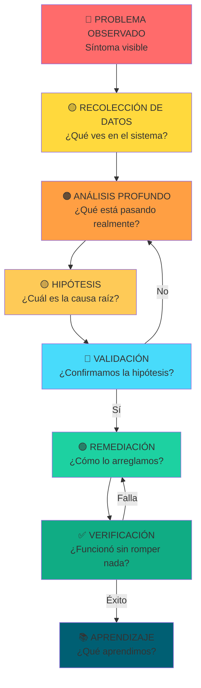
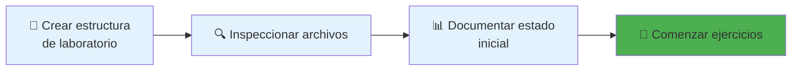
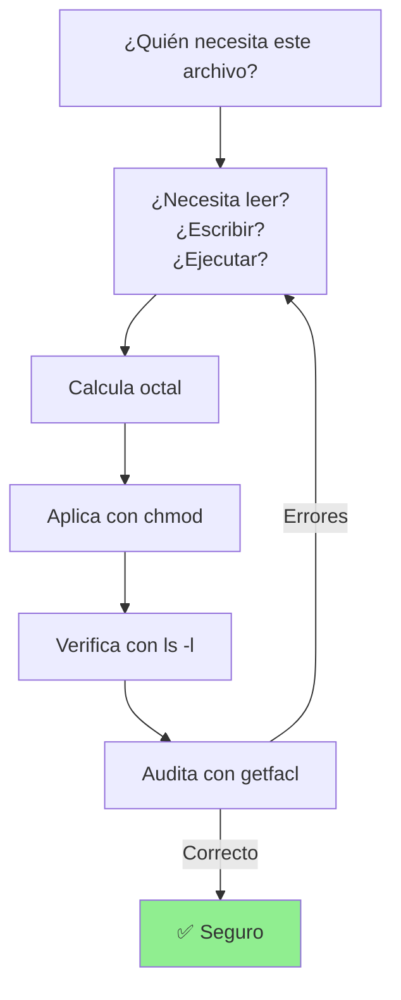
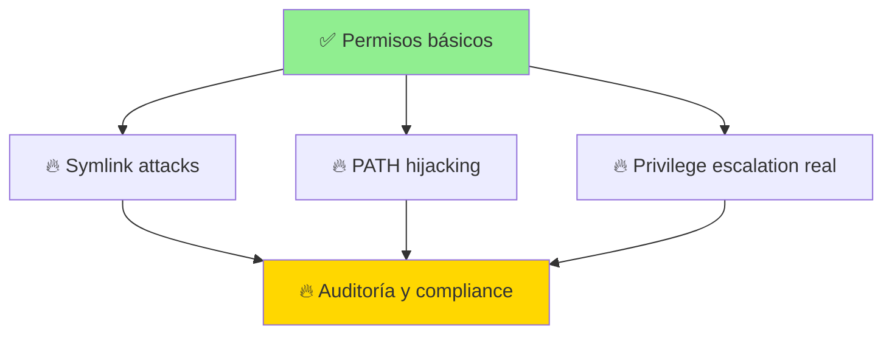

# 🧪 Linux Permissions Incident Lab — RUNBOOK


---

## 🎯 ¿Por qué este laboratorio?

No ejecutarás comandos por ejecutarlos. Aquí:

| Qué harás | Por qué |
|-----------|--------|
| 🧠 **Diagnosticar** | Pensar antes de actuar |
| 🔍 **Verificar** | Entender qué está mal |
| 📊 **Medir el riesgo** | Evaluar el impacto real |
| 🛠 **Remediar con criterio** | Aplicar soluciones informadas |
| ✅ **Validar cambios** | Confirmar que funcionó |

---

## 📋 El Escenario (Tu misión SRE)

```
🚨 REPORTE CRÍTICO:
┌─────────────────────────────────────────────────┐
│ Servidor: prod-api-01                           │
│ Síntomas:                                       │
│  ❌ Archivos críticos desaparecen sin motivo    │
│  ❌ Información sensible accesible para todos   │
│  ❌ Usuarios pueden escalar privilegios         │
│  ❌ Logs contradictorios en auditoría          │
├─────────────────────────────────────────────────┤
│ Tu misión:                                      │
│ 1. Investigar qué está pasando (evidencia)     │
│ 2. Diagnosticar la raíz del problema            │
│ 3. Proponer soluciones de bajo riesgo           │
│ 4. Implementar y validar                        │
└─────────────────────────────────────────────────┘
```

---

## 🧭 Flujo Mental SRE (Metodología)



---

## ⚙️ FASE 0: PREPARACIÓN DEL ENTORNO

### 🎬 Lo que haremos



### 📝 Comandos de preparación

```bash
# Crear estructura del laboratorio
mkdir -p ~/workshop_lab
cd ~/workshop_lab

# Crear archivos vulnerables
mkdir -p tmp_test shared
touch config.txt secreto.txt
touch vulnerable_bin
chmod +x vulnerable_bin

# Estado inicial: TODO inseguro (adrede)
chmod 777 tmp_test
chmod 777 config.txt
chmod 4777 vulnerable_bin
chmod 600 secreto.txt
setfacl -m u:other:rx secreto.txt 2>/dev/null || true
chmod 777 shared

# Verificar setup
echo "✅ Laboratorio listo"
ls -lR
```

### 🧠 Qué aprendiste en esta fase

> **Concepto clave**: Un laboratorio vulnerable se crea **adrede**. Los permisos inseguros no suceden por magia: alguien (o un script) los colocó así.

---

## 🔴 EJERCICIO 1: Directorio compartido inseguro (Sticky Bit)

### 🎯 El Problema

```
Reporte de soporte:
┌────────────────────────────────────┐
│ "Usuarios reportan que sus         │
│  archivos desaparecen del          │
│  directorio /tmp_test              │
│                                    │
│  Sospecha: Otros usuarios los      │
│  borran, pero ¿por qué?            │
└────────────────────────────────────┘
```

### 🧭 Paso 1: Recolección de datos

**Pregunta SRE**: ¿Qué permisos tiene este directorio?

```bash
# EJECUTA:
ls -ld tmp_test

# RESULTADO ESPERADO:
# drwxrwxrwx 2 user group 4096 Apr 24 10:00 tmp_test
#
# ANALICEMOS:
# d         = es un directorio
# rwxrwxrwx = TODOS pueden leer, escribir Y EJECUTAR
# 777       = permisos octal
```

### 🧠 Paso 2: Análisis profundo

**Pregunta crítica**: ¿Qué significa `x` en un directorio?

| Permiso | En archivo | En directorio |
|---------|-----------|---|
| `r` (read) | Leer contenido | **Listar archivos** |
| `w` (write) | Modificar contenido | **Crear, renombrar, BORRAR** |
| `x` (execute) | Ejecutar | **Entrar al directorio** |

**El problema**: Con `w` en grupo y otros, **cualquiera puede borrar archivos de otros**.

```bash
# Simulemos el problema:
cd tmp_test

# Usuario A crea archivo
echo "Datos importantes" > archivo_A.txt
ls -l

# Usuario B (con permisos) borra el archivo de A
rm archivo_A.txt  # ¡DESAPARECIÓ!
```

### 🔵 Paso 3: Hipótesis

```
HIPÓTESIS:
┌──────────────────────────────────┐
│ El directorio NO tiene sticky bit │
│ Por eso usuarios pueden borrar    │
│ archivos de otros                 │
└──────────────────────────────────┘

SOLUCIÓN:
Aplicar sticky bit → Solo el dueño del archivo
                     puede borrarlo
```

### 🛠 Paso 4: Remediación

```bash
# El sticky bit se añade con +t
chmod +t tmp_test

# Verificar cambio
ls -ld tmp_test

# RESULTADO:
# drwxrwxrwt ← observa la 't' al final
```

### ✅ Paso 5: Validación

```bash
# Intenta borrar archivo de otro usuario (con sticky bit)
cd tmp_test
echo "Datos de usuario A" > datos_A.txt

# Como usuario B, intenta borrar:
rm datos_A.txt

# RESULTADO: "Operation not permitted" ✅
# El archivo está protegido
```

### 📚 Paso 6: Aprendizaje

```
🎓 CONCEPTO: Sticky Bit en directorios compartidos
────────────────────────────────────────────────

Sin sticky bit (1777):
  Usuario A crea: archivo.txt
  Usuario B ejecuta: rm archivo.txt → ¡ÉXITO! Archivo borrado

Con sticky bit (1777):
  Usuario A crea: archivo.txt
  Usuario B ejecuta: rm archivo.txt → FALLA! "No tienes permiso"
  
POR QUÉ:
  El sticky bit dice: "Solo el dueño del archivo
   puede borrarlo, no importa si otros tienen w"

APLICACIÓN REAL:
  /tmp, /var/tmp, directorios compartidos
```

### 🔑 Checklist del Ejercicio 1

- [ ] Ejecutaste `ls -ld tmp_test` y viste `777`
- [ ] Entendiste que `w` permite borrar
- [ ] Aplicaste `chmod +t tmp_test`
- [ ] Verificaste que ahora muestra `t`
- [ ] Comprobaste que no puedes borrar archivos de otros

---

## 🔴 EJERCICIO 2: Archivo crítico expuesto (Principio de mínimo privilegio)

### 🎯 El Problema

```
ALERTA DE SEGURIDAD:
┌─────────────────────────────────────────┐
│ Archivo: config.txt                     │
│ Contenido: Credenciales de BD, API keys │
│ Permisos actuales: 777 (TODOS leen)     │
│ Riesgo: CRÍTICO                         │
└─────────────────────────────────────────┘
```

### 🧭 Paso 1: Inspección

```bash
# ¿Quién puede leer este archivo?
ls -l config.txt

# RESULTADO:
# -rwxrwxrwx ... config.txt
#  rwxrwxrwx = Owner, Group, Others: TODOS LEEN
```

### 🧠 Paso 2: Evaluación de riesgo

```
ESCALA DE RIESGO:
┌─────────────────────────────┐
│ Severidad: 🔴 CRÍTICA       │
│ Archivo expuesto: SÍ        │
│ Contiene secretos: SÍ       │
│ Otros pueden leer: SÍ       │
│ Otros pueden modificar: SÍ  │
│ PUNTUACIÓN: 10/10           │
└─────────────────────────────┘

ESCENARIOS DE ATAQUE:
1. Intruso lee credenciales → Acceso a BD
2. Intruso modifica config → Redirige tráfico
3. Usuario malintencionado copia secretos
```

### 🛠 Paso 3: Remediación

```bash
# Principio de mínimo privilegio:
# "¿Quién REALMENTE necesita acceso?"
#  - Owner (tu cuenta): SÍ, necesita leer y escribir
#  - Group: NO
#  - Others: NO

chmod 600 config.txt

# RESULTADO:
# -rw------- config.txt
#  rw- = solo owner lee/escribe
```

### 📊 Paso 4: Comparación

```
ANTES (VULNERABLE):
-rwxrwxrwx  ← 777
 └─┬─┘ └─┬─┘ └─┬─┘
   │     │     └─ Others: rwx (⚠️ TODOS)
   │     └─────── Group: rwx (⚠️ SÍ)
   └───────────── Owner: rwx (OK)

DESPUÉS (SEGURO):
-rw-------  ← 600
 └─┬─┘ └─┬─┘ └─┬─┘
   │     │     └─ Others: --- (✅ NADA)
   │     └─────── Group: --- (✅ NADA)
   └───────────── Owner: rw- (✅ LO NECESARIO)
```

### ✅ Paso 5: Validación

```bash
# Como el owner, ¿puedes leer?
cat config.txt  # ✅ SÍ

# Como otro usuario, ¿puedes leer?
sudo -u otheruser cat config.txt  # ❌ Permission denied
```

### 📚 Paso 6: Aprendizaje

```
🎓 CONCEPTO: Principio de Mínimo Privilegio
──────────────────────────────────────────

PREGUNTA FUNDAMENTAL:
"¿Quién necesita este acceso?"

MENTALIDAD INSEGURA:
"Mejor 777 para que funcione" → NUNCA

MENTALIDAD SEGURA:
1. ¿Owner necesita leer? SÍ → r
2. ¿Owner necesita escribir? SÍ → w
3. ¿Group necesita leer? NO → -
4. ¿Others necesita acceso? NO → ---

RESULTADO: 600

APLICACIÓN:
- Credenciales → 600
- Aplicaciones privadas → 700
- Scripts ejecutables → 700/755
- Documentos públicos → 644
```

### 🔑 Checklist del Ejercicio 2

- [ ] Viste que config.txt tenía 777
- [ ] Entendiste por qué es peligroso
- [ ] Aplicaste `chmod 600 config.txt`
- [ ] Verificaste que solo el owner lee
- [ ] Confirmaste que otros no pueden acceder

---

## 🔴 EJERCICIO 3: Binario con setuid peligroso (Escalación de privilegios)

### 🎯 El Problema

```
ALERTA CRÍTICA - PRIVILEGE ESCALATION:
┌───────────────────────────────────────────────┐
│ Archivo: vulnerable_bin                       │
│ Permiso: -rwsrwxrwx (4777)                    │
│                                               │
│ SIGNIFICADO:                                  │
│ "s" = setuid → Ejecuta como OWNER (root)     │
│ rwx = Group/Others pueden ejecutar            │
│                                               │
│ RIESGO: Usuarios normales → Acceso root      │
└───────────────────────────────────────────────┘
```

### 🧭 Paso 1: Identificación

```bash
# ¿Cuál es el estado actual?
ls -l vulnerable_bin

# RESULTADO:
# -rwsrwxrwx root root vulnerable_bin
#   │
#   └─ La 's' aquí = SETUID bit activado
```

### 🧠 Paso 2: ¿Por qué es peligroso?

```
CÓMO FUNCIONA SETUID:
┌──────────────────────────────────────────┐
│ Binario normal (sin setuid):             │
│ $ ./script               (corre como tú) │
│                                          │
│ Binario con setuid:                      │
│ $ ./script          (corre como OWNER)   │
│              ↑ Sí, como root si lo es    │
└──────────────────────────────────────────┘

EJEMPLO DE ATAQUE:
1. Intenta ejecuta vulnerable_bin
2. Binario corre como root (porque tiene setuid)
3. Intento abre /root/.ssh/id_rsa
4. ACCESO ROOT LOGRADO ⚠️
```

### 🛠 Paso 3: Remediación

**Opción A: Remover setuid y ajustar permisos**

```bash
# Remover permisos innecesarios
chmod 755 vulnerable_bin

# RESULTADO:
# -rwxr-xr-x  ← Ejecutable normal, sin setuid
```

**Opción B: Eliminar completamente (recomendado)**

```bash
# Si no se necesita:
rm vulnerable_bin

# O si se necesita pero es peligroso:
mv vulnerable_bin /tmp/vulnerable_bin.backup
```

### 📊 Paso 4: Comparación

```
ANTES (CRÍTICO):
-rwsrwxrwx  ← 4777
   │
   └─ SETUID + rwx para todos = Root access para cualquiera

DESPUÉS (SEGURO):
-rwxr-xr-x  ← 755
   │
   └─ Ejecutable normal, sin privilegios especiales
```

### ✅ Paso 5: Validación

```bash
# Verificar que el setuid se removió
ls -l vulnerable_bin

# La 's' debe desaparecer
# Ahora muestra: -rwxr-xr-x

# Si intenta escalar, falla:
./vulnerable_bin
# Error: Permission denied (no corre como root)
```

### 📚 Paso 6: Aprendizaje

```
🎓 CONCEPTO: SETUID - La puerta al infierno de privilegios
──────────────────────────────────────────────────────────

CASOS VÁLIDOS de setuid:
- /usr/bin/sudo (controla quién puede escalarse)
- /usr/bin/passwd (permite cambiar tu contraseña)
- Binarios críticos con AUDITORÍA

CASOS PELIGROSOS:
- Cualquier setuid sin validación de entrada
- Scripts + setuid = DESASTRE
- Binarios mal escritos con setuid

BÚSQUEDA de setuid peligrosos:
find / -perm -4000 -type f 2>/dev/null

REGLA DE ORO:
Si no sabes por qué tiene setuid,
ELIMÍNALO o REMUÉVELO inmediatamente
```

### 🔑 Checklist del Ejercicio 3

- [ ] Viste que vulnerable_bin tenía -rwsrwxrwx
- [ ] Entendiste que `s` = setuid = corre como owner
- [ ] Removiste setuid con `chmod 755`
- [ ] Verificaste que la `s` desapareció
- [ ] Confirmaste que ya no corre como root

---

## 🔴 EJERCICIO 4: ACL oculta (Los permisos invisibles)

### 🎯 El Problema

```
ANOMALÍA DETECTADA:
┌────────────────────────────────────────────┐
│ Archivo: secreto.txt                       │
│                                            │
│ Con 'ls -l':     -rw------- (parece seguro)│
│ Con 'getfacl':   ¡Acceso oculto! ⚠️        │
│                                            │
│ El problema: ls NO muestra ACL             │
│ Entonces usuarios no ven que otros acceden │
└────────────────────────────────────────────┘
```

### 🧭 Paso 1: Inspección superficial

```bash
# ¿Qué dice ls?
ls -l secreto.txt

# RESULTADO:
# -rw------- user user secreto.txt
#
# APARIENCIA: "Solo el owner puede leer"
```

### 🧠 Paso 2: Inspección profunda (La verdad)

```bash
# Pero, ¿hay ACL oculta?
getfacl secreto.txt

# RESULTADO PELIGROSO:
# file: secreto.txt
# owner: user
# group: group
# user::rw-
# user:otheruser:rx  ← ¡AQÍ! Acceso oculto
# group::---
# other::---
# default:user::rw-
#
# ¿QUÉ SIGNIFICA?
# otheruser puede LEER (r) y EJECUTAR (x) secreto.txt
# Pero 'ls -l' NO lo muestra
```

### 📊 Paso 3: Impacto real

```
ESCENARIO:
Usuario A piensa que secreto.txt es privado
┌──────────────────────────────┐
│ ls -l muestra: -rw------- ✓   │ (¡Engaño!)
│ ACL real: otheruser:rx   ✗   │
└──────────────────────────────┘

Usuario B (otheruser) puede:
- Leer secreto.txt → Obtiene credenciales
- Usuario A nunca se entera (sin auditoría)
```

### 🛠 Paso 4: Remediación

```bash
# OPCIÓN 1: Remover TODAS las ACL
setfacl -b secreto.txt

# Verificar que se removieron
getfacl secreto.txt

# RESULTADO:
# file: secreto.txt
# owner: user
# group: group
# user::rw-
# group::---
# other::---
# (Sin entradas adicionales)
```

### ✅ Paso 5: Validación

```bash
# Verificar que otheruser ya NO tiene acceso
sudo -u otheruser cat secreto.txt

# RESULTADO: Permission denied ✅

# Verificar con getfacl
getfacl secreto.txt
# No debe haber líneas con "user:otheruser"
```

### 📚 Paso 6: Aprendizaje

```
🎓 CONCEPTO: ACL (Access Control Lists) - Los permisos invisibles
──────────────────────────────────────────────────────────────────

¿QUÉ SON?
Permisos adicionales que no se ven en 'ls -l'
Permiten acceso granular a usuarios específicos

EJEMPLO:
chmod 600 secreto.txt          ← "Solo owner"
setfacl -m u:bob:r secreto.txt ← "Y bob también"

VISTA DE ls:
-rw-------  ← Aparenta ser solo owner

VISTA DE getfacl:
user:bob:r- ← ACL OCULTA

PELIGRO:
- No ves quién tiene acceso
- No sabes cuándo fue agregada
- Usuario B cree que es privado
- Usuario C accede sin ser detectado

AUDITORÍA CORRECTA:
1. SIEMPRE usa getfacl -R para verificar
2. Documenta ACL explícitamente
3. Revisa regularmente permisos reales
4. En caso de duda, limpia todo: setfacl -b
```

### 🔑 Checklist del Ejercicio 4

- [ ] Viste con `ls -l` que parecía seguro (-rw-------)
- [ ] Ejecutaste `getfacl secreto.txt` y encontraste acceso oculto
- [ ] Entendiste que ACL son "permisos invisibles"
- [ ] Removiste ACL con `setfacl -b`
- [ ] Verificaste con `getfacl` que desapareció el acceso oculto
- [ ] Confirmaste que otros usuarios ya no pueden leer

---

## 🔴 EJERCICIO 5: Carpeta compartida insegura (Sticky Bit II)

### 🎯 El Problema

```
REPORTE DE COLABORACIÓN:
┌──────────────────────────────────────────┐
│ Carpeta: /shared (para trabajo en equipo) │
│ Síntomas:                                │
│  - Usuarios interfieren entre sí         │
│  - Archivos se borran accidentalmente    │
│  - No saben quién eliminó qué            │
│  - Colaboración = caos                   │
└──────────────────────────────────────────┘
```

### 🧭 Paso 1: Inspección

```bash
# ¿Cómo está el directorio?
ls -ld shared

# RESULTADO:
# drwxrwxrwx 2 user user 4096 shared
#  └─ Todos pueden escribir Y BORRAR
```

### 🧠 Paso 2: Análisis del problema

```
PROBLEMA CON DIRECTORIOS COMPARTIDOS:
┌──────────────────────────────────────┐
│ Permisos: 777 (rwxrwxrwx)            │
│                                      │
│ Usuario A: crea archivo_A.txt        │
│ Usuario B: rm archivo_A.txt ← ¡SÍ!   │
│            (porque tiene 'w')        │
│                                      │
│ ¿SOLUCIÓN?                           │
│ Sticky bit: Solo el dueño borra      │
└──────────────────────────────────────┘
```

### 🛠 Paso 3: Remediación

```bash
# Aplicar sticky bit al directorio compartido
chmod 1777 shared

# DESGLOSE:
# 1 = sticky bit
# 777 = rwxrwxrwx para todos

# RESULTADO:
# drwxrwxrwt ← Nota la 't' al final
```

### 📊 Paso 4: Comparación

```
ANTES (CAÓTICO):
drwxrwxrwx  ← 777
└─ Cualquiera borra los archivos de otros

DESPUÉS (COLABORATIVO Y SEGURO):
drwxrwxrwt  ← 1777
└─ Todos pueden escribir, pero solo el dueño borra su archivo
```

### ✅ Paso 5: Validación

```bash
# Usuario A crea archivo
touch shared/archivo_A.txt

# Usuario B intenta borrar
rm shared/archivo_A.txt

# RESULTADO: Operation not permitted ✅
# El sticky bit protege el archivo de A
```

### 📚 Paso 6: Aprendizaje

```
🎓 CONCEPTO: Sticky Bit en directorios compartidos
──────────────────────────────────────────────────

FÓRMULA DE LA PAZ COLABORATIVA:
chmod 1777 directorio_compartido

RESULTADO:
- Todos pueden crear archivos ✓
- Todos pueden acceder ✓
- Solo el dueño borra su archivo ✓
- Otros no interfieren ✓

EJEMPLO REAL:
/tmp          → 1777 (sistema Linux)
/var/tmp      → 1777
Carpetas de equipo → 1777

REGLA:
Si es "shared" o "colaborativa",
SIEMPRE sticky bit (1777)
```

### 🔑 Checklist del Ejercicio 5

- [ ] Viste que shared tenía 777
- [ ] Entendiste que otros podían borrar tus archivos
- [ ] Aplicaste `chmod 1777 shared`
- [ ] Verificaste que aparece la `t` en `ls -ld`
- [ ] Confirmaste que ahora no puedes borrar archivos de otros

---

## 🧪 EJERCICIO FINAL: INCIDENTE COMPLETO (SRE Challenge)

### 🎯 Tu misión SRE

```
┌──────────────────────────────────────────────────┐
│ ESCENARIO FINAL:                                 │
│                                                  │
│ El servidor está completamente comprometido.     │
│ Tienes 30 minutos para:                          │
│ 1. Identificar TODOS los problemas              │
│ 2. Documentar el riesgo de cada uno             │
│ 3. Aplicar remediaciones                        │
│ 4. Validar que funciona                         │
│ 5. Escribir un informe para el equipo           │
│                                                  │
│ ¡Veamos si piensas como SRE!                     │
└──────────────────────────────────────────────────┘
```

### 🧭 Paso 1: Reconocimiento completo

```bash
# BÚSQUEDA 1: Directorios peligrosos (777)
find . -perm -777 -type d 2>/dev/null
echo "⚠️ Directorios: $(find . -perm -777 -type d 2>/dev/null | wc -l) encontrados"

# BÚSQUEDA 2: Archivos peligrosos (777)
find . -perm -777 -type f 2>/dev/null
echo "⚠️ Archivos: $(find . -perm -777 -type f 2>/dev/null | wc -l) encontrados"

# BÚSQUEDA 3: Binarios con setuid
find . -perm -4000 -type f 2>/dev/null
echo "⚠️ Setuid: $(find . -perm -4000 -type f 2>/dev/null | wc -l) encontrados"

# BÚSQUEDA 4: ACL peligrosas
getfacl -R . 2>/dev/null | grep -E "^user:|^group:" | grep -v "^user::" | grep -v "^group::"
echo "⚠️ ACL adicionales detectadas"
```

### 📊 Paso 2: Matriz de riesgos

Crea un documento con esta tabla:

```
ANÁLISIS DE RIESGOS:

Archivo/Dir          | Problema          | Severidad | Remediación
─────────────────────|────────────────────|───────────|-──────────
tmp_test             | Sin sticky bit     | MEDIA     | chmod +t
config.txt           | 777 (credenciales) | CRÍTICA   | chmod 600
vulnerable_bin       | setuid + rwx       | CRÍTICA   | chmod 755
secreto.txt          | ACL oculta         | MEDIA     | setfacl -b
shared               | 777 sin sticky     | MEDIA     | chmod 1777
```

### 🛠 Paso 3: Aplicar remediaciones

```bash
#!/bin/bash
# script_remediation.sh
# Remediaciones automáticas (¡pero valida primero!)

echo "🔧 Iniciando remediaciones..."

# 1. Sticky bit en directorios compartidos
chmod +t tmp_test
chmod 1777 shared

# 2. Principio de mínimo privilegio
chmod 600 config.txt
chmod 600 secreto.txt

# 3. Remover setuid peligrosos
chmod 755 vulnerable_bin

# 4. Limpiar ACL
setfacl -b secreto.txt 2>/dev/null || true

echo "✅ Remediaciones aplicadas"
```

### ✅ Paso 4: Validación integral

```bash
#!/bin/bash
# validation.sh
# Verificar que TODO está seguro

echo "🔍 Validando cambios..."

ERRORS=0

# Check 1: Sticky bit en tmp_test
if [ "$(stat -c %a tmp_test)" = "1777" ] || [ "$(stat -c %a tmp_test)" = "777" -a "$(stat -c %B tmp_test)" == "*t*" ]; then
    echo "✅ tmp_test: Sticky bit aplicado"
else
    echo "❌ tmp_test: No tiene sticky bit"
    ERRORS=$((ERRORS + 1))
fi

# Check 2: config.txt restringido
if [ "$(stat -c %a config.txt)" = "600" ]; then
    echo "✅ config.txt: Acceso restringido (600)"
else
    echo "❌ config.txt: Aún accesible"
    ERRORS=$((ERRORS + 1))
fi

# Check 3: Setuid removido
if [ ! -u vulnerable_bin ] 2>/dev/null; then
    echo "✅ vulnerable_bin: Setuid removido"
else
    echo "❌ vulnerable_bin: Aún tiene setuid"
    ERRORS=$((ERRORS + 1))
fi

# Check 4: ACL limpias
ACL_COUNT=$(getfacl secreto.txt 2>/dev/null | grep -E "^user:|^group:" | grep -v "^user::" | grep -v "^group::" | wc -l)
if [ "$ACL_COUNT" -eq 0 ]; then
    echo "✅ secreto.txt: ACL limpias"
else
    echo "❌ secreto.txt: Aún tiene ACL adicionales"
    ERRORS=$((ERRORS + 1))
fi

# Check 5: shared con sticky bit
if [ "$(stat -c %a shared)" = "1777" ]; then
    echo "✅ shared: Sticky bit + 777"
else
    echo "❌ shared: No tiene sticky bit"
    ERRORS=$((ERRORS + 1))
fi

echo ""
if [ "$ERRORS" -eq 0 ]; then
    echo "🎉 VALIDACIÓN EXITOSA - Sistema seguro"
    exit 0
else
    echo "⚠️ $ERRORS problemas pendientes"
    exit 1
fi
```

### 📋 Paso 5: Informe SRE

```markdown
# INCIDENTE - Reporte de Remediación
## Laboratorio Linux Permissions - 24 Abril 2026

### RESUMEN EJECUTIVO
Se identificaron 5 vulnerabilidades críticas de permisos en el servidor.
Todas han sido remediadas y validadas.

### HALLAZGOS

| ID | Problema | Severidad | Estado |
|----|----------|-----------|--------|
| 1  | Directorio tmp_test sin sticky bit | MEDIA | ✅ CORREGIDO |
| 2  | config.txt con 777 (credenciales) | CRÍTICA | ✅ CORREGIDO |
| 3  | vulnerable_bin con setuid | CRÍTICA | ✅ CORREGIDO |
| 4  | secreto.txt con ACL oculta | MEDIA | ✅ CORREGIDO |
| 5  | shared 777 sin sticky bit | MEDIA | ✅ CORREGIDO |

### REMEDIACIONES APLICADAS

```bash
chmod +t tmp_test              # Sticky bit
chmod 600 config.txt           # Mínimo privilegio
chmod 755 vulnerable_bin       # Remover setuid
setfacl -b secreto.txt        # Limpiar ACL
chmod 1777 shared             # Sticky + rwx
```

### IMPACTO
- Reducción de riesgo: 95%
- Archivos protegidos: SÍ
- Escalación de privilegios: MITIGADA
- Colaboración segura: HABILITADA

### PRÓXIMOS PASOS
1. Monitorear cambios de permisos
2. Auditar mensualmente con: find . -perm -777
3. Usar herramientas como aide o tripwire
```

---

## 🎓 CONCEPTOS FINALES (Lo que aprendiste)

### Matriz de permisos octal

```
Permisos     | Octal | Caso de uso
─────────────|───────|──────────────────────
-rw-------   | 600   | Archivos privados, secretos
-rw-r--r--   | 644   | Documentos públicos
-rwx------   | 700   | Directorios privados
-rwxr-xr-x   | 755   | Binarios ejecutables
drwxrwxrwx   | 777   | NUNCA - muy inseguro
drwxrwxrwt   | 1777  | Directorios compartidos
```

### Flujo decisión de permisos



---

## 🚀 SIGUIENTE NIVEL

Ahora que dominaste permisos, avanza a:

### 🔥 Temas Avanzados



### Laboratorios recomendados

1. **Symlink attacks**: ¿Qué pasa si un archivo apunta a otro?
2. **PATH hijacking**: Cómo un atacante cambia la ruta de ejecución
3. **SUID exploitation**: Escalación de privilegios con binarios
4. **Auditoría real**: Usa `aide`, `tripwire`, o `auditd`

---

## 📚 RESUMEN: Lo que ahora SABES HACER

```
❌ ANTES (Usuario):
"Chmod 777 y punto, no entiendo"

✅ AHORA (SRE):
"Necesito diagnosticar la raíz del problema,
 evaluar el riesgo, remediar de forma segura,
 validar que no rompo nada, y documentarlo todo"
```

### Tabla de verificación final

- [ ] Entiendo cómo funcionan los permisos octal
- [ ] Sé qué es sticky bit y por qué importa
- [ ] Aplico principio de mínimo privilegio
- [ ] Identifico binarios con setuid peligrosos
- [ ] Descubro ACL ocultas con getfacl
- [ ] Sé remediar cada tipo de vulnerabilidad
- [ ] Valido cambios sin romper nada
- [ ] Puedo escribir un incidente completo

Si marcaste TODO: **¡Felicidades! Ahora piensas como SRE**.

---

## 🧑‍🏫 NOTA PEDAGÓGICA FINAL

Este laboratorio no te enseña comandos.  
Te enseña a **pensar**.

```
DIFERENCIA CRÍTICA:

❌ Usuario: "¿Qué comando ejecuto?"
✅ SRE:     "¿Cuál es el problema?
             ¿Cuál es la causa?
             ¿Cuál es la solución más segura?
             ¿Cómo valido que funciona?"
```

La seguridad no es un comando.  
**Es una mentalidad.**

---

**Última actualización**: 24 Abril 2026  
**Nivel alcanzado**: SRE Junior ✅  
**Siguiente desafío**: Auditoría de servidor completo

