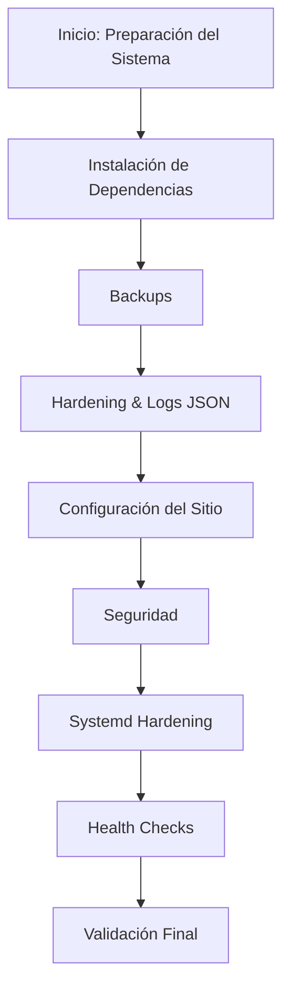
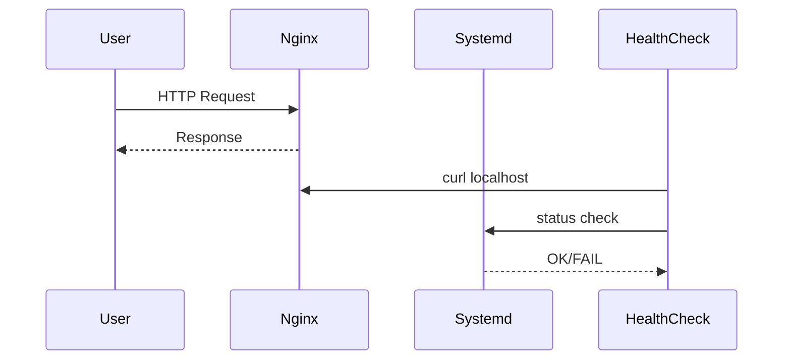

# 🛠️ Runbook: Despliegue de Infraestructura Web Robusta con Nginx
> **SRE Lab Series: Edición Linux v2.0**


---

## 📖 Introducción
Runbook SRE para desplegar Nginx con:
- Hardening de sistema
- Observabilidad (logs JSON)
- Aislamiento de procesos
- Health checks automatizados

---

## 📈 Flujo de Trabajo



---

## 1️⃣ Preparación e Instalación

```bash
sudo apt update
sudo apt install -y nginx apache2-utils curl
```

---

## 2️⃣ Gestión del Servicio

```bash
sudo systemctl enable --now nginx
systemctl status nginx --no-pager
ss -tulpn | grep :80
```

---

## 3️⃣ Backups (Rollback Strategy)

```bash
export BKP_DIR="/var/backups/nginx_$(date +%F)"
sudo mkdir -p $BKP_DIR

sudo cp /etc/nginx/nginx.conf $BKP_DIR/
sudo cp /etc/nginx/sites-available/default $BKP_DIR/
```

---

## 4️⃣ Hardening + Logs JSON

Editar `/etc/nginx/nginx.conf`:

```nginx
http {
    server_tokens off;

    log_format json_analytics escape=json '{'
        '"time_local":"$time_local",'
        '"remote_addr":"$remote_addr",'
        '"request_method":"$request_method",'
        '"request_uri":"$request_uri",'
        '"status":"$status",'
        '"body_bytes_sent":"$body_bytes_sent",'
        '"http_referrer":"$http_referer",'
        '"http_user_agent":"$http_user_agent",'
        '"request_time":"$request_time"'
    '}';

    client_max_body_size 2M;

    include /etc/nginx/conf.d/*.conf;
    include /etc/nginx/sites-enabled/*;
}
```

---

## 5️⃣ Configuración del Sitio

### A. Usuario y Permisos

```bash
sudo useradd -m -s /usr/sbin/nologin webapp
sudo mkdir -p /var/www/sre-lab
sudo chown -R webapp:www-data /var/www/sre-lab
sudo chmod 750 /var/www/sre-lab
```

### B. Autenticación

```bash
sudo htpasswd -c /etc/nginx/.htpasswd sre_admin
sudo chmod 640 /etc/nginx/.htpasswd
sudo chown root:www-data /etc/nginx/.htpasswd
```

### C. Virtual Host
/etc/nginx/sites-available/sre-lab
```nginx
server {
    listen 80;
    server_name localhost;

    root /var/www/sre-lab;
    index index.html;

    access_log /var/log/nginx/sre-lab.access.json json_analytics;

    add_header X-Frame-Options "SAMEORIGIN";
    add_header X-XSS-Protection "1; mode=block";
    add_header X-Content-Type-Options "nosniff";

    location / {
        auth_basic "SRE Lab - Acceso Restringido";
        auth_basic_user_file /etc/nginx/.htpasswd;
        try_files $uri $uri/ =404;
    }

    location /metrics {
        stub_status;
        allow 127.0.0.1;
        deny all;
    }
}
```

### Activación

```bash
sudo ln -s /etc/nginx/sites-available/sre-lab /etc/nginx/sites-enabled/
sudo rm /etc/nginx/sites-enabled/default
```

---

## 6️⃣ Contenido Web

```bash
sudo tee /var/www/sre-lab/index.html <<EOF
<!DOCTYPE html>
<html lang="es">
<head>
<meta charset="UTF-8">
<style>
body { background: linear-gradient(135deg,#1e3a8a,#3b82f6); color:white; font-family:sans-serif; height:100vh; display:flex; align-items:center; justify-content:center; }
.card { background:rgba(255,255,255,0.1); padding:2rem; border-radius:1rem; backdrop-filter:blur(10px); }
</style>
</head>
<body>
<div class="card">
<h1> SRE Lab: Nginx Hardened</h1>
<p> Servidor Activo</p>
<p> Auth habilitada</p>
<p> Logs JSON</p>
</div>
</body>
</html>
EOF

sudo chown webapp:www-data /var/www/sre-lab/index.html
sudo chmod 640 /var/www/sre-lab/index.html
```

---

## 7️⃣ Hardening Systemd

Aumentaremos la resiliencia limitando recursos a nivel kernel. Ejecute sudo systemctl edit nginx y añada:

```bash
sudo mkdir -p /etc/systemd/system/nginx.service.d
sudo tee /etc/systemd/system/nginx.service.d/override.conf <<EOF
[Service]
MemoryMax=256M
ProtectSystem=strict
ReadWritePaths=/var/lib/nginx /var/log/nginx /run /var/cache/nginx /etc/nginx /var/run
PrivateTmp=yes
NoNewPrivileges=yes
EOF

sudo mkdir -p /var/cache/nginx
sudo chown www-data:www-data /var/cache/nginx

sudo systemctl daemon-reload
sudo systemctl restart nginx
```

---

## 8️⃣ Health Check Automatizado

```bash
sudo vi /usr/local/bin/check_nginx_health.sh
```

```bash
#!/bin/bash

systemctl is-active --quiet nginx || exit 1
ss -tulpn | grep -q :80 || exit 1
curl -s -o /dev/null -w "%{http_code}" -u sre_admin:123 http://localhost/ | grep -q 200 || exit 1
! tail -n 50 /var/log/nginx/error.log | grep -q "emerg" || exit 1

echo "Health OK - $(date)"
```

```bash
sudo chmod 750 /usr/local/bin/check_nginx_health.sh
```

### Cron

```bash
echo "*/5 * * * * root /usr/local/bin/check_nginx_health.sh >> /var/log/nginx_health.log 2>&1" | sudo tee /etc/cron.d/nginx_health
```

---

## 9️⃣ Validación y Carga

```bash
sudo nginx -t
sudo systemctl reload nginx

ab -n 100 -c 10 -A sre_admin:123 http://127.0.0.1/

tail -f /var/log/nginx/sre-lab.access.json
```

---

## ✅ Checklist Final

- [ ] nginx -t OK
- [ ] Auth responde 401
- [ ] server_tokens off activo
- [ ] Health check exit 0
- [ ] Logs JSON correctos
- [ ] CHANGELOG actualizado

---

## 🚨 Simulación de Fallo + Rollback

```bash
sudo cp $BKP_DIR/nginx.conf /etc/nginx/nginx.conf
sudo systemctl restart nginx
```

---

## 🧠 Notas SRE

- Principio de mínimo privilegio aplicado
- Logs estructurados → observabilidad real
- Systemd hardening → defensa en profundidad
- Health checks → reducción de MTTR


