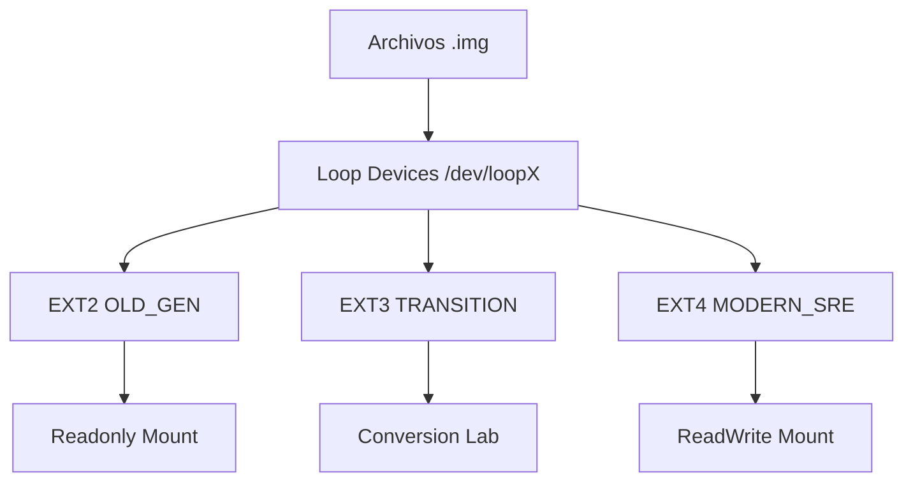
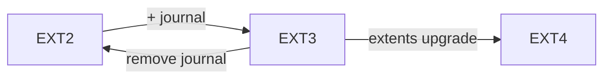
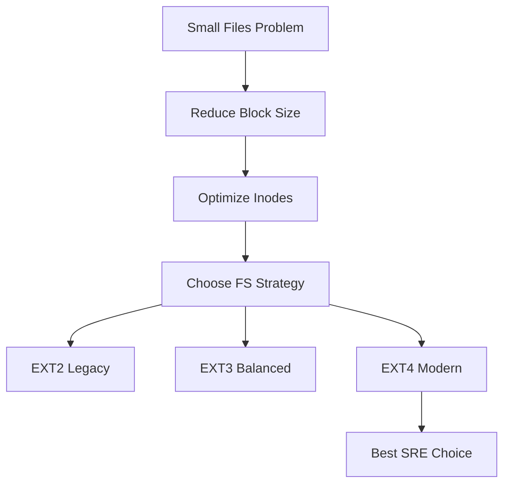

# 🧠🌀 SRE RUNBOOK — Laboratorio Maestro de Almacenamiento Linux (EXT2/3/4)


---

## 🎯 Objetivo
Optimizar almacenamiento Linux para **archivos pequeños**, reduciendo *slack space* mediante:
- Block Size: **1KB**
- Inode Size:
  - EXT2/3: **128 bytes**
  - EXT4: **256 bytes**

---

## 🏗️ Arquitectura del Laboratorio



---

## 🛠️ FASE 1 — Creación de Hardware Virtual (Loopback)

### 📌 Paso 1: Preparar entorno
```bash
mkdir -p ~/lab-storage && cd ~/lab-storage
```

### 📌 Paso 2: Crear discos virtuales (1GB)
```bash
fallocate -l 1G disk_ext2.img
fallocate -l 1G disk_ext3.img
fallocate -l 1G disk_ext4.img
```

### 📌 Paso 3: Asociar loop devices
```bash
sudo losetup -fP disk_ext2.img
sudo losetup -fP disk_ext3.img
sudo losetup -fP disk_ext4.img
```

### 📌 Paso 4: Verificar dispositivos
```bash
losetup -a
```

---

## 🏗️ FASE 2 — Formateo Optimizado

| Disco | FS   | Block Size | Inode Size | Label        |
|------|------|-----------|------------|--------------|
| loop1 | EXT2 | 1024      | 128        | OLD_GEN      |
| loop2 | EXT3 | 1024      | 128        | TRANSITION   |
| loop3 | EXT4 | 1024      | 256        | MODERN_SRE   |

### 📌 Paso 1: Formatear EXT2
```bash
sudo mkfs.ext2 -b 1024 -I 128 -L OLD_GEN /dev/loop1
```

### 📌 Paso 2: Formatear EXT3
```bash
sudo mkfs.ext3 -b 1024 -I 128 -L TRANSITION /dev/loop2
```

### 📌 Paso 3: Formatear EXT4
```bash
sudo mkfs.ext4 -b 1024 -I 256 -L MODERN_SRE /dev/loop3
```

---

## 🔄 FASE 3 — Conversiones (Core del Lab)



### 📌 3.1 Upgrade: EXT2 → EXT3
```bash
sudo tune2fs -j /dev/loop1
```
- ✔ Agrega journaling
- ✔ Evita fsck largos
- ✔ Datos intactos

---

### 📌 3.2 Downgrade: EXT3 → EXT2
```bash
sudo tune2fs -O ^has_journal /dev/loop2
```
- ⚠ Sin journaling
- ⚠ Riesgo de corrupción
- ✔ Datos se mantienen

---

### 📌 3.3 Upgrade: EXT3 → EXT4
```bash
sudo tune2fs -O extents,uninit_bg,dir_index /dev/loop2
sudo e2fsck -f /dev/loop2
```
- ✔ Mejor rendimiento
- ✔ Soporte extents
- ❗ Conversión prácticamente irreversible

---

## 📂 FASE 4 — Montaje

### 📌 4.1 Montaje temporal

```bash
sudo mkdir -p /mnt/readonly /mnt/readwrite

# Solo lectura
sudo mount -o ro /dev/loop1 /mnt/readonly

# Lectura / escritura
sudo mount -o rw /dev/loop3 /mnt/readwrite
```

---

### 📌 4.2 Persistencia (fstab)

```bash
LABEL=MODERN_SRE  /mnt/readwrite  ext4  defaults,noatime  0  2
/home/gmt/lab-storage/disk_ext2.img  /mnt/readonly  ext2  ro,loop  0  0
```

---

## 🛠️ FASE 5 — Post-Creación

### 📌 Cambiar Label
```bash
sudo tune2fs -L "NUEVO_NOMBRE" /dev/loop3
```

### 📌 Reducir espacio reservado root
```bash
sudo tune2fs -m 1 /dev/loop3
```

---

## 📊 FASE 6 — Observabilidad Moderna

### 🚀 Herramientas SRE

#### duf (Go)
```bash
sudo apt install duf
```

#### gdu (Go)
```bash
curl -L https://github.com/dundee/gdu/releases/latest/download/gdu_linux_amd64.tgz | tar xz
```

#### dust (Rust)
```bash
cargo install du-dust
```

---

## 📈 Métricas Críticas

```bash
df -h     # espacio
df -i     # inodos (CRÍTICO para archivos pequeños)
```

## 📈 Verificar el size del bloque de datos y de inodos

```bash
sudo tune2fs -l /dev/sda3 | grep -i "Block size"
sudo tune2fs -l /dev/sdXN | grep -i "Inode size"
sudo tune2fs -l /dev/sdXN | egrep -i "Block size|Inode size|Inode count|Inodes per group"
```
---

## 🧠 Buenas Prácticas SRE

- 🔥 **Inodes first**: archivos pequeños → agotamiento de inodos antes que disco
- 🔒 **Evitar EXT2 en producción**
- ⚡ **noatime** mejora rendimiento significativamente
- ☁️ **Cloud-friendly**: journaling overhead es despreciable
- 📀 **Alignment**: evitar fragmentación en archivos loop
- 🔍 **Siempre validar con e2fsck tras conversiones**

---
## 🧩 Resumen Ejecutivo


---

## ✅ Checklist Operacional

- [ ] Discos loop creados
- [ ] FS formateados correctamente
- [ ] Conversiones probadas
- [ ] Montajes validados
- [ ] fstab persistente configurado
- [ ] Métricas monitoreadas
- [ ] Herramientas modernas instaladas

---

🚀 **Estado Final:** Laboratorio listo para pruebas avanzadas de almacenamiento SRE
