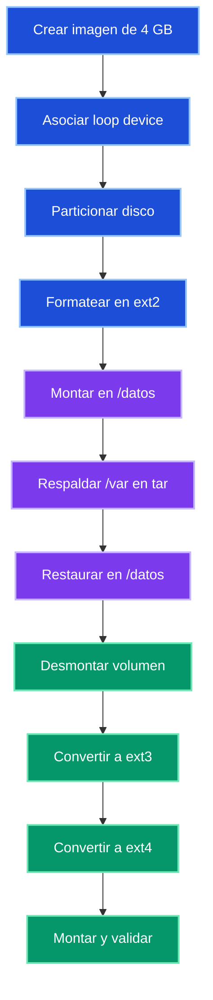
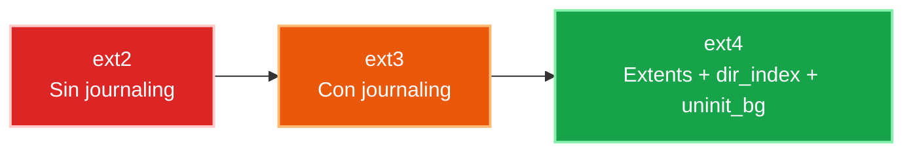

# 🛠️ Runbook: Gestión de File Systems y Migración de Datos (SRE Edition)


---

## 📖 Descripción General

Este procedimiento documenta la creación de un dispositivo loopback, su particionado, el formateo inicial con ext2, la migración de datos desde `/var` hacia `/datos` y la evolución del filesystem a ext3 y ext4.

Está pensado como un runbook de laboratorio con enfoque SRE: reproducible, verificable y fácil de auditar.

---

## 🎯 Objetivos

- Simular un disco usando un archivo de 4 GB.
- Crear una partición sobre un loop device.
- Formatear la partición con ext2.
- Migrar el contenido de `/var` a `/datos`.
- Convertir el filesystem en línea de ext2 a ext3 y luego a ext4.
- Verificar integridad y estado final del volumen.

---

## ✅ Prerrequisitos

| Requisito | Detalle |
|---|---|
| Sistema operativo | Ubuntu 24.04 LTS |
| Permisos | Acceso con `sudo` |
| Herramientas | `fallocate`, `losetup`, `fdisk`, `mkfs.ext2`, `fsck`, `tune2fs`, `tar`, `lsblk`, `blkid` |
| Espacio libre | Al menos 4 GB disponibles |
| Entorno recomendado | Laboratorio o VM |

---

## 🧭 Flujo general



---

## 🚀 Fase 1: Preparación del almacenamiento lógico

### 1. Crear archivo de imagen de 4 GB

```bash
sudo fallocate -l 4G /particion1.img
```

### 2. Asociar la imagen a un loop device

```bash
sudo losetup -fP /particion1.img
```

### 3. Identificar el loop asignado

```bash
losetup -a
```

Busca una salida similar a esta:

```text
/dev/loop8: []: (/particion1.img)
```

### 4. Crear una partición primaria

```bash
sudo fdisk /dev/loop8
```

Secuencia sugerida dentro de `fdisk`:

```text
n
p
1
[Enter]
[Enter]
w
```

### 5. Confirmar creación de la partición

```bash
sudo lsblk
sudo partprobe /dev/loop8
```

> Nota: Lo normal tras crear la primera partición es obtener `/dev/loop8p1`.

---

## 📂 Fase 2: Formateo e inicialización en ext2

### 1. Formatear la partición

```bash
sudo mkfs.ext2 /dev/loop8p1
```

### 2. Verificar estructura del volumen

```bash
sudo lsblk
sudo blkid /dev/loop8p1
```

### 3. Ejecutar chequeo preventivo de integridad

```bash
sudo fsck -f /dev/loop8p1
```

---

## 🔄 Fase 3: Montaje y migración de datos

### 1. Crear punto de montaje

```bash
sudo mkdir -p /datos
sudo mount /dev/loop8p1 /datos
```

### 2. Confirmar montaje

```bash
sudo df -hT | grep datos
```

### 3. Revisar tamaño del origen

```bash
sudo du -sh /var
```

### 4. Empaquetar el contenido de `/var`

```bash
cd /var
sudo tar cvf /tmp/var.tar .
```

### 5. Validar integridad del archivo tar

```bash
sudo tar tvf /tmp/var.tar | head
```

### 6. Restaurar en el nuevo volumen

```bash
cd /datos
sudo tar xvf /tmp/var.tar
```

### 7. Comparar tamaño entre origen y destino

```bash
sudo du -sh /var
sudo du -sh /datos
```

---

## 📦 Migración de datos


---

## 🛠️ Fase 4: Upgrade del filesystem

### A. Conversión de ext2 a ext3

Desmontar primero el volumen:

```bash
cd ~
sudo umount /datos
```

Agregar journal para convertir a ext3:

```bash
sudo tune2fs -j /dev/loop8p1
```

Validar consistencia:

```bash
sudo fsck -f /dev/loop8p1
sudo blkid /dev/loop8p1
```

### B. Conversión de ext3 a ext4

Habilitar features modernas de ext4:

```bash
sudo tune2fs -O extents,uninit_bg,dir_index /dev/loop8p1
```

Ejecutar chequeo obligatorio posterior:

```bash
sudo fsck -pf /dev/loop8p1
```

### C. Montaje final

```bash
sudo mount /dev/loop8p1 /datos
sudo df -hT | grep datos
```

---

## 🧬 Evolución del filesystem



---

## ✅ Validaciones finales

Ejecutar los siguientes comandos:

```bash
ls /datos
lsblk -f
mount | grep datos
df -hT | grep datos
sudo blkid /dev/loop8p1
```

### Estado esperado

| Verificación | Resultado esperado |
|---|---|
| `ls /datos` | Archivos migrados desde `/var` |
| `lsblk -f` | El volumen aparece como `ext4` |
| `mount | grep datos` | `/dev/loop8p1` montado en `/datos` |
| `df -hT` | Tipo de filesystem `ext4` |
| `blkid` | El dispositivo reporta `TYPE="ext4"` |

---

## 🧯 Troubleshooting

| Problema | Posible causa | Acción recomendada |
|---|---|---|
| No aparece `/dev/loop8p1` | La tabla no fue recargada | Ejecutar `sudo partprobe /dev/loop8` |
| `mount` falla | El volumen sigue montado o no fue formateado | Revisar con `lsblk` y `blkid` |
| `fsck` pide intervención | Inconsistencia detectada | Ejecutar `sudo fsck -f /dev/loop8p1` |
| `tune2fs` falla | El volumen está montado | Desmontar con `sudo umount /datos` |
| El tipo no cambia a ext4 | No se aplicaron features o faltó `fsck` | Repetir `tune2fs -O ...` y luego `fsck -pf` |

---

## 💡 Notas SRE

- Este procedimiento es ideal para laboratorios de particionamiento, validación de fsck y evolución de filesystems.
- En producción, antes de migrar datos críticos, conviene usar `rsync` con validación adicional además de un backup externo.
- El uso de loop devices simplifica pruebas sin requerir discos físicos dedicados.
- Toda modificación de flags del filesystem debe documentarse y validarse con evidencia posterior.

---

## 📌 Comandos de referencia rápida

```bash
sudo fallocate -l 4G /particion1.img
sudo losetup -fP /particion1.img
sudo fdisk /dev/loop8
sudo mkfs.ext2 /dev/loop8p1
sudo mkdir -p /datos
sudo mount /dev/loop8p1 /datos
cd /var && sudo tar cvf /tmp/var.tar .
cd /datos && sudo tar xvf /tmp/var.tar
sudo umount /datos
sudo tune2fs -j /dev/loop8p1
sudo tune2fs -O extents,uninit_bg,dir_index /dev/loop8p1
sudo fsck -pf /dev/loop8p1
sudo mount /dev/loop8p1 /datos
```
