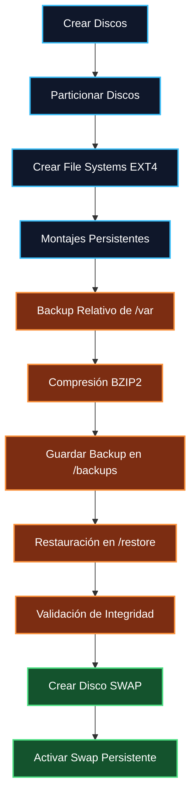
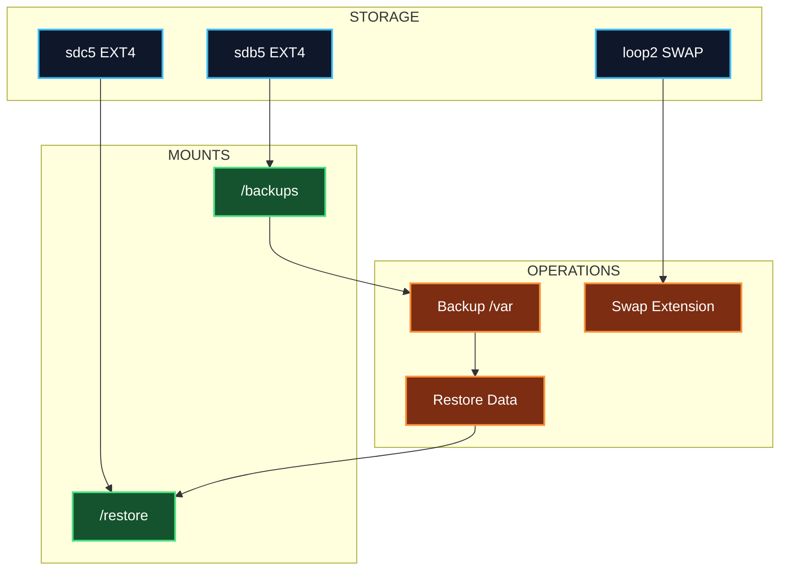

# WS_5.md

# 🧪 Workshop SRE Linux Storage & Backup Operations
> **Linux Administration • Storage Management • Backup & Restore • Swap Management**
>
> 
> 
> 
> 
> 

---

# 📘 Objetivo del Workshop

El estudiante debe ser capaz de:

- Crear discos persistentes en Linux.
- Particionar discos utilizando particiones extendidas/lógicas.
- Formatear sistemas de archivos EXT4.
- Configurar montajes persistentes mediante `/etc/fstab`.
- Generar respaldos comprimidos del directorio `/var`.
- Restaurar respaldos verificando integridad.
- Crear y administrar espacio SWAP adicional.
- Aplicar buenas prácticas SRE en almacenamiento Linux.

---

# 🧭 Escenario del Laboratorio

El estudiante debe reproducir el siguiente entorno:

| Disco | Tamaño | Tipo FS | Punto de Montaje |
|---|---|---|---|
| Disco 1 | 2 GB | EXT4 | `/backups` |
| Disco 2 | 4 GB | EXT4 | `/restore` |
| Disco 3 | 1 GB | SWAP | Swap Area |

---

# 🏗️ Arquitectura del Workshop



---

# 📋 Requisitos Previos

## 🔧 Herramientas requeridas

- VirtualBox o VMware
- Linux Ubuntu/Debian
- Privilegios root o sudo

## 📦 Paquetes recomendados

```bash
sudo apt update
sudo apt install -y bzip2 tar util-linux fdisk
```

---

# 🧩 Fase 1 — Creación de Discos

## 🎯 Objetivo

Crear los siguientes discos:

| Disco | Tamaño |
|---|---|
| Disco Backup | 2 GB |
| Disco Restore | 4 GB |
| Disco Swap | 1 GB |

---

# 📌 Opción A — Crear discos con VirtualBox

## Crear:

- Disco 1 → 2 GB
- Disco 2 → 4 GB

Tipo recomendado:

- VDI
- Dynamically Allocated

---

# 📌 Opción B — Crear discos con dd

## Crear disco de 2 GB

```bash
sudo dd if=/dev/zero of=/root/disk_backup.img bs=1M count=2048
```

## Crear disco de 4 GB

```bash
sudo dd if=/dev/zero of=/root/disk_restore.img bs=1M count=4096
```

## Asociar dispositivos loop

```bash
sudo losetup -fP /root/disk_backup.img
sudo losetup -fP /root/disk_restore.img
```

## Verificar loops

```bash
losetup -a
```

---

# 🧠 Identificación de Discos

```bash
lsblk
```

Ejemplo esperado:

```text
sdb   2G
sdc   4G
```

---

# 🧩 Fase 2 — Particionado de Discos

# 🎯 Objetivo

- Crear partición extendida
- Crear partición lógica número 5
- Utilizar 100% del disco

---

# 📌 Particionar Disco de 2 GB

```bash
sudo fdisk /dev/sdb
```

## Secuencia fdisk

```text
n
e
1

n
l


w
```

---

# 📌 Particionar Disco de 4 GB

```bash
sudo fdisk /dev/sdc
```

## Secuencia fdisk

```text
n
e
1

n
l


w
```

---

# 🔍 Verificación

```bash
lsblk
```

Resultado esperado:

```text
sdb5
sdc5
```

---

# 🧩 Fase 3 — Formateo EXT4

# 🎯 Objetivo

Formatear ambas particiones usando EXT4.

---

## Formatear `/dev/sdb5`

```bash
sudo mkfs.ext4 /dev/sdb5
```

## Formatear `/dev/sdc5`

```bash
sudo mkfs.ext4 /dev/sdc5
```

---

# 🧩 Fase 4 — Montajes Persistentes

# 🎯 Objetivo

Montar:

| Partición | Mount Point |
|---|---|
| `/dev/sdb5` | `/backups` |
| `/dev/sdc5` | `/restore` |

---

# 📌 Crear directorios

```bash
sudo mkdir -p /backups
sudo mkdir -p /restore
```

---

# 📌 Obtener UUIDs

```bash
sudo blkid
```

Ejemplo:

```text
/dev/sdb5: UUID="xxxx"
/dev/sdc5: UUID="yyyy"
```

---

# 📌 Configurar `/etc/fstab`

Editar:

```bash
sudo nano /etc/fstab
```

Agregar:

```fstab
UUID=XXXX   /backups   ext4   defaults   0 0
UUID=YYYY   /restore   ext4   defaults   0 0
```

---

# 📌 Montar File Systems

```bash
sudo mount -a
```

---

# 🔍 Verificación

```bash
df -h
```

Resultado esperado:

```text
/backups
/restore
```

---

# 🧩 Fase 5 — Backup Relativo de /var

# 🎯 Objetivo

- Crear backup relativo
- Comprimir usando BZIP2
- Incluir timestamp
- Almacenar en `/backups`

---

# 🧠 Flujo del Backup


---

# 📌 Crear timestamp

```bash
date +%F_%H-%M-%S
```

---

# 📌 Crear Backup

```bash
sudo tar -cjvf /backups/var_backup_$(date +%F_%H-%M-%S).tar.bz2 -C / var
```

---

# 🔍 Verificar Backup

```bash
ls -lh /backups
```

---

# 📌 Validar contenido del backup

```bash
tar -tjvf /backups/var_backup_*.tar.bz2
```

---

# 🧩 Fase 6 — Restauración de Datos

# 🎯 Objetivo

Restaurar el contenido respaldado hacia `/restore`.

---

# 🧠 Flujo de Restauración


---

# 📌 Restaurar Backup

```bash
sudo tar -xjvf /backups/var_backup_*.tar.bz2 -C /restore
```

---

# 🔍 Verificar Restauración

```bash
ls -l /restore
```

---

# 📌 Validar integridad

```bash
sudo diff -r /var /restore/var
```

---

# ✅ Resultado esperado

Sin diferencias significativas entre:

```text
/var
/restore/var
```

---

# 🧩 Fase 7 — Creación de Disco SWAP

# 🎯 Objetivo

Crear un tercer disco de 1 GB usando `dd`.

---

# 📌 Crear archivo de disco

```bash
sudo dd if=/dev/zero of=/root/disk_swap.img bs=1M count=1024
```

---

# 📌 Asociar Loop Device

```bash
sudo losetup -fP /root/disk_swap.img
```

---

# 📌 Verificar dispositivo

```bash
losetup -a
```

Ejemplo:

```text
/dev/loop2
```

---

# 📌 Formatear SWAP

```bash
sudo mkswap /dev/loop2
```

---

# 📌 Activar SWAP

```bash
sudo swapon /dev/loop2
```

---

# 📌 Verificar SWAP

```bash
swapon --show
```

---

# 📌 Persistencia SWAP

Editar:

```bash
sudo nano /etc/fstab
```

Agregar:

```fstab
/dev/loop2 none swap sw 0 0
```

---

# 🧠 Arquitectura Final



---

# 🧪 Validaciones Finales

## Verificar discos

```bash
lsblk
```

---

## Verificar montajes

```bash
df -h
```

---

## Verificar backup

```bash
ls -lh /backups
```

---

## Verificar restauración

```bash
ls -l /restore
```

---

## Verificar swap

```bash
swapon --show
free -h
```

---

# 🏁 Criterios de Éxito

✅ Discos creados correctamente  
✅ Particiones lógicas número 5 creadas  
✅ EXT4 configurado correctamente  
✅ Persistencia mediante `/etc/fstab`  
✅ Backup comprimido con BZIP2  
✅ Restauración funcional  
✅ SWAP adicional operativo  
✅ Validaciones exitosas  

---

# 📚 Buenas Prácticas SRE

- Utilizar UUID en lugar de `/dev/sdX`
- Verificar integridad después de restaurar
- Mantener backups con timestamps
- Usar compresión eficiente
- Documentar cambios en almacenamiento
- Automatizar respaldos mediante cronjobs

---

# 🧠 Comandos Clave del Workshop

| Comando | Función |
|---|---|
| `fdisk` | Particionado |
| `mkfs.ext4` | Crear EXT4 |
| `mount` | Montar FS |
| `blkid` | Ver UUID |
| `tar` | Backup/Restore |
| `bzip2` | Compresión |
| `dd` | Crear discos |
| `mkswap` | Crear swap |
| `swapon` | Activar swap |

---

# 🎓 Resultado Esperado

El estudiante será capaz de:

- Administrar almacenamiento Linux
- Implementar backups persistentes
- Restaurar información crítica
- Gestionar SWAP dinámicamente
- Aplicar procedimientos SRE reales

---
