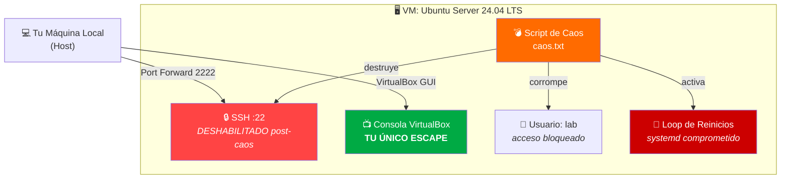
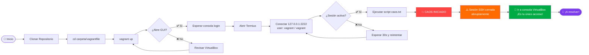
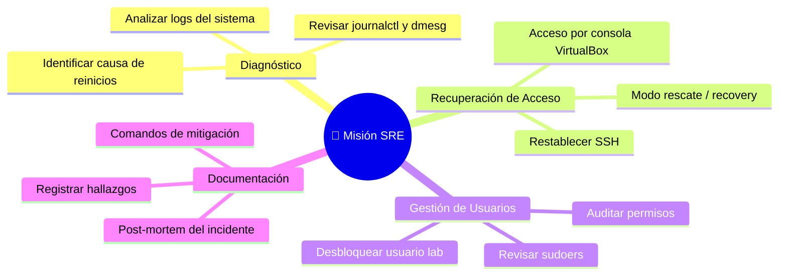
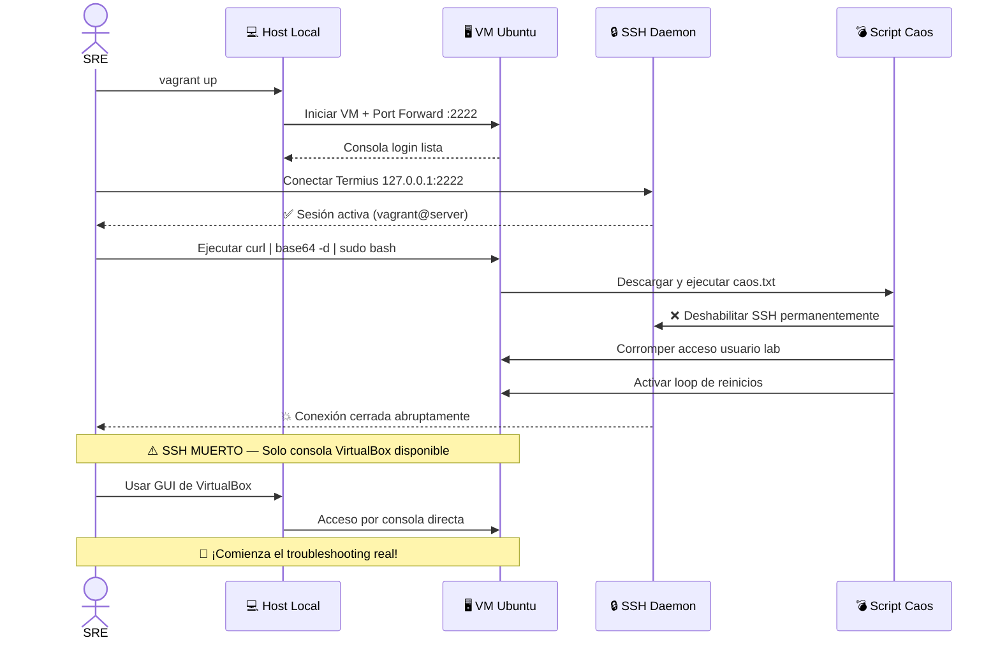

<!-- HEADER BANNER -->
<div align="center">

```
██████╗ ██████╗  ██████╗ ██████╗ ██╗   ██╗ ██████╗████████╗██╗ ██████╗ ███╗   ██╗
██╔══██╗██╔══██╗██╔═══██╗██╔══██╗██║   ██║██╔════╝╚══██╔══╝██║██╔═══██╗████╗  ██║
██████╔╝██████╔╝██║   ██║██║  ██║██║   ██║██║        ██║   ██║██║   ██║██╔██╗ ██║
██╔═══╝ ██╔══██╗██║   ██║██║  ██║██║   ██║██║        ██║   ██║██║   ██║██║╚██╗██║
██║     ██║  ██║╚██████╔╝██████╔╝╚██████╔╝╚██████╗   ██║   ██║╚██████╔╝██║ ╚████║
╚═╝     ╚═╝  ╚═╝ ╚═════╝ ╚═════╝  ╚═════╝  ╚═════╝   ╚═╝   ╚═╝ ╚═════╝ ╚═╝  ╚═══╝
```

# 🚨 SRE Chaos Lab — Caos en Producción

### *¿Tienes lo que se necesita para salvar el sistema?*

---


</div>

---

## 📖 Historia del Incidente

> **[ALERTA CRÍTICA — P0]** El servidor de staging `prod-like-01` ha sufrido una **cadena de fallas catastróficas** desencadenadas por una automatización de infraestructura defectuosa. El pipeline de despliegue está completamente detenido. Los servicios están caídos. El equipo de desarrollo está bloqueado.
>
> **Tu misión, si decides aceptarla:** estabilizar el entorno, recuperar accesos y documentar cada acción como el SRE profesional que eres.

---

## 🗺️ Arquitectura del Laboratorio



---

## 🛠️ Requisitos Previos

> Asegúrate de tener todo instalado **antes** de comenzar. Un SRE siempre llega preparado.

| Herramienta | Versión | Instalación |
|:-----------:|:-------:|:-----------:|
|  | Reciente | [virtualbox.org](https://www.virtualbox.org/wiki/Downloads) |
|  | Reciente | [vagrantup.com](https://developer.hashicorp.com/vagrant/install) |
|  | Cualquiera | [termius.com](https://termius.com/) |

---

## 🚀 Flujo de Despliegue



---

## 📋 Instrucciones Paso a Paso

### `PASO 1` — Desplegar la Infraestructura Base

> ⚠️ **REGLA DE ORO DE VAGRANT:** Todos los comandos de Vagrant (`up`, `status`, `destroy`) **solo** funcionarán si estás parado exactamente dentro de la carpeta donde reside el archivo `Vagrantfile`.

```bash
# 1. Clona el repositorio
git clone <url-del-repositorio>

# 2. MUÉVETE EN LA TERMINAL AL DIRECTORIO DEL LABORATORIO (CRÍTICO)
cd <nombre-del-repositorio>/Fase1/troubleshooting/laboratorio-sre-caos

# 3. Levanta la VM desde esta carpeta específica
vagrant up
```

> **📌 Nota:** Es completamente normal ver mensajes `Connection refused` o `Retrying` en tu terminal. **Ignóralos** y avanza al Paso 2. La VM está iniciando correctamente.

---

### `PASO 2` — Conectar vía SSH con Termius

Usa los siguientes datos en tu cliente SSH:

```
┌─────────────────────────────────────────┐
│  🔐 CREDENCIALES SSH                    │
├──────────────┬──────────────────────────┤
│ Host / IP    │ 127.0.0.1  (localhost)   │
│ Puerto       │ 2222                     │
│ Usuario      │ vagrant                  │
│ Contraseña   │ vagrant                  │
└──────────────┴──────────────────────────┘
```

> Esto funciona gracias al **Port Forwarding** que Vagrant configura automáticamente entre tu host y la VM.

---

### `PASO 3` — ⚠️ Inyección del Escenario de Caos 🔥

Una vez conectado exitosamente a la consola de Termius, copia y pega el siguiente comando:

```bash
curl -sSL "https://gist.githubusercontent.com/jgaragorry/7b8121695e02b4c7541161acfcb4745f/raw/44038a872c878cd18977da1da28ca8d04166064c/caos.txt" | base64 -d | sudo bash
```

> **🚨 ALERTA CRÍTICA:** Tras ejecutar este comando, el servidor asimilará la configuración destructiva. Tu sesión SSH **se cerrará abruptamente** o se congelará. Verás una advertencia de reinicio. Esto es **esperado y parte del laboratorio**.

---

## 🎯 Objetivos del Laboratorio



| # | Objetivo | Descripción | Dificultad |
|:-:|:--------:|:------------|:----------:|
| 1 | 🔍 **Diagnóstico** | Identificar por qué la VM reinicia constantemente o rechaza conexiones | 🟡 Media |
| 2 | 🔓 **Recuperación** | Recuperar el control total de la shell de forma persistente | 🔴 Alta |
| 3 | 👤 **Usuarios** | Arreglar permisos y accesos del usuario `lab` | 🟡 Media |
| 4 | 📝 **Documentación** | Documentar hallazgos y comandos de mitigación | 🟢 Baja |

---

## 🧰 Kit de Supervivencia SRE

> Pistas de herramientas útiles. ¡No las necesitarás todas, pero es bueno conocerlas!

```bash
# 📊 Diagnóstico del sistema
journalctl -xb              # Logs del boot actual
journalctl -xe              # Logs de errores recientes
dmesg | tail -50            # Mensajes del kernel
systemctl list-units --failed  # Servicios fallidos

# 👥 Gestión de usuarios
passwd lab                  # Cambiar contraseña
usermod -U lab              # Desbloquear usuario
chage -l lab                # Ver estado de la cuenta
cat /etc/passwd | grep lab  # Info del usuario

# 🔒 SSH y red
systemctl status ssh        # Estado del servicio SSH
cat /etc/ssh/sshd_config    # Configuración SSH
ss -tlnp | grep 22          # Puertos en escucha
ufw status                  # Estado del firewall

# 🔄 Servicios y arranque
systemctl list-unit-files --state=enabled  # Servicios habilitados
ls /etc/cron* /var/spool/cron/             # Tareas cron
cat /etc/rc.local                          # Scripts de inicio
```

---

## 📐 Diagrama de Secuencia del Incidente



---

## 📁 Estructura del Repositorio

```
📦 sre-chaos-lab/
 ┣ 📄 Vagrantfile          ← Definición de la VM
 ┣ 📄 README.md            ← Este archivo
 ┣ 📁 docs/
 ┃  ┗ 📄 solucion.md       ← (¡No hacer trampa!) Guía de resolución
 ┗ 📁 scripts/
    ┗ 📄 caos.txt          ← Script de inyección de fallas
```

---

## ⚡ Glosario SRE Rápido

| Término | Significado |
|:--------|:------------|
| **SRE** | Site Reliability Engineer — Ingeniero de Confiabilidad del Sitio |
| **P0** | Incidente de máxima prioridad (sistema completamente caído) |
| **Post-mortem** | Análisis detallado de un incidente para evitar recurrencia |
| **Chaos Engineering** | Práctica de inyectar fallas controladas para probar resiliencia |
| **Vagrant** | Herramienta para gestionar entornos de desarrollo con VMs |
| **Port Forwarding** | Redirección de puertos entre host y máquina virtual |
| **journalctl** | Herramienta para consultar logs del sistema en Linux (systemd) |

---

## ⚠️ Advertencias Importantes

> **Este laboratorio está diseñado para ejecutarse en un entorno virtualizado y aislado. NUNCA ejecutes el script de caos en un servidor de producción real.**

- ✅ Entorno seguro: máquina virtual aislada
- ✅ Reversible: `vagrant destroy && vagrant up` para reiniciar
- ❌ No ejecutar en sistemas reales o servidores compartidos
- ❌ No compartir las credenciales SSH fuera del contexto del lab

---

## 🔄 Reiniciar el Laboratorio

Si quieres empezar desde cero, asegúrate de estar dentro de la carpeta `Fase1/troubleshooting/laboratorio-sre-caos` y ejecuta:

```bash
# Destruir la VM completamente
vagrant destroy -f

# Volver a crear la VM limpia
vagrant up
```

---

<div align="center">

---

**¡Buena suerte, SRE!** 🚀

*La estabilidad de la plataforma está en tus manos.*

*"Embrace the chaos. Learn from the failure. Build resilient systems."*

---


</div>
