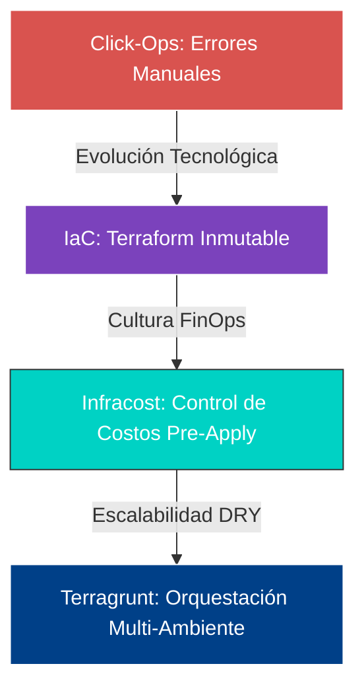
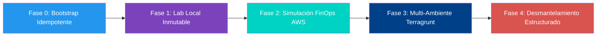

# 🚀 Fase 2: IaC Mastery — Terraform & Terragrunt


---

## 🎯 Objetivo de la Fase 2

El núcleo central de esta fase es la **superación definitiva del "Click-Ops"** mediante la adopción de prácticas avanzadas de **Infraestructura como Código (IaC)**. El objetivo es diseñar, presupuestar y orquestar arquitecturas complejas de manera modular, inmutable y segura, escalando desde despliegues locales controlados hasta topologías multi-ambiente empresarial bajo la cultura SRE.



---

## 🏗️ Pilares Tecnológicos Abordados

1. **Terraform Foundations** — Comprensión profunda del ciclo de vida (`init`, `plan`, `apply`, `destroy`), gestión estricta del estado (`.tfstate`) y pinamiento de versiones de proveedores (Providers Lock).
2. **FinOps con Infracost** — Implementación de auditorías financieras preventivas en la terminal para predecir costos de nube antes de impactar los presupuestos de producción.
3. **Orquestación DRY con Terragrunt** — Segmentación limpia de entornos (`Development` y `Production`) reutilizando un único módulo base sin duplicación de código.
4. **Resiliencia Operativa** — Gestión de dependencias compartidas locales, mitigación de conflictos en el motor de contenedores y corrección de desviaciones de configuración (Configuration Drift).

---

## 🗺️ Mapa de Ejecución del Laboratorio

Para cumplir los objetivos pedagógicos y técnicos, la fase se divide en los siguientes hitos secuenciales:



| # | Fase | Descripción |
|---|------|-------------|
| 0 | **Bootstrap Idempotente** | Script automatizado para preparar el entorno: Docker, Terraform, Terragrunt, Infracost y enlace CLI a la API de costos. |
| 1 | **Despliegue Local** | Creación de recursos inmutables con control estricto de tags en el motor local. |
| 2 | **Auditoría FinOps** | Análisis predictivo de costos mensuales sobre topologías complejas simuladas en la nube. |
| 3 | **Arquitectura Escalable** | Separación de la lógica del negocio (moldes de Terraform) de los parámetros de entorno (datos inyectados por Terragrunt). |
| 4 | **Ciclo de Cierre** | Destrucción ordenada basada en el árbol de dependencias centralizadas para garantizar la limpieza total del host. |

---

## 📂 Estructura del Repositorio (`Fase2/`)

```
📁 iac-mastery/
├── 📁 laboratorio-local/     # Código de Terraform puro, single-environment e inmutable
├── 📁 preview-costos/        # Simulación de topologías Cloud para auditoría de presupuestos
└── 📁 infra-estructurada/    # Arquitectura avanzada DRY
    ├── 📁 modules/           # Moldes base de infraestructura reutilizables
    └── 📁 environments/      # Configuraciones de Terragrunt para Dev y Prod
```

---

<p align="center">
  <sub>Fase 2 del Programa <strong>SRE Mastery</strong> · Infraestructura y Orquestación como Código Puro</sub>
</p>
