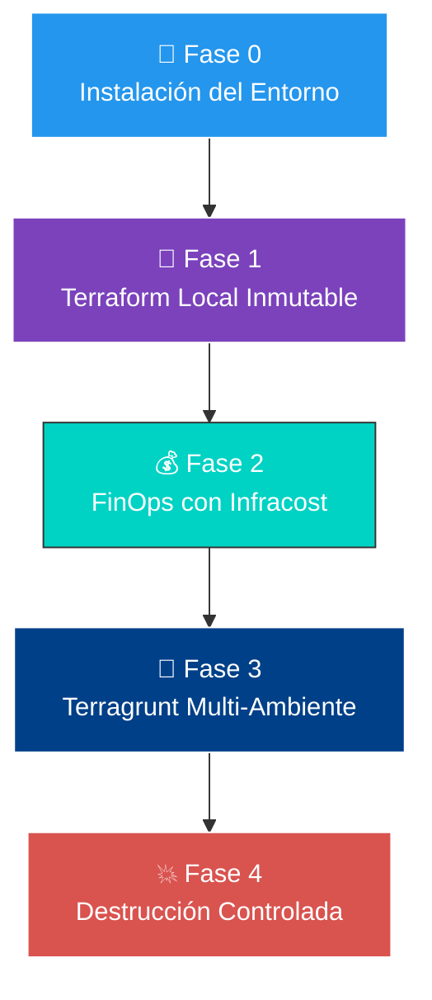
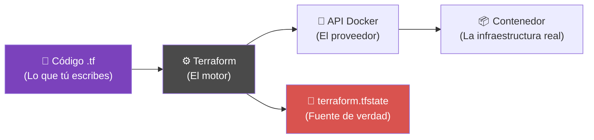
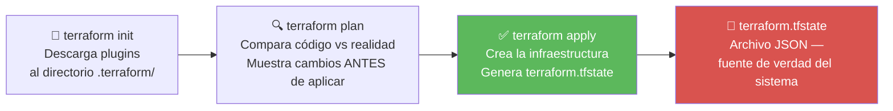
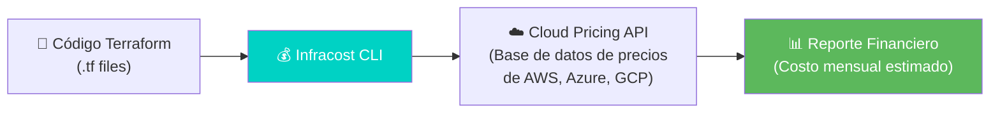
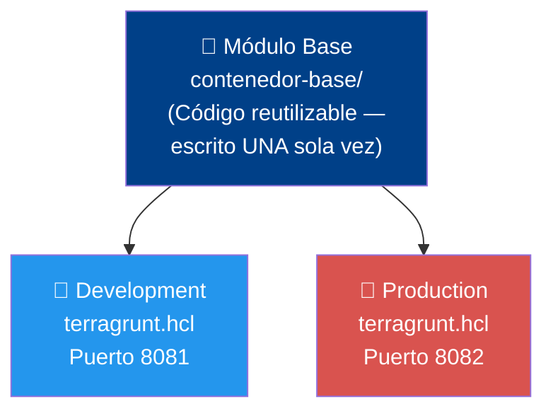
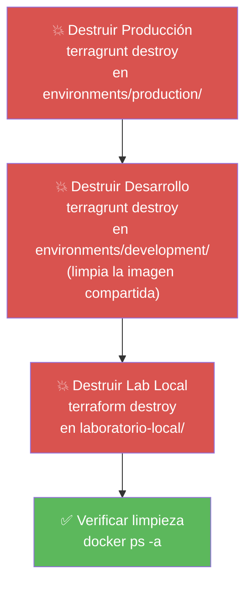

# 📖 RUNBOOK: IAC MASTERY — TERRAFORM & TERRAGRUNT


> **¿Para quién es este runbook?**  
> Para cualquier persona **sin experiencia previa** en infraestructura como código. Cada paso está explicado en detalle. Si sigues las instrucciones en orden, llegarás al final sin errores.

---

## 🗺️ Mapa de Ruta



---

## 📋 Prerequisitos

| Requisito | Versión mínima | Verificación |
|-----------|---------------|-------------|
| Sistema operativo | Ubuntu 20.04 LTS o superior | `lsb_release -a` |
| Acceso a Internet | Requerido | `curl -I https://google.com` |
| Usuario con `sudo` | Requerido | `sudo whoami` → debe responder `root` |

---

## 🔧 Fase 0 — Instalación Automatizada del Entorno

> **Concepto clave — Script idempotente:**  
> Un script idempotente puede ejecutarse cien veces sin romper nada. Si una herramienta ya está instalada, la detecta y la omite. Si no está, la instala. Nunca duplica ni corrompe.

### Paso 0.1 — Crear la estructura de carpetas del laboratorio

```bash
mkdir -p ~/sre-linux-mastery/Fase2
cd ~/sre-linux-mastery/Fase2
```

### Paso 0.2 — Crear el script de instalación

```bash
cat > bootstrap.sh << 'EOF'
#!/bin/bash
set -e  # Si cualquier comando falla, el script se detiene inmediatamente

echo "================================================================="
echo "🚀 INICIALIZANDO ENTORNO IAC - SRE MASTER"
echo "================================================================="

# 1. Actualizar repositorios
sudo apt-get update -y

# 2. Instalar dependencias base
sudo apt-get install -y curl gnupg software-properties-common unzip jq

# 3. Docker — instalación idempotente
if ! command -v docker &> /dev/null; then
    echo "🐳 Instalando Docker Engine..."
    sudo mkdir -p /etc/apt/keyrings
    curl -fsSL https://download.docker.com/linux/ubuntu/gpg \
        | sudo gpg --dearmor -o /etc/apt/keyrings/docker.gpg
    echo \
        "deb [arch=$(dpkg --print-architecture) signed-by=/etc/apt/keyrings/docker.gpg] \
        https://download.docker.com/linux/ubuntu $(lsb_release -cs) stable" \
        | sudo tee /etc/apt/sources.list.d/docker.list > /dev/null
    sudo apt-get update -y
    sudo apt-get install -y docker-ce docker-ce-cli containerd.io docker-compose-plugin
    sudo usermod -aG docker "$USER"
    echo "✅ Docker instalado. IMPORTANTE: cierra y vuelve a abrir tu terminal."
else
    echo "✅ Docker ya instalado: $(docker --version)"
fi

# 4. Terraform — instalación idempotente
if ! command -v terraform &> /dev/null; then
    echo "💜 Instalando Terraform..."
    curl -fsSL https://apt.releases.hashicorp.com/gpg \
        | sudo gpg --dearmor -o /usr/share/keyrings/hashicorp-archive-keyring.gpg
    echo \
        "deb [signed-by=/usr/share/keyrings/hashicorp-archive-keyring.gpg] \
        https://apt.releases.hashicorp.com $(lsb_release -cs) main" \
        | sudo tee /etc/apt/sources.list.d/hashicorp.list
    sudo apt-get update -y && sudo apt-get install terraform -y
else
    echo "✅ Terraform ya instalado: $(terraform --version)"
fi

# 5. Terragrunt — instalación idempotente
if ! command -v terragrunt &> /dev/null; then
    echo "💙 Instalando Terragrunt..."
    TG_VERSION=$(curl -s https://api.github.com/repos/gruntwork-io/terragrunt/releases/latest \
        | jq -r '.tag_name')
    curl -SL \
        "https://github.com/gruntwork-io/terragrunt/releases/download/${TG_VERSION}/terragrunt_linux_amd64" \
        -o /tmp/terragrunt
    sudo install -m 0755 /tmp/terragrunt /usr/local/bin/terragrunt
    rm /tmp/terragrunt
else
    echo "✅ Terragrunt ya instalado: $(terragrunt --version)"
fi

# 6. Infracost — instalación idempotente
if ! command -v infracost &> /dev/null; then
    echo "💰 Instalando Infracost..."
    curl -fsSL https://raw.githubusercontent.com/infracost/infracost/master/scripts/install.sh | sh
else
    echo "✅ Infracost ya instalado: $(infracost --version)"
fi

echo "================================================================="
echo "🎉 ¡SISTEMA BASE LISTO AL 100%!"
echo "================================================================="
EOF
```

### Paso 0.3 — Ejecutar el script

```bash
chmod +x bootstrap.sh
./bootstrap.sh
```

> ⚠️ **Si Docker fue recién instalado**, cierra la terminal completamente y vuelve a abrirla antes de continuar. Esto activa los permisos de grupo necesarios.

### Paso 0.4 — Verificar instalaciones

```bash
docker --version
terraform --version
terragrunt --version
infracost --version
```

✅ Si los cuatro comandos muestran versión, el entorno está listo.

### Paso 0.5 — Configurar cuenta de Infracost

Infracost necesita una API key gratuita para consultar precios reales de la nube.

```bash
# Inicia el proceso de login (generará un enlace en la terminal)
infracost auth login
```

> ⚠️ En entornos WSL o terminales sin navegador, el proceso se queda colgado. **Presiona `Ctrl + C`** para cancelarlo.

```bash
# El comando anterior imprimió una URL. Cópiala y ábrela en tu navegador.
# Regístrate con Google, GitHub o correo corporativo.
# En el dashboard, ve a: Org Settings → API Key → copia la clave.

# Inyecta tu API key (reemplaza TU_API_KEY por la clave copiada):
infracost configure set api_key TU_API_KEY

# Verifica que quedó configurada:
infracost configure get api_key
```

---

## 💜 Fase 1 — Terraform Local Inmutable

> **¿Qué es Terraform?**  
> Un motor declarativo: tú describes **qué** quieres (un servidor, un contenedor), y Terraform se encarga del **cómo** crearlo. Escribe código una vez; Terraform llama a la API del proveedor (Docker, AWS, Azure, etc.) por ti.



### Paso 1.1 — Crear la carpeta del laboratorio

```bash
mkdir -p ~/sre-linux-mastery/Fase2/iac-mastery/laboratorio-local
cd ~/sre-linux-mastery/Fase2/iac-mastery/laboratorio-local
```

### Paso 1.2 — Crear `providers.tf`

> **¿Por qué bloquear versiones?** Si el creador del plugin de Docker lanza una versión con cambios que rompen compatibilidad, tu infraestructura fallará al día siguiente. El operador `~> 3.0.1` permite solo parches de seguridad (3.0.2, 3.0.3...) pero bloquea cambios mayores.

```bash
cat > providers.tf << 'EOF'
terraform {
  required_version = ">= 1.5.0"

  required_providers {
    docker = {
      source  = "kreuzwerker/docker"
      version = "~> 3.0.1"
    }
  }
}

provider "docker" {
  host = "unix:///var/run/docker.sock"
}
EOF
```

### Paso 1.3 — Crear `main.tf`

> **¿Por qué `nginx:1.25.4-alpine` y no `nginx:latest`?**  
> `latest` es una trampa. Mañana puede apuntar a una versión diferente con bugs o cambios de comportamiento. Fijar la versión exacta garantiza que lo que funciona hoy funciona dentro de un año.

```bash
cat > main.tf << 'EOF'
resource "docker_image" "nginx_base" {
  name         = "nginx:1.25.4-alpine"
  keep_locally = true  # Al destruir el contenedor, conserva la imagen en disco
}

resource "docker_container" "servidor_estatico" {
  name  = "servidor-web-clase"
  image = docker_image.nginx_base.image_id

  ports {
    internal = 80    # Puerto dentro del contenedor
    external = 8080  # Puerto en tu máquina local
  }
}
EOF
```

### Paso 1.4 — Ciclo de vida de Terraform



```bash
# 1. Inicializar: descarga el plugin de Docker
terraform init

# 2. Planificar: ver qué se va a crear (sin crear nada aún)
terraform plan

# 3. Aplicar: crear el contenedor
terraform apply -auto-approve
```

### Paso 1.5 — Verificar el resultado

```bash
docker ps
```

Abre tu navegador en **http://localhost:8080** — debes ver la página de bienvenida de Nginx.

---

## 💰 Fase 2 — FinOps & Auditoría de Costos con Infracost

> **¿Qué es FinOps?**  
> Una cultura de ingeniería financiera en la nube. En lugar de ver la factura a fin de mes con sorpresas, Infracost te dice cuánto costará **antes** de crear los recursos.



### Paso 2.1 — Crear el directorio de simulación

```bash
mkdir -p ~/sre-linux-mastery/Fase2/iac-mastery/preview-costos
cd ~/sre-linux-mastery/Fase2/iac-mastery/preview-costos
```

### Paso 2.2 — Crear archivo de simulación de recursos AWS

> Este archivo **no se desplegará en AWS**. Solo se usa para que Infracost lo lea y calcule el costo. No necesitas credenciales de AWS para ejecutar Infracost.

```bash
cat > cloud_preview.tf << 'EOF'
terraform {
  required_providers {
    aws = {
      source  = "hashicorp/aws"
      version = "~> 5.0"
    }
  }
}

provider "aws" {
  region = "us-east-1"
}

# Servidor de cómputo intensivo
resource "aws_instance" "nodo_computo" {
  ami           = "ami-0c55b159cbfafe1f0"
  instance_type = "c6i.4xlarge"
}

# Disco de alta velocidad (io2 es el más caro)
resource "aws_ebs_volume" "almacenamiento_rapido" {
  availability_zone = "us-east-1a"
  size              = 500
  type              = "io2"
  iops              = 3000
}
EOF
```

### Paso 2.3 — Ejecutar la auditoría financiera

```bash
# Ver resumen en terminal
infracost breakdown --path .

# Exportar reporte detallado en JSON para presentar a finanzas
infracost breakdown --path . --format json --out-file reporte_costos.json
```

> 💡 **Uso profesional:** En empresas grandes, Infracost se integra en GitHub Actions / GitLab CI para **bloquear automáticamente** un Pull Request si el costo supera el presupuesto aprobado.

---

## 💙 Fase 3 — Terragrunt & Arquitectura Multi-Ambiente DRY

> **El problema que resuelve Terragrunt:**  
> Si tienes entornos de Desarrollo, Staging y Producción con Terraform puro, copias y pegas el mismo código tres veces. Un error de seguridad se multiplica por tres. Un cambio requiere editar tres archivos.  
> Terragrunt aplica el principio **DRY (Don't Repeat Yourself)**: un solo molde, múltiples instancias.



### Paso 3.1 — Crear la estructura de carpetas completa

```bash
mkdir -p ~/sre-linux-mastery/Fase2/iac-mastery/infra-estructurada/modules/contenedor-base
mkdir -p ~/sre-linux-mastery/Fase2/iac-mastery/infra-estructurada/environments/development
mkdir -p ~/sre-linux-mastery/Fase2/iac-mastery/infra-estructurada/environments/production
```

La estructura final se verá así:

```
📂 infra-estructurada/
├── 📂 modules/
│   └── 📂 contenedor-base/       ← El molde (Terraform puro, sin valores fijos)
│       ├── variables.tf
│       └── main.tf
└── 📂 environments/
    ├── 📂 development/
    │   └── terragrunt.hcl        ← Inyecta valores de Desarrollo
    └── 📂 production/
        └── terragrunt.hcl        ← Inyecta valores de Producción
```

### Paso 3.2 — Crear el módulo base (`variables.tf`)

```bash
cat > ~/sre-linux-mastery/Fase2/iac-mastery/infra-estructurada/modules/contenedor-base/variables.tf << 'EOF'
variable "nombre_contenedor" {
  type        = string
  description = "Identificador único del contenedor en Docker"
}

variable "puerto_externo" {
  type        = number
  description = "Puerto del host (tu máquina) que se mapea al puerto 80 del contenedor"
}
EOF
```

### Paso 3.3 — Crear el módulo base (`main.tf`)

```bash
cat > ~/sre-linux-mastery/Fase2/iac-mastery/infra-estructurada/modules/contenedor-base/main.tf << 'EOF'
terraform {
  required_providers {
    docker = {
      source  = "kreuzwerker/docker"
      version = "~> 3.0.1"
    }
  }
}

resource "docker_image" "nginx_prod" {
  name         = "nginx:1.25.4-alpine"
  keep_locally = true
}

resource "docker_container" "app" {
  image = docker_image.nginx_prod.image_id
  name  = var.nombre_contenedor

  ports {
    internal = 80
    external = var.puerto_externo
  }
}
EOF
```

### Paso 3.4 — Crear configuración de Desarrollo

```bash
cat > ~/sre-linux-mastery/Fase2/iac-mastery/infra-estructurada/environments/development/terragrunt.hcl << 'EOF'
terraform {
  source = "../../modules/contenedor-base"
}

inputs = {
  nombre_contenedor = "web-entorno-dev"
  puerto_externo    = 8081
}
EOF
```

### Paso 3.5 — Crear configuración de Producción

```bash
cat > ~/sre-linux-mastery/Fase2/iac-mastery/infra-estructurada/environments/production/terragrunt.hcl << 'EOF'
terraform {
  source = "../../modules/contenedor-base"
}

inputs = {
  nombre_contenedor = "web-entorno-prod"
  puerto_externo    = 8082
}
EOF
```

### Paso 3.6 — Desplegar ambos ambientes

```bash
# Desplegar Desarrollo
cd ~/sre-linux-mastery/Fase2/iac-mastery/infra-estructurada/environments/development/
terragrunt apply -auto-approve

# Desplegar Producción
cd ../production/
terragrunt apply -auto-approve
```

### Paso 3.7 — Verificar que ambos ambientes conviven

```bash
docker ps --format "table {{.ID}}\t{{.Names}}\t{{.Ports}}"
```

**Salida esperada:**

```
CONTAINER ID   NAMES              PORTS
62eb47e09ed1   web-entorno-prod   0.0.0.0:8082->80/tcp
6d92850c6098   web-entorno-dev    0.0.0.0:8081->80/tcp
```

- Desarrollo → http://localhost:8081  
- Producción → http://localhost:8082

---

## 💥 Fase 4 — Destrucción Controlada

> **¿Por qué importa el orden?**  
> Ambos ambientes comparten la misma imagen base de Docker (`nginx:1.25.4-alpine`). Si destruyes uno mientras el otro sigue corriendo, Docker no puede eliminar la imagen compartida y lanza un error de conflicto.  
> La solución: destruir todos los contenedores **antes** de que el último intente borrar la imagen.



### Runbook de cierre (ejecutar en orden)

```bash
# 1. Destruir Producción
cd ~/sre-linux-mastery/Fase2/iac-mastery/infra-estructurada/environments/production/
terragrunt destroy -auto-approve

# 2. Destruir Desarrollo (también limpia la imagen Docker compartida)
cd ../development/
terragrunt destroy -auto-approve

# 3. Destruir el laboratorio local de Fase 1
cd ~/sre-linux-mastery/Fase2/iac-mastery/laboratorio-local/
terraform destroy -auto-approve

# 4. Verificar que no queda ningún contenedor activo
docker ps -a
```

**Salida esperada después de la limpieza:**

```
CONTAINER ID   IMAGE   COMMAND   CREATED   STATUS   PORTS   NAMES
(vacío)
```

---

## 🏛️ Referencia Rápida — Conceptos Clave

### Comandos Terraform

| Comando | ¿Qué hace? | ¿Cuándo usarlo? |
|---------|-----------|----------------|
| `terraform init` | Descarga plugins al directorio `.terraform/` | Primera vez en cada directorio nuevo |
| `terraform plan` | Muestra los cambios sin aplicarlos | Siempre antes de `apply` |
| `terraform apply -auto-approve` | Aplica los cambios en la infraestructura | Para crear o actualizar recursos |
| `terraform destroy -auto-approve` | Elimina todos los recursos del estado | Para limpiar el laboratorio |

### Comandos Terragrunt

| Comando | ¿Qué hace? |
|---------|-----------|
| `terragrunt apply -auto-approve` | Igual que `terraform apply`, pero con orquestación DRY |
| `terragrunt destroy -auto-approve` | Igual que `terraform destroy`, pero en el contexto de Terragrunt |

### Backend: Local vs Remoto

| Característica | Backend Local | Backend Remoto (S3 / Blob) |
|---------------|--------------|---------------------------|
| Colaboración en equipo | ❌ Imposible | ✅ Centralizado |
| Seguridad del estado | ❌ Expuesto en disco | ✅ Encriptado en reposo |
| Acceso concurrente | ❌ Corrompe el estado | ✅ State Locking con DynamoDB |
| Recuperación ante fallos | ❌ Se pierde con el disco | ✅ Versionado con historial |

> 🎓 **Para este laboratorio usamos backend local.** En entornos corporativos, el backend remoto es **obligatorio**.

---

## 🐛 Resolución de Errores Comunes

### Error: `permission denied` al ejecutar Docker

```bash
# El usuario no pertenece al grupo docker
sudo usermod -aG docker "$USER"
# Cerrar sesión y volver a entrar, luego verificar:
groups
```

### Error: `Unable to remove Docker image: conflict`

Significa que intentaste destruir un ambiente mientras otro sigue usando la misma imagen.  
**Solución:** Sigue estrictamente el orden de la Fase 4 — destruye Producción antes que Desarrollo.

### Error: `Error: Error pinging Docker server`

El servicio de Docker no está corriendo.

```bash
sudo systemctl start docker
sudo systemctl status docker
```

### Error al configurar Infracost en WSL

El flujo automático `infracost auth login` no puede abrir el navegador en WSL.  
**Solución:** Usa el método manual del Paso 0.5 de este runbook.

---

*Runbook generado para uso educativo — Enfoque SRE · Terraform & Terragrunt · De Cero a Elite*

