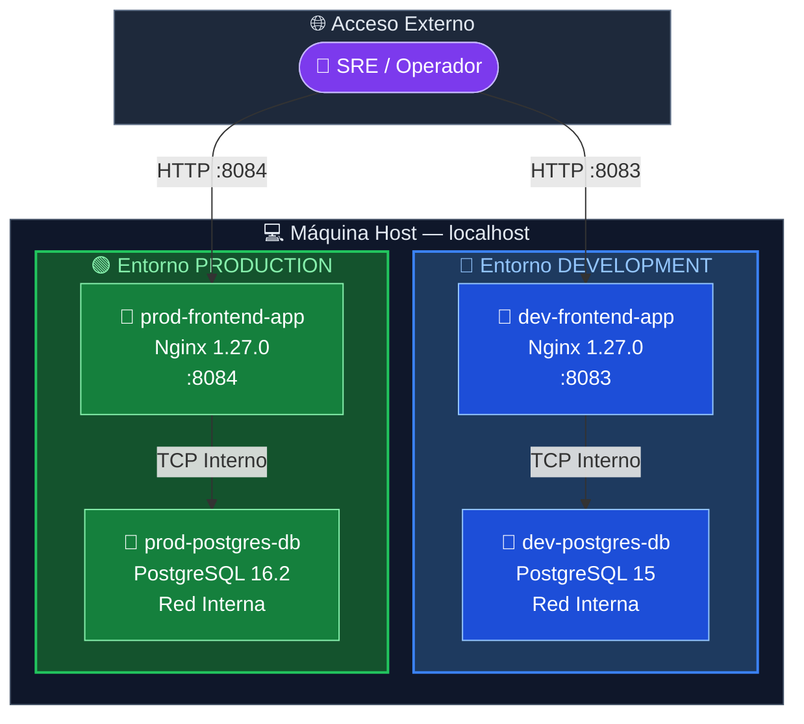
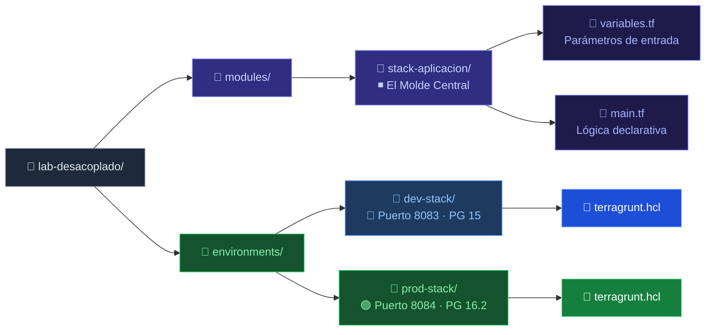
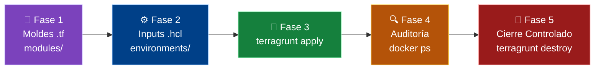
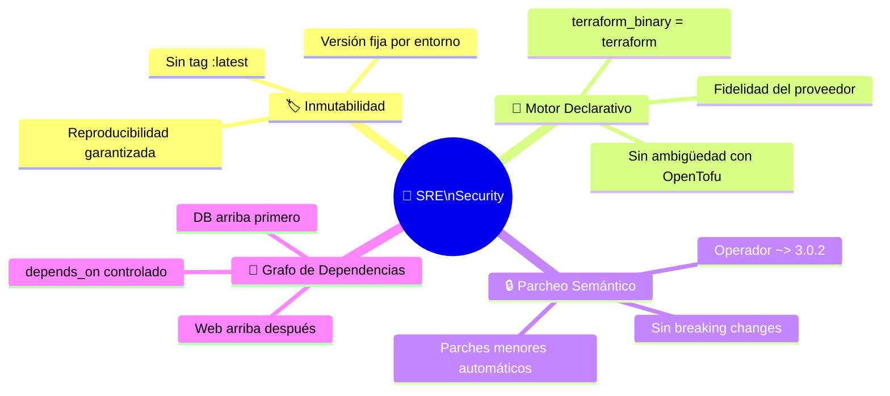
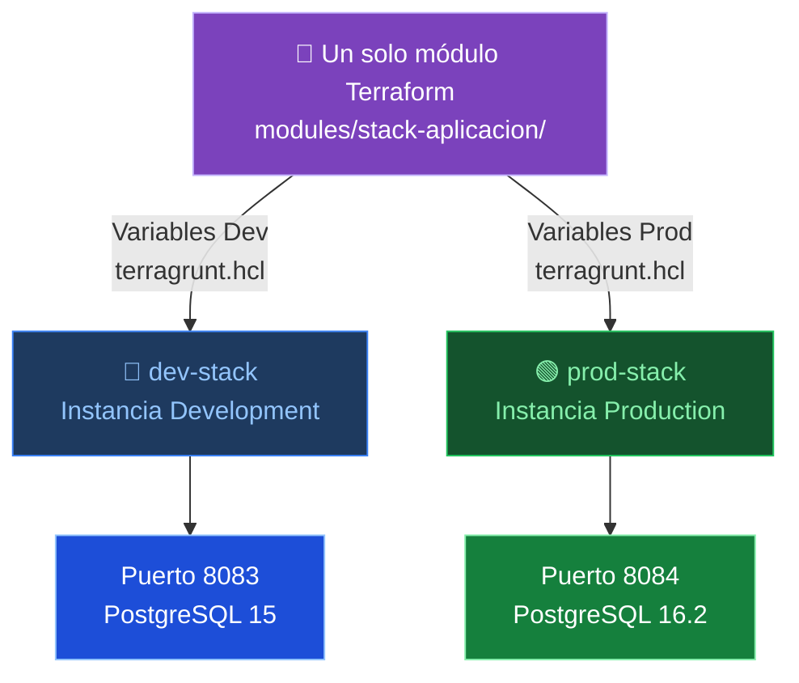

<div align="center">

# 🚀 Lab · Arquitectura Multi-Ambiente Desacoplada

### Tier-2 Topology con Terraform + Terragrunt + Docker

<br/>


<br/>

> **Objetivo:** Desplegar dos entornos completamente aislados (`dev` y `prod`) con Nginx + PostgreSQL,  
> sin duplicar código — aplicando el principio **DRY** a través de **Terragrunt**.

</div>

---

## 📐 Arquitectura del Sistema



> Cada entorno vive en su propia **red Docker aislada** — nunca comparten tráfico interno.

---

## 🗂️ Estructura del Repositorio



---

## ⚡ Flujo de Ejecución



---

## 🛠️ Guía de Uso Rápido

### 1️⃣ Desplegar Entorno de Desarrollo

```bash
cd environments/dev-stack/
terragrunt apply -auto-approve
```

### 2️⃣ Desplegar Entorno de Producción

```bash
cd environments/prod-stack/
terragrunt apply -auto-approve
```

### 3️⃣ Verificar Aislamiento

```bash
# Ver contenedores activos con imágenes y puertos
docker ps --format "table {{.Names}}\t{{.Image}}\t{{.Ports}}"

# Confirmar redes aisladas
docker network ls | grep -E "dev|prod"
```

### 4️⃣ Desmantelamiento Ordenado

> ⚠️ **Destruir en orden descendente** para evitar bloqueos por dependencias compartidas.

```bash
# Primero: Producción
cd environments/prod-stack/
terragrunt destroy -auto-approve

# Después: Desarrollo
cd ../dev-stack/
terragrunt destroy -auto-approve
```

---

## 🛡️ Controles de Seguridad SRE



---

## 📊 Comparativa de Entornos

| Parámetro            | 🔵 Development          | 🟢 Production           |
|----------------------|-------------------------|-------------------------|
| **Puerto Externo**   | `8083`                  | `8084`                  |
| **Frontend**         | Nginx `1.27.0`          | Nginx `1.27.0`          |
| **Base de Datos**    | PostgreSQL `15`         | PostgreSQL `16.2`       |
| **Red Docker**       | `dev-network` (aislada) | `prod-network` (aislada)|
| **Prefijo recursos** | `dev-`                  | `prod-`                 |
| **Código Terraform** | ♻️ Módulo compartido    | ♻️ Módulo compartido    |

---

## 💡 Filosofía DRY en Acción



> Un único módulo `main.tf` → N entornos distintos. **Cero duplicación de código.**

---

<div align="center">

**Módulo 2 — Orquestación Avanzada Multi-Tier**


</div>

