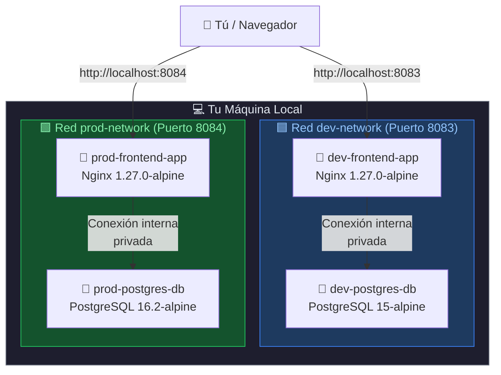
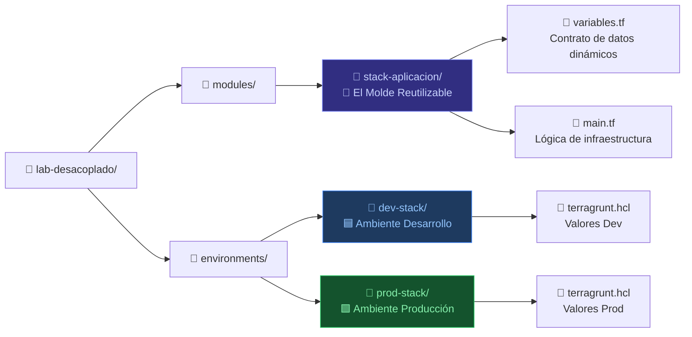
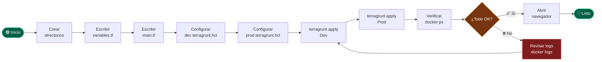
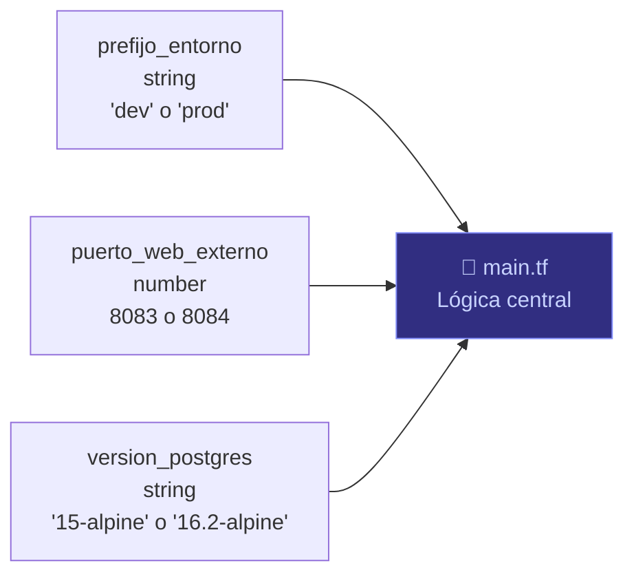
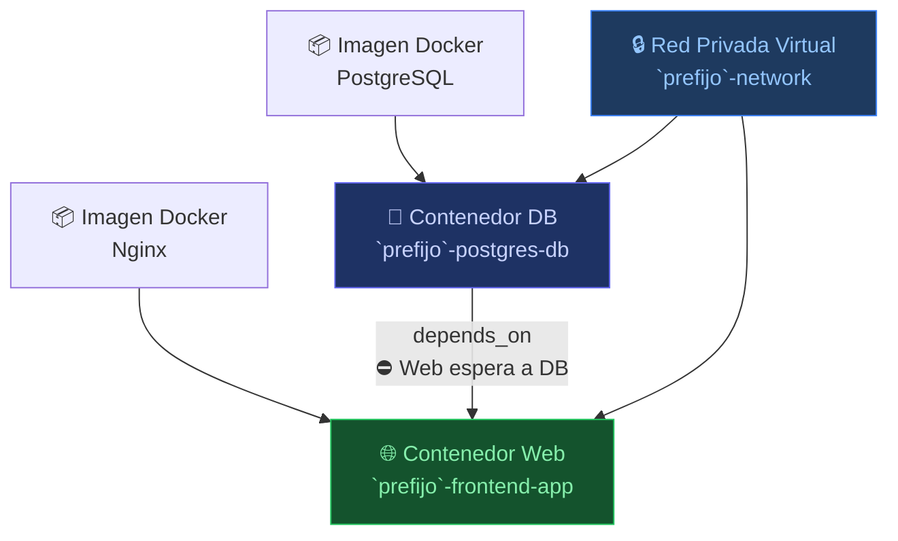
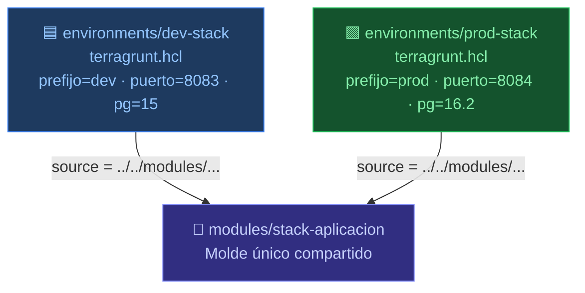
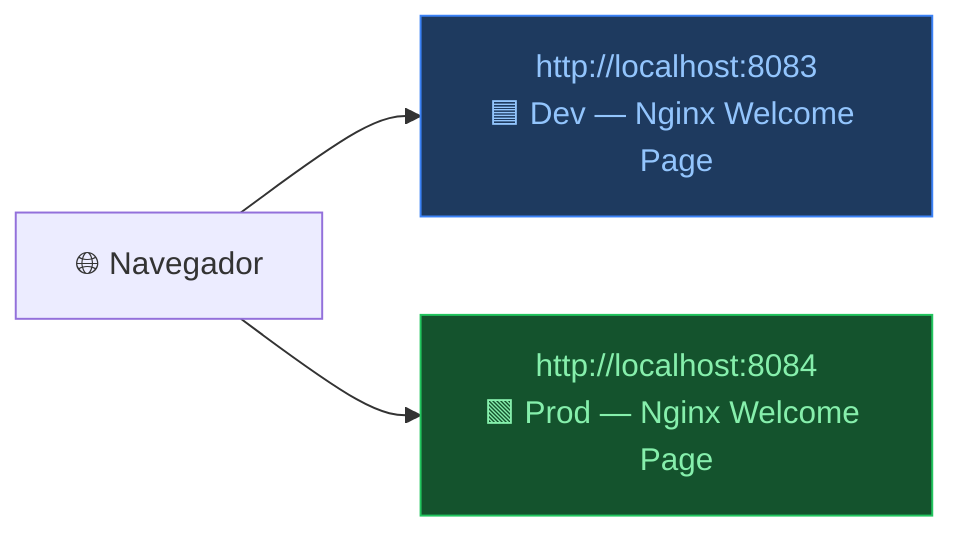
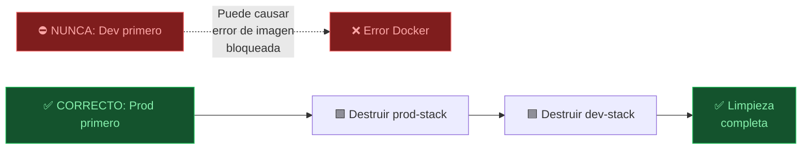

# 🚀 RUNBOOK: ARQUITECTURA MULTI-AMBIENTE DESACOPLADA
### Tier-2 Topology · Frontend Web + Base de Datos Relacional · Nivel: Principiante

> **¿Qué vas a lograr?** Desplegar **dos ambientes independientes** (Dev y Prod) con un frontend Nginx y una base de datos PostgreSQL, cada uno en su propia red privada Docker, usando un solo molde de código reutilizable.  
> **Tiempo estimado:** 30–45 min · **Prerrequisitos:** Docker, Terraform ≥ 1.5.0, Terragrunt instalados.

---

## 🗺️ MAPA MENTAL DE LA ARQUITECTURA



> 💡 **Clave:** Cada ambiente tiene su **propia red aislada**. Dev y Prod no pueden "verse" entre sí. Si Dev cae, Prod sigue intacto.

---

## 📁 ESTRUCTURA DEL PROYECTO



---

## ⚡ FLUJO COMPLETO DE TRABAJO



---

## 🧱 FASE 1 — Crear la Estructura de Directorios

> 📌 **Qué hace:** Crea todas las carpetas del proyecto de una sola vez.

```bash
mkdir -p ~/sre-linux-mastery/Fase2/iac-mastery/lab-desacoplado/modules/stack-aplicacion
mkdir -p ~/sre-linux-mastery/Fase2/iac-mastery/lab-desacoplado/environments/dev-stack
mkdir -p ~/sre-linux-mastery/Fase2/iac-mastery/lab-desacoplado/environments/prod-stack
```

**✅ Verificación:** Confirma que las carpetas existen:
```bash
tree ~/sre-linux-mastery/Fase2/iac-mastery/lab-desacoplado/
```

---

## 🧩 FASE 2 — Construir el Molde Base (Terraform)

> 📌 **Concepto clave:** El módulo es un **molde reutilizable**. No sabe si es Dev o Prod. Eso lo decide Terragrunt más adelante.

### 2.1 · `variables.tf` — El Contrato de Datos



```bash
cd ~/sre-linux-mastery/Fase2/iac-mastery/lab-desacoplado/modules/stack-aplicacion

cat > variables.tf << 'EOF'
variable "prefijo_entorno" {
  type        = string
  description = "Prefijo para identificar y aislar el entorno (ej: dev o prod)"
}

variable "puerto_web_externo" {
  type        = number
  description = "Puerto físico de tu PC para mapear la salida de la aplicación web"
}

variable "version_postgres" {
  type        = string
  description = "Versión fija del motor PostgreSQL para evitar deuda técnica"
}
EOF
```

---

### 2.2 · `main.tf` — La Lógica de Infraestructura

> 📌 **Orden de creación de recursos:** Terraform respeta dependencias automáticamente.



```bash
cat > main.tf << 'EOF'
terraform {
  required_version = ">= 1.5.0"
  required_providers {
    docker = {
      source  = "kreuzwerker/docker"
      version = "~> 3.0.2"
    }
  }
}

# ── 1. Red Privada Aislada por Entorno ──────────────────────────────────────
resource "docker_network" "red_privada" {
  name = "${var.prefijo_entorno}-network"
}

# ── 2. Imágenes Base (inmutables, protegidas contra CVEs) ───────────────────
resource "docker_image" "postgres_img" {
  name         = "postgres:${var.version_postgres}"
  keep_locally = true
}

resource "docker_image" "nginx_img" {
  name         = "nginx:1.27.0-alpine"
  keep_locally = true
}

# ── 3. Base de Datos PostgreSQL ─────────────────────────────────────────────
resource "docker_container" "db_server" {
  name  = "${var.prefijo_entorno}-postgres-db"
  image = docker_image.postgres_img.image_id

  env = [
    "POSTGRES_PASSWORD=SreMasterSecretPass",
    "POSTGRES_USER=sre_admin",
    "POSTGRES_DB=telemetria_db"
  ]

  networks_advanced {
    name = docker_network.red_privada.name
  }
}

# ── 4. Frontend Nginx ────────────────────────────────────────────────────────
resource "docker_container" "web_server" {
  name  = "${var.prefijo_entorno}-frontend-app"
  image = docker_image.nginx_img.image_id

  networks_advanced {
    name = docker_network.red_privada.name
  }

  ports {
    internal = 80
    external = var.puerto_web_externo
  }

  # ✅ BUENA PRÁCTICA: La web NO arranca hasta que la DB esté lista
  depends_on = [docker_container.db_server]
}
EOF
```

---

## 💙 FASE 3 — Orquestación Multi-Ambiente (Terragrunt)

> 📌 **Concepto DRY:** "Don't Repeat Yourself". Un solo molde, múltiples ambientes. Terragrunt **inyecta** los valores correctos según el ambiente.



### 3.1 · Ambiente Dev

```bash
cd ~/sre-linux-mastery/Fase2/iac-mastery/lab-desacoplado/environments/dev-stack

cat > terragrunt.hcl << 'EOF'
# 🛡️ Control defensivo: bloquea OpenTofu, solo Terraform oficial
terraform_binary = "terraform"

terraform {
  source = "../../modules/stack-aplicacion"
}

inputs = {
  prefijo_entorno    = "dev"
  puerto_web_externo = 8083          # Puerto de pruebas local
  version_postgres   = "15-alpine"   # Postgres v15 ligero
}
EOF
```

### 3.2 · Ambiente Prod

```bash
cd ~/sre-linux-mastery/Fase2/iac-mastery/lab-desacoplado/environments/prod-stack

cat > terragrunt.hcl << 'EOF'
# 🛡️ Control defensivo: bloquea OpenTofu, solo Terraform oficial
terraform_binary = "terraform"

terraform {
  source = "../../modules/stack-aplicacion"
}

inputs = {
  prefijo_entorno    = "prod"
  puerto_web_externo = 8084            # Puerto corporativo producción
  version_postgres   = "16.2-alpine"   # Postgres v16.2 auditado empresarial
}
EOF
```

---

## 🚀 FASE 4 — Despliegue

> ⚠️ **Ejecuta en este orden exacto.** Dev primero, Prod segundo.

### 4.1 · Desplegar Dev

```bash
cd ~/sre-linux-mastery/Fase2/iac-mastery/lab-desacoplado/environments/dev-stack
terragrunt apply -auto-approve
```

**Qué verás en consola (resumen):**
```
Terraform will perform the following actions:
  + docker_network.red_privada       → dev-network
  + docker_image.postgres_img        → postgres:15-alpine
  + docker_image.nginx_img           → nginx:1.27.0-alpine
  + docker_container.db_server       → dev-postgres-db
  + docker_container.web_server      → dev-frontend-app

Apply complete! Resources: 5 added, 0 changed, 0 destroyed.
```

### 4.2 · Desplegar Prod

```bash
cd ../prod-stack
terragrunt apply -auto-approve
```

---

## 🔍 FASE 5 — Auditoría y Verificación

### 5.1 · Verificar contenedores activos

```bash
docker ps --format "table {{.Names}}\t{{.Image}}\t{{.Ports}}"
```

**Salida esperada:**

| NAMES | IMAGE | PORTS |
|---|---|---|
| `prod-frontend-app` | `nginx:1.27.0-alpine` | `0.0.0.0:8084->80/tcp` |
| `prod-postgres-db` | `postgres:16.2-alpine` | — |
| `dev-frontend-app` | `nginx:1.27.0-alpine` | `0.0.0.0:8083->80/tcp` |
| `dev-postgres-db` | `postgres:15-alpine` | — |

### 5.2 · Verificar redes aisladas

```bash
docker network ls | grep -E "dev|prod"
```

**Salida esperada:**
```
xxxxxxxx   dev-network    bridge    local
yyyyyyyy   prod-network   bridge    local
```

### 5.3 · Verificar en el navegador



> ✅ Si ves la página de bienvenida de Nginx en ambos puertos, **¡el despliegue fue exitoso!**

---

## 💥 FASE 6 — Destrucción Controlada

> ⚠️ **CRÍTICO: Orden obligatorio Prod → Dev.**  
> Ambos ambientes comparten la imagen `nginx:1.27.0-alpine` localmente. Si destruyes Dev primero, Docker puede intentar eliminar la imagen mientras Prod aún la usa, generando un **conflicto de bloqueo**.



```bash
# ── PASO 1: Destruir Producción ──────────────────────────────────────────────
cd ~/sre-linux-mastery/Fase2/iac-mastery/lab-desacoplado/environments/prod-stack
terragrunt destroy -auto-approve

# ── PASO 2: Destruir Desarrollo (elimina imagen Nginx compartida) ────────────
cd ../dev-stack
terragrunt destroy -auto-approve
```

---

## 📊 TABLA DE REFERENCIA RÁPIDA

| Contexto | Comando | Qué hace |
|---|---|---|
| 🔒 **Aislamiento** | `terraform_binary = "terraform"` | Bloquea OpenTofu, solo binario oficial |
| 🚀 **Despliegue** | `terragrunt apply -auto-approve` | Descarga provider, inyecta variables, crea recursos |
| 💥 **Destrucción** | `terragrunt destroy -auto-approve` | Elimina recursos en orden inverso al grafo |
| 🔍 **Auditoría** | `docker ps --format ...` | Valida contenedores activos y puertos |
| 🔬 **Logs DB** | `docker logs dev-postgres-db` | Inspecciona el arranque de PostgreSQL |
| 🌐 **Logs Web** | `docker logs dev-frontend-app` | Inspecciona el arranque de Nginx |

---

## 🆘 RESOLUCIÓN DE PROBLEMAS COMUNES

| Síntoma | Causa probable | Solución |
|---|---|---|
| `Error: port already in use` | Otro proceso usa el puerto 8083/8084 | `lsof -i :8083` → matar proceso |
| `Error: image not found` | Sin acceso a Docker Hub | Verificar conexión: `docker pull nginx:1.27.0-alpine` |
| Página no carga en navegador | Contenedor no corriendo | `docker ps` → verificar estado |
| `terraform: command not found` | Terraform no instalado o no en PATH | Verificar: `which terraform` |
| `Error acquiring the state lock` | Estado de Terraform bloqueado | `terragrunt force-unlock <ID>` |

---

> 🏛️ **Runbook Estándar Corporativo** · Arquitectura Desacoplada Tier-2 · SRE Mastery  
> *Diseñado para aprendizaje acelerado desde cero — cualquier persona puede completar este ejercicio sin ayuda externa.*

