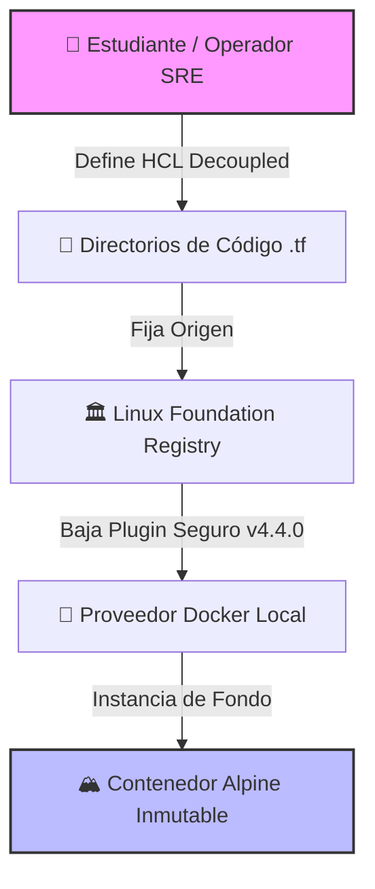

# 🟣 INTRODUCCIÓN A OPENTOFU
## Orquestación de Infraestructura Inmutable Local

<div align="center">


</div>

---

## 🎯 Objetivo del Laboratorio

> El propósito de este ejercicio es introducir al estudiante en el uso, configuración y despliegue de infraestructura utilizando **OpenTofu** como alternativa *open-source* nativa dentro del flujo de trabajo de un **Site Reliability Engineer (SRE)**.

A través de esta práctica se comprenderá:
- El comportamiento de proveedores independientes
- La estructura de código modular multi-archivo
- El aislamiento de entornos locales dentro del mismo espacio de trabajo en WSL

---

## 🗺️ Mapa Arquitectónico



---

## 💡 ¿Por Qué OpenTofu? — Core Teórico

| # | Concepto | Descripción |
|---|----------|-------------|
| 🔓 | **Licencia Verdaderamente Abierta** | Tras el cambio de Terraform a BUSL, OpenTofu nace bajo la Linux Foundation para garantizar un motor de IaC libre y comunitario |
| 🔐 | **Validación Estricta de Seguridad** | Implementa control riguroso de firmas criptográficas para mitigar ataques de cadena de suministro *(Supply Chain Attacks)* |
| 🔁 | **Compatibilidad HCL Drop-in** | Mantiene compatibilidad total con la sintaxis tradicional, permitiendo migraciones transparentes de código preexistente |

---

## 📁 Estructura Multi-Archivo del Proyecto

```
lab-tofu-profesional/
├── 📄 providers.tf       ← Versión mínima de OpenTofu + origen criptográfico del proveedor Docker
├── 📄 variables.tf       ← Firmas y tipados de los parámetros de entrada
├── 📄 terraform.tfvars   ← Valores reales de producción (nombres y etiquetas de versión)
├── 📄 main.tf            ← Recursos lógicos: imagen Alpine + configuración del contenedor
└── 📄 outputs.tf         ← Metadatos finales calculados tras el despliegue exitoso
```

> ⚠️ La separación de responsabilidades entre archivos es un **estándar en la industria SRE**.

---

## 🚀 Guía de Ejecución Paso a Paso

### `Paso 1` — Acceso al Espacio de Trabajo Dedicado

> Para mitigar el fenómeno de **Configuration Drift** (Deriva de Configuración), navegue hacia la carpeta aislada del ejercicio.

```bash
cd ~/sre-linux-mastery/Fase2/iac-mastery/laboratorio-local/ejercicio-opentofu/lab-tofu-profesional
```

---

### `Paso 2` — Análisis de la Estructura Multi-Archivo

Audite los archivos fuente presentes en el directorio:

```bash
ls -la
```

---

### `Paso 3` — Inicialización del Motor de IaC


Descargue las dependencias e inicialice los llaveros criptográficos de seguridad locales.

```bash
tofu init
```

---

### `Paso 4` — Aseguramiento de Calidad Estética y Lógica


```bash
# ✅ Corrige la alineación e identación del código de forma automática
tofu fmt

# ✅ Valida que los argumentos y tipos de variables sean lógicamente correctos
tofu validate
```

---

### `Paso 5` — Generación del Plano Cerrado *(Práctica SRE Enterprise)*


> 🛑 **Nunca ejecute un despliegue directo a ciegas.** Genere un archivo de plan binario para **congelar el plano de ejecución** y asegurar idempotencia pura.

```bash
tofu plan -out=despliegue_seguro.tfplan
```

---

### `Paso 6` — Despliegue de la Infraestructura Inmutable


```bash
tofu apply "despliegue_seguro.tfplan"
```

---

### `Paso 7` — Auditoría y Verificación de Procesos en Vivo


```bash
# 📊 Imprimir las variables de salida en consola
tofu output

# 🐳 Listar contenedores activos filtrando por el nombre asignado
docker ps --filter "name=servidor_seguro_alpine"
```

---

## ✅ Conclusiones Clave del Aprendizaje

Al finalizar este laboratorio, el estudiante habrá asimilado los siguientes conceptos operativos de un SRE:

```
┌─────────────────────────────────────────────────────────────────┐
│  🗂️  Aislamiento a nivel de Directorio                          │
│      OpenTofu descarga y administra plugins internamente        │
│      sin interferir con proyectos anteriores de Terraform       │
├─────────────────────────────────────────────────────────────────┤
│  🔒  Ciclo de Vida Controlado                                    │
│      Valor de la bandera -out para evitar mutaciones            │
│      inesperadas en ambientes concurrentes                      │
├─────────────────────────────────────────────────────────────────┤
│  📋  Mantenimiento del Estado                                    │
│      terraform.tfstate actúa como la única fuente de verdad     │
│      (Single Source of Truth) del entorno local                 │
└─────────────────────────────────────────────────────────────────┘
```

---

<div align="center">

**Laboratorio desarrollado bajo el ecosistema de la** 

*Construido para el flujo de trabajo de un SRE moderno · OpenTofu v1.8.8 · Docker Provider v4.4.0*

</div>

