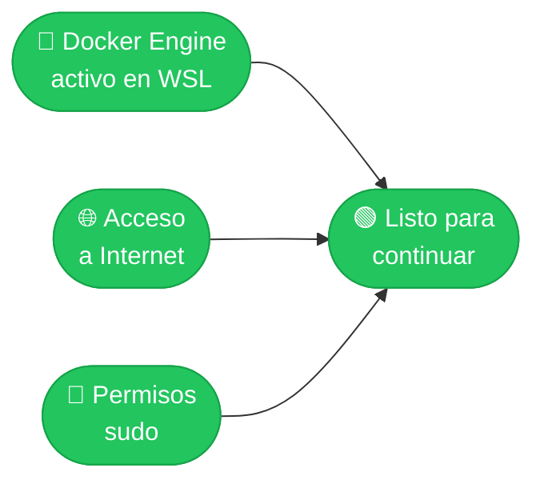
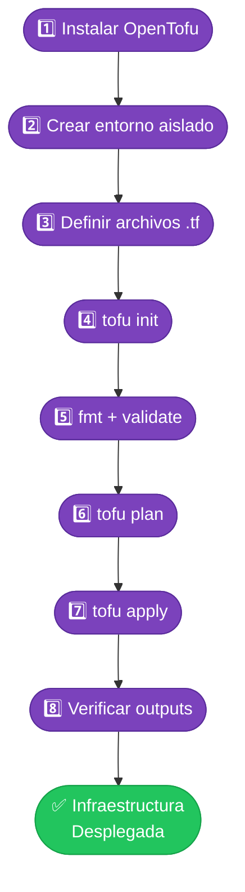
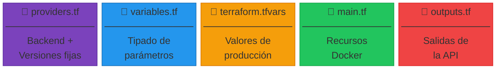
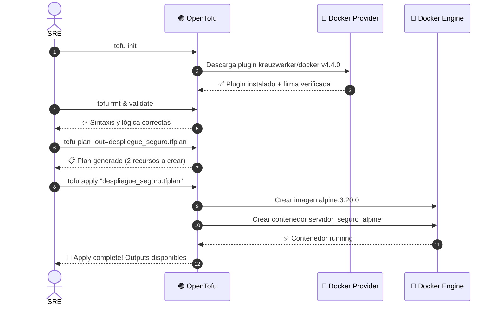
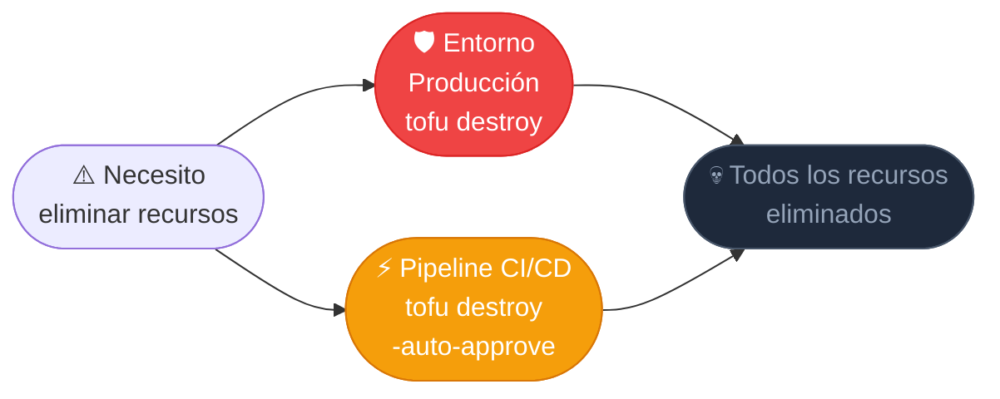

# 🚀 RUNBOOK: Despliegue de Infraestructura Local con OpenTofu

[](https://opentofu.org)
[](https://ubuntu.com)
[](https://docker.com)
[]()

> **Objetivo:** Procedimiento estándar para instalar, configurar y administrar infraestructura local con OpenTofu siguiendo buenas prácticas SRE — inmutabilidad, aislamiento y reproducibilidad garantizados.

---

## 📐 Arquitectura General

```mermaid
flowchart LR
    classDef tool fill:#7B42BC,stroke:#5B2D9C,color:#fff,rx:8
    classDef file fill:#2496ED,stroke:#1A6FB5,color:#fff,rx:8
    classDef action fill:#22C55E,stroke:#16A34A,color:#fff,rx:8
    classDef output fill:#F59E0B,stroke:#D97706,color:#fff,rx:8

    A(["🔧 Script\nIdempotente"]):::tool -->|instala| B(["⚙️ Binario\nOpenTofu v1.8.8"]):::tool
    B --> C(["📁 Estructura\nMulti-archivo .tf"]):::file
    C --> D(["🔄 tofu init"]):::action
    D --> E(["✅ fmt · validate"]):::action
    E --> F(["📋 tofu plan\n-out=.tfplan"]):::action
    F --> G(["🚀 tofu apply"]):::action
    G --> H(["🐳 docker_container\nalpine:3.20.0"]):::output
```



---

## ✅ Prerrequisitos



> Verificar Docker activo: `sudo service docker start`

---

## 📋 Flujo de Pasos



---

## 🔧 PASO 1 — Instalación Idempotente de OpenTofu

> Descarga directa desde GitHub Releases para evitar fallas de redirección CDN o índices APT desactualizados.

```bash
cat << 'EOF' > instalar_tofu_manual.sh
#!/bin/bash
set -e

ARCH=$(uname -m)
[ "$ARCH" = "x86_64" ]  && TOFU_ARCH="amd64"
[ "$ARCH" = "aarch64" ] && TOFU_ARCH="arm64"

VERSION="1.8.8"
FILENAME="tofu_${VERSION}_linux_${TOFU_ARCH}.tar.gz"
URL="https://github.com/opentofu/opentofu/releases/download/v${VERSION}/${FILENAME}"

rm -f /tmp/tofu_*
curl -L --fail -o "/tmp/${FILENAME}" "${URL}"
cd /tmp && tar -xzf "${FILENAME}" tofu
sudo mv tofu /usr/local/bin/tofu && sudo chmod +x /usr/local/bin/tofu

tofu --version && echo "✅ OpenTofu instalado con éxito!"
EOF

chmod +x instalar_tofu_manual.sh && ./instalar_tofu_manual.sh
```

---

## 📁 PASO 2 — Entorno Aislado de Trabajo

```bash
mkdir -p ~/sre-linux-mastery/Fase2/iac-mastery/laboratorio-local/ejercicio-opentofu/lab-tofu-profesional
cd ~/sre-linux-mastery/Fase2/iac-mastery/laboratorio-local/ejercicio-opentofu/lab-tofu-profesional
```

---

## 🗂️ PASO 3 — Estructura Modular de Archivos



### 3.1 `providers.tf`
```hcl
terraform {
  required_version = ">= 1.8.0"
  required_providers {
    docker = {
      source  = "kreuzwerker/docker"
      version = "4.4.0"
    }
  }
}

provider "docker" {
  host = "unix:///var/run/docker.sock"
}
```

### 3.2 `variables.tf`
```hcl
variable "nombre_contenedor" {
  type        = string
  description = "Nombre descriptivo del contenedor en Docker"
}

variable "version_imagen_alpine" {
  type        = string
  description = "Versión fija de Alpine para garantizar inmutabilidad"
}
```

### 3.3 `terraform.tfvars`
```hcl
nombre_contenedor     = "servidor_seguro_alpine"
version_imagen_alpine = "3.20.0"
```

### 3.4 `main.tf`
```hcl
resource "docker_image" "alpine_image" {
  name         = "alpine:${var.version_imagen_alpine}"
  keep_locally = false
}

resource "docker_container" "alpine_container" {
  image   = docker_image.alpine_image.image_id
  name    = var.nombre_contenedor
  command = ["tail", "-f", "/dev/null"]
}
```

### 3.5 `outputs.tf`
```hcl
output "contenedor_id" {
  value       = docker_container.alpine_container.id
  description = "ID único generado por Docker"
}

output "nombre_contenedor_creado" {
  value       = docker_container.alpine_container.name
  description = "Nombre oficial asignado al contenedor"
}
```

---

## 🔄 PASOS 4–7 — Ciclo de Vida IaC



```bash
# Init
tofu init

# Quality Gate
tofu fmt && tofu validate

# Plan cerrado (práctica enterprise)
tofu plan -out=despliegue_seguro.tfplan

# Apply
tofu apply "despliegue_seguro.tfplan"
```

---

## 🔍 PASO 8 — Verificación Operativa

```bash
# Outputs de OpenTofu
tofu output

# Estado real en Docker
docker ps --filter "name=servidor_seguro_alpine"
```

**Salida esperada:**

```
contenedor_id              = "a3f9b..."
nombre_contenedor_creado   = "servidor_seguro_alpine"
```

---

## 🔥 Plan de Contingencia — Rollback



```bash
# 🛡️ Modo Seguro — pide confirmación manual
tofu destroy

# ⚡ Modo Automatizado — sin interacción (CI/CD únicamente)
tofu destroy -auto-approve
```

> ⚠️ **Usar `-auto-approve` exclusivamente en pipelines CI/CD o entornos de laboratorio. Nunca en producción manual.**

---

## 📊 Resumen de Comandos

| # | Comando | Propósito |
|---|---------|-----------|
| 1 | `tofu init` | Inicializa backend y descarga providers |
| 2 | `tofu fmt` | Formatea archivos HCL automáticamente |
| 3 | `tofu validate` | Valida consistencia lógica |
| 4 | `tofu plan -out=*.tfplan` | Genera plan reproducible |
| 5 | `tofu apply "*.tfplan"` | Ejecuta el plan congelado |
| 6 | `tofu output` | Muestra salidas definidas |
| 7 | `tofu destroy` | Destruye todos los recursos |

---

*Runbook mantenido bajo estándar SRE · OpenTofu v1.8.8 · Docker Provider v4.4.0*

