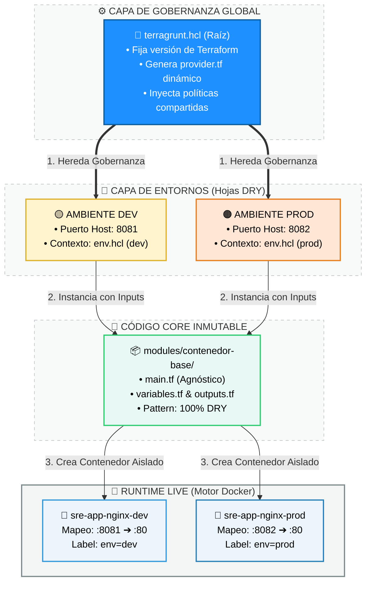

# 🏗️ `iac-mastery_1` — Orquestación Multi-Ambiente con Terragrunt

<div align="center">


**Entorno de simulación Enterprise** que demuestra la gestión de múltiples ambientes  
bajo principios estrictos de **Site Reliability Engineering**, usando un único módulo base reutilizable.

[🚀 Inicio Rápido](#-inicio-rápido) · [🗺️ Arquitectura](#️-arquitectura) · [📂 Estructura](#-estructura-del-proyecto) · [🧪 Runbook](#-runbook-operacional)

</div>

---

## 🎯 ¿Qué resuelve este laboratorio?

> **Problema real:** En equipos de DevOps, copiar y pegar bloques de Terraform entre entornos genera *configuration drift*, deuda técnica y errores costosos en producción.

Este lab demuestra cómo **un solo módulo base** puede desplegarse en múltiples entornos, con configuraciones aisladas, sin repetir ni una línea de código de infraestructura.

```
❌ Enfoque tradicional (frágil)        ✅ Este laboratorio (resiliente)
─────────────────────────────          ──────────────────────────────────
dev/main.tf      (300 líneas)          modules/contenedor-base/main.tf
prod/main.tf     (302 líneas)    →         (1 módulo, 0 duplicados)
staging/main.tf  (298 líneas)          environments/{dev,prod}/terragrunt.hcl
     ↑ 3 archivos que divergen              ↑ Solo la configuración cambia
```

---

## 🗺️ Arquitectura

### Capas del sistema



### Flujo de herencia HCL

```hcl
# Terragrunt evalúa de arriba hacia abajo:

terragrunt.hcl (raíz)           ← define: provider, versiones
    └── environments/dev/
            └── env.hcl          ← define: nombre_entorno = "dev"
                    └── app-nginx/
                            └── terragrunt.hcl  ← define: puerto = 8081
```

---

## 📂 Estructura del Proyecto

```
iac-mastery_1/
│
├── 📁 environments/                  # Contextos de despliegue
│   │
│   ├── 📁 dev/                       # 🟡 Ambiente de Desarrollo
│   │   ├── env.hcl                   #    Variables exclusivas de DEV
│   │   └── app-nginx/
│   │       └── terragrunt.hcl        #    Puerto 8081 · Políticas relajadas
│   │
│   └── 📁 prod/                      # 🟠 Ambiente de Producción
│       ├── env.hcl                   #    Variables exclusivas de PROD
│       └── app-nginx/
│           └── terragrunt.hcl        #    Puerto 8082 · Políticas estrictas
│
├── 📁 modules/                       # Infraestructura inmutable
│   └── contenedor-base/              # ← UN módulo para todos los entornos
│       ├── main.tf                   #   Código Terraform puro (agnóstico)
│       ├── variables.tf              #   Tipado estricto de entradas
│       └── outputs.tf                #   Salidas para interconexión
│
└── 📄 terragrunt.hcl                 # Gobernanza central (raíz)
```

---

## 🧱 Los 4 Pilares SRE de este Lab

### 1️⃣ Principio DRY Absoluto
> *"Don't Repeat Yourself"* — Cero bloques `provider` o `backend` duplicados.

Terragrunt genera estos bloques **al vuelo** en `.terragrunt-cache/`, de forma transparente. El desarrollador escribe cada bloque exactamente **una vez**.

---

### 2️⃣ Aislamiento del Blast Radius 💥
> Un fallo en DEV es **físicamente incapaz** de corromper PROD.

```
environments/dev/   ←── terraform.tfstate (DEV)
environments/prod/  ←── terraform.tfstate (PROD)
        ↑
    Estados separados = Radio de explosión controlado
```

Un `terraform destroy` en dev **no toca** el estado de prod. Nunca.

---

### 3️⃣ Gestión del Ciclo de Vida Local 🐳
> `keep_locally = true` previene colisiones en el daemon de Docker de WSL.

```hcl
# modules/contenedor-base/main.tf
resource "docker_image" "nginx" {
  name         = "nginx:1.25.4-alpine"
  keep_locally = true   # ← La imagen NO se borra al hacer destroy
}                       #   Evita conflictos cuando ambos entornos
                        #   comparten el mismo daemon Docker en WSL
```

---

### 4️⃣ Inmunidad a Rate-Limiting 🛡️
> Plugin Cache global evita errores HTTP 429 del Registry de Terraform.

```ini
# ~/.terraformrc
plugin_cache_dir = "$HOME/.terraform.d/plugin-cache"
```

Los proveedores se descargan **una sola vez** y se reutilizan en todos los workspaces. Sin bloqueos, sin reintentos.

---

## 📊 Matriz de Control Operativo

| Entorno | Contenedor | Puerto Host | Imagen | Estado Esperado |
|:-------:|:----------:|:-----------:|:------:|:---------------:|
| 🟡 **DEV** | `sre-app-nginx-dev` | `8081` | `nginx:1.25.4-alpine` | `HTTP 200 OK` |
| 🟠 **PROD** | `sre-app-nginx-prod` | `8082` | `nginx:1.25.4-alpine` | `HTTP 200 OK` |

### Verificación rápida post-despliegue

```bash
# Smoke test DEV
curl -o /dev/null -s -w "DEV  → HTTP %{http_code}\n" http://localhost:8081

# Smoke test PROD
curl -o /dev/null -s -w "PROD → HTTP %{http_code}\n" http://localhost:8082

# Salida esperada:
# DEV  → HTTP 200
# PROD → HTTP 200
```

---

## 🚀 Inicio Rápido

### Pre-requisitos

```bash
# Verificar versiones requeridas
terragrunt --version   # >= 0.60.0
terraform --version    # >= 1.5.0
docker --version       # cualquier versión reciente
```

### Despliegue de DEV

```bash
cd environments/dev/app-nginx
terragrunt apply
```

### Despliegue de PROD

```bash
cd environments/prod/app-nginx
terragrunt apply
```

### Destrucción segura (sin downtime cruzado)

```bash
# Destruir DEV sin afectar PROD
cd environments/dev/app-nginx
terragrunt destroy

# PROD sigue corriendo en :8082 ✅
```

---

## 📖 Runbook Operacional

Para operaciones avanzadas, pruebas de humo detalladas, validación de Zero Downtime y troubleshooting, consulta el manual completo:

> **➡️ [`RUNBOOK_FASE_2.md`](./RUNBOOK_FASE_2.md)**

---

## 🧠 Conceptos Clave — Glosario

| Término | Definición |
|---------|------------|
| **DRY** | *Don't Repeat Yourself* — cada pieza de lógica existe en un único lugar |
| **Blast Radius** | El alcance máximo de daño que puede causar un fallo aislado |
| **HCL** | HashiCorp Configuration Language — el lenguaje de Terraform/Terragrunt |
| **Plugin Cache** | Caché local de proveedores para evitar descargas repetidas |
| **keep_locally** | Flag que preserva imágenes Docker al destruir recursos Terraform |
| **tfstate** | Archivo de estado que Terraform usa para rastrear infraestructura real |

---

<div align="center">

**Parte de la especialización en** `Infrastructure as Code` **para SRE**

*Construido con principios de gobernanza, resiliencia y reproducibilidad.*

</div>

