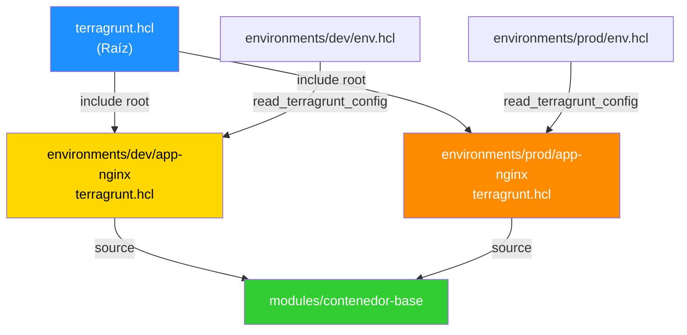
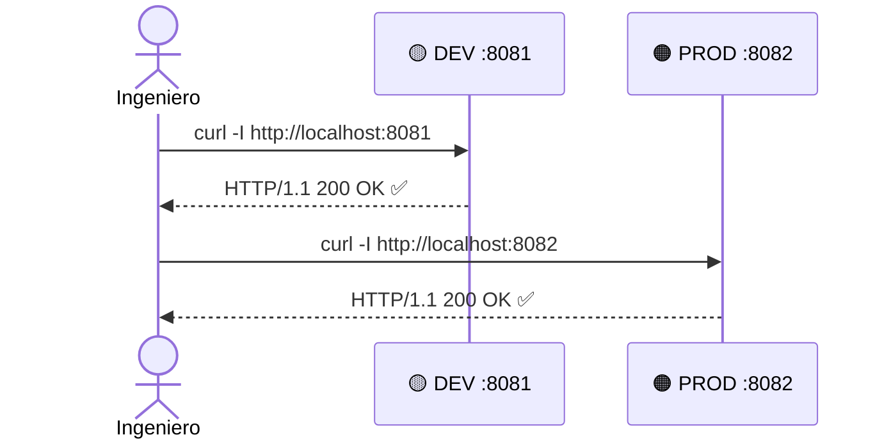
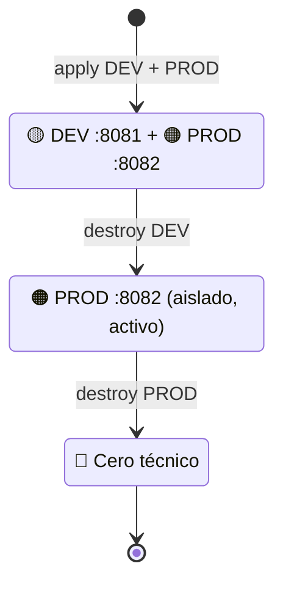

# 🚀 IaC Multi-Ambiente · Runbook SRE Enterprise


> **Objetivo:** Estructurar, codificar, desplegar y monitorear contenedores aislados en ambientes DEV y PROD — desde cero, sin bloqueos, al primer intento.

---

## 🗺️ Flujo General


---

## 📂 Fase 1 · Estructura de Directorios

> Crear el andamiaje limpio para evitar colisiones de estado.

```bash
mkdir -p ~/sre-linux-mastery/Fase2/iac-mastery_1/environments/dev/app-nginx \
         ~/sre-linux-mastery/Fase2/iac-mastery_1/environments/prod/app-nginx \
         ~/sre-linux-mastery/Fase2/iac-mastery_1/modules/contenedor-base

cd ~/sre-linux-mastery/Fase2/iac-mastery_1
```

### ✅ Validación de Sanidad

```bash
tree
```

```
.
├── environments
│   ├── dev
│   │   └── app-nginx
│   └── prod
│       └── app-nginx
├── modules
│   └── contenedor-base
└── terragrunt.hcl
```

---

## ⚙️ Fase 2 · Gobernanza Raíz

> Inyectar el proveedor dinámico para eliminar discrepancias de binarios.

```bash
nano terragrunt.hcl
```

```hcl
# Forzar binario oficial de Terraform
terraform_binary = "terraform"

generate "provider" {
  path      = "provider.tf"
  if_exists = "overwrite_terragrunt"
  contents  = <<EOF
provider "docker" {
  host = "unix:///var/run/docker.sock"
}
EOF
}
```

| Directiva | Propósito |
|---|---|
| `terraform_binary` | Evita conflictos con variantes como OpenTofu |
| `generate "provider"` | Inyecta `provider.tf` automáticamente en cada entorno |

---

## 🧱 Fase 3 · Módulo Base Inmutable

> Plantillas de infraestructura pura reutilizables por todos los entornos.

### 3.1 · Variables

```bash
nano modules/contenedor-base/variables.tf
```

```hcl
variable "nombre_contenedor" {
  type        = string
  description = "Nombre único del contenedor Docker."
}
variable "puerto_externo" {
  type        = number
  description = "Puerto del host mapeado al puerto 80 del contenedor."
}
variable "entorno" {
  type        = string
  description = "Nombre del entorno (dev, prod). Usado para observabilidad."
}
```

### 3.2 · Recursos

```bash
nano modules/contenedor-base/main.tf
```

```hcl
terraform {
  required_version = ">= 1.5.0"
  required_providers {
    docker = {
      source  = "kreuzwerker/docker"
      version = "~> 3.0"
    }
  }
}

resource "docker_image" "nginx" {
  name         = "nginx:1.25.4-alpine"   # Versión fija: Alpine por rendimiento
  keep_locally = true                     # ⬅️ Blinda el flujo local (ver nota)
}

resource "docker_container" "app" {
  image = docker_image.nginx.image_id
  name  = var.nombre_contenedor

  ports {
    internal = 80
    external = var.puerto_externo
  }

  labels { label = "environment" ; value = var.entorno      }
  labels { label = "orchestrator" ; value = "terragrunt"    }
}
```

> 🛡️ **`keep_locally = true`** — Prohíbe a Terraform eliminar la imagen del daemon Docker al destruir un entorno individual. Previene el error `conflict: unable to remove repository image`.

### 3.3 · Outputs

```bash
nano modules/contenedor-base/outputs.tf
```

```hcl
output "container_id" {
  value       = docker_container.app.id
  description = "ID único del contenedor."
}
output "external_port" {
  value       = var.puerto_externo
  description = "Puerto expuesto en el host."
}
```

---

## 🌿 Fase 4 · Hojas de Entorno

> Asignar metadatos específicos e independientes por ambiente.

### Modelo de Herencia



### 4.1 · Identificadores de Entorno

```bash
nano environments/dev/env.hcl
```
```hcl
locals { env = "dev" }
```

```bash
nano environments/prod/env.hcl
```
```hcl
locals { env = "prod" }
```

### 4.2 · Hoja DEV

```bash
nano environments/dev/app-nginx/terragrunt.hcl
```

```hcl
include "root" { path = "../../../terragrunt.hcl" }

locals {
  env_vars = read_terragrunt_config("../env.hcl")
  entorno  = local.env_vars.locals.env
}

terraform { source = "../../../modules//contenedor-base" }

inputs = {
  nombre_contenedor = "sre-app-nginx-dev"
  puerto_externo    = 8081
  entorno           = local.entorno
}
```

### 4.3 · Hoja PROD

```bash
nano environments/prod/app-nginx/terragrunt.hcl
```

```hcl
include "root" { path = "../../../terragrunt.hcl" }

locals {
  env_vars = read_terragrunt_config("../env.hcl")
  entorno  = local.env_vars.locals.env
}

terraform { source = "../../../modules//contenedor-base" }

inputs = {
  nombre_contenedor = "sre-app-nginx-prod"
  puerto_externo    = 8082
  entorno           = local.entorno
}
```

> ⚡ **`//` en `source`** — Convención crítica de Terraform: separa el origen del repositorio del subdirectorio del módulo ejecutable.

---

## 🚀 Fase 5 · Despliegue + Smoke Tests

### 5.1 · Deploy DEV

```bash
cd ~/sre-linux-mastery/Fase2/iac-mastery_1/environments/dev/app-nginx/
rm -rf .terragrunt-cache/
terragrunt apply -auto-approve
```

### 5.2 · Deploy PROD

```bash
cd ~/sre-linux-mastery/Fase2/iac-mastery_1/environments/prod/app-nginx/
rm -rf .terragrunt-cache/
terragrunt apply -auto-approve
```

### 5.3 · Inspección y Pruebas de Humo

```bash
docker ps
```

```
CONTAINER ID   IMAGE          PORTS                  NAMES
965f30184968   31bad00311cb   0.0.0.0:8081->80/tcp   sre-app-nginx-dev
d897be7dc539   31bad00311cb   0.0.0.0:8082->80/tcp   sre-app-nginx-prod
```

```bash
curl -I http://localhost:8081
curl -I http://localhost:8082
```



> ✅ **Ambos retornan `HTTP/1.1 200 OK`** → Infraestructura multi-ambiente operativa.

---

## 🧹 Fase 6 · Destrucción Aislada

> Validar que el desmontaje de DEV **no afecta** a PROD.

### 6.1 · Destruir DEV

```bash
cd ~/sre-linux-mastery/Fase2/iac-mastery_1/environments/dev/app-nginx/
terragrunt destroy -auto-approve
docker ps   # ← sre-app-nginx-prod sigue activo en :8082 ✅
```

### 6.2 · Destruir PROD (Cierre Total)

```bash
cd ~/sre-linux-mastery/Fase2/iac-mastery_1/environments/prod/app-nginx/
terragrunt destroy -auto-approve
docker ps   # ← Sin contenedores: host en estado inicial ✅
```



---

## 📋 Referencia Rápida de Puertos

| Entorno | Contenedor | Puerto Host | Puerto Interno |
|:---:|:---|:---:|:---:|
| 🟡 DEV | `sre-app-nginx-dev` | `8081` | `80` |
| 🟠 PROD | `sre-app-nginx-prod` | `8082` | `80` |

---

*Doc: `RBK-IAC-MASTERY-01` · v3.0 · Aprobado*
