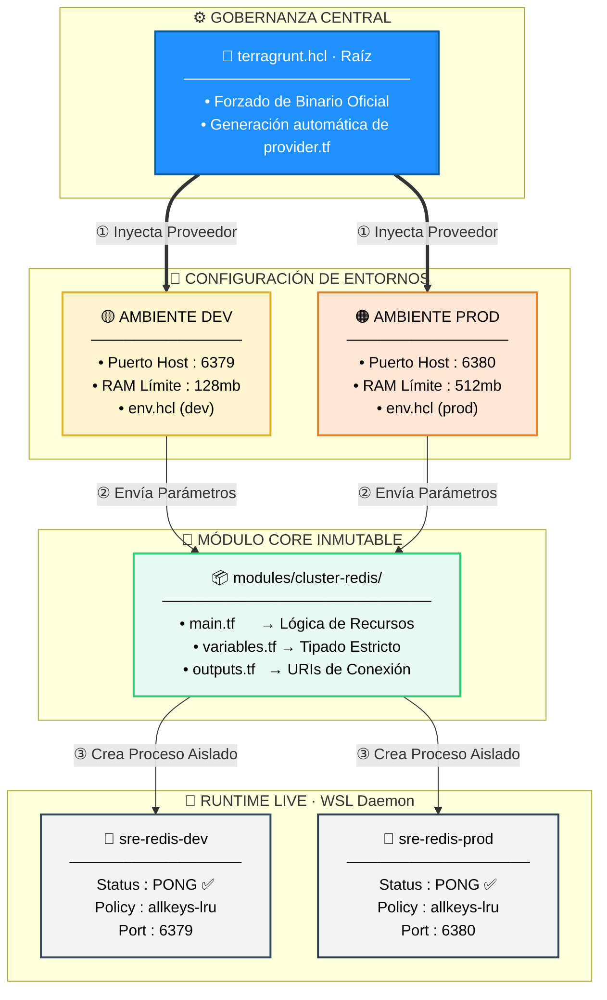

# 🧱 `iac-mastery_2` · Orquestación de Base de Datos Inmutable (DRY)

<div align="center">


<br/>

> **Laboratorio Avanzado de Persistencia y Caché** que implementa un clúster desacoplado de Redis  
> en Alta Disponibilidad Local bajo principios estrictos de **Site Reliability Engineering (SRE)**.

<br/>

[](#-objetivos-del-laboratorio)
[](#️-arquitectura-de-bloques)
[](#-anatomía-del-repositorio)
[](#️-hardening-sre--buenas-prácticas)
[](#-ejecución-operacional)

</div>

---

## 🎯 Objetivos del Laboratorio

Este repositorio resuelve el desafío de desplegar **Bases de Datos de alto rendimiento** en entornos compartidos. Demuestra cómo parametrizar políticas de memoria y aislamiento de red en `Desarrollo` y `Producción` reutilizando un único módulo *Core* inmutable, garantizando **reproducibilidad en el primer intento**.

<br/>

<table>
<tr>
<td width="50%">

### ❌ Enfoque Tradicional (Frágil)

- 🔴 Imágenes borradas por conflicto de daemon
- 🔴 Puertos colisionados (todos en `:6379`)
- 🔴 Consumo descontrolado de RAM
- 🔴 Módulos duplicados por entorno
- 🔴 Sin separación dev / prod

</td>
<td width="50%">

### ✅ Arquitectura `iac-mastery_2`

- 🟢 Mitigación con `keep_locally = true`
- 🟢 Aislamiento de Red (`:6379` vs `:6380`)
- 🟢 Hardening SRE con `--maxmemory`
- 🟢 Módulo Core **único e inmutable**
- 🟢 DRY estricto vía Terragrunt

</td>
</tr>
</table>

---

## 🗺️ Arquitectura de Bloques

El siguiente diagrama modela el flujo de **inyección de dependencias**. La gobernanza raíz automatiza el proveedor, las hojas de entorno configuran el contexto, y el módulo genera los recursos vivos en el motor de Docker.



---

## 📂 Anatomía del Repositorio

La segmentación sigue el **estándar senior de modularización**, separando lógica inmutable (módulos) de datos mutables (entornos).

```
iac-mastery_2/
│
├── 📄 terragrunt.hcl                    ← 🧠 Cerebro Central: Gobierna binarios y proveedores
│
├── 📁 modules/                          ← 🔒 CAPA INMUTABLE — Nunca se edita por entorno
│   └── 📁 cluster-redis/
│       ├── 📄 main.tf                   ←    Recursos Docker + argumentos de Redis
│       ├── 📄 variables.tf              ←    Tipado estricto de todas las variables
│       └── 📄 outputs.tf                ←    URIs y cadenas de conexión exportadas
│
└── 📁 environments/                     ← 🌿 CAPA VARIABLE — Datos y contextos únicos
    │
    ├── 📁 dev/
    │   ├── 📄 env.hcl                   ←    Identificador local: "dev"
    │   └── 📁 app-redis/
    │       └── 📄 terragrunt.hcl        ←    Puerto 6379 · RAM 128mb · baja prioridad
    │
    └── 📁 prod/
        ├── 📄 env.hcl                   ←    Identificador local: "prod"
        └── 📁 app-redis/
            └── 📄 terragrunt.hcl        ←    Puerto 6380 · RAM 512mb · alta prioridad
```

> 💡 **Principio DRY aplicado:** el módulo `cluster-redis/` existe **una sola vez**. Ambos entornos lo invocan con parámetros distintos. Modificar la lógica en un único lugar propaga el cambio a todos los contextos automáticamente.

---

## ⚡ Hardening SRE & Buenas Prácticas

### 🔵 `1` · Capacity Management — Gestión de Capacidad

Se inyectan argumentos estrictos (`--maxmemory`) directamente al motor de Redis. Cuando la base de datos alcanza el límite configurado, el algoritmo **evicción `allkeys-lru`** descarta las llaves menos utilizadas recientemente, emulando el comportamiento real de un caché de producción bajo presión de memoria.

```hcl
# Ejemplo: argumento inyectado en main.tf del módulo
command = ["--maxmemory", var.redis_max_memory, "--maxmemory-policy", "allkeys-lru"]
```

---

### 🟣 `2` · Mitigación de Race Conditions Locales

Al activar `keep_locally = true` en el recurso de imagen Docker, **blindamos el flujo** contra colisiones del daemon compartido en WSL. Un entorno puede destruirse por completo sin corromper los archivos del entorno paralelo.

```hcl
# Recurso en main.tf — imagen protegida contra borrado accidental
resource "docker_image" "redis" {
  name         = "redis:7.2-alpine"
  keep_locally = true   # ← Protección ante terraform destroy del entorno paralelo
}
```

---

### 🟢 `3` · Higiene de Formato Inmutable

Estricta separación de responsabilidades en archivos `.tf` independientes, 100% compatibles con las herramientas de formateo automatizado:

```bash
terraform fmt -recursive   # ← Formatea sin romper ningún archivo del módulo
```

---

## 📊 Matriz de Control Operativo

| Entorno | Contenedor | Puerto Host | RAM Límite | Política Evicc. | Comando de Salud | Estado |
|:-------:|:----------:|:-----------:|:----------:|:---------------:|:----------------:|:------:|
| 🟡 **DEV** | `sre-redis-dev` | `6379` | `128mb` | `allkeys-lru` | `redis-cli ping` | ✅ `PONG` |
| 🟠 **PROD** | `sre-redis-prod` | `6380` | `512mb` | `allkeys-lru` | `redis-cli ping` | ✅ `PONG` |

---

## 📖 Ejecución Operacional

Para recrear la estructura desde cero, inicializar cachés centralizados, ejecutar pruebas de humo cruzadas o realizar un desmantelamiento controlado **Zero Downtime**, consulta el manual quirúrgico completo:

<div align="center">

### ➡️ [`RUNBOOK_OPERACIONAL.md`](./RUNBOOK_OPERACIONAL.md)

*Guía paso a paso con comandos exactos para cada escenario operativo*

</div>

---

<div align="center">

**`iac-mastery_2`** · Especialización en Site Reliability Engineering


*Modularidad que escala · Código que se explica solo · Infraestructura que no falla*

</div>

