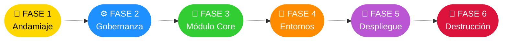
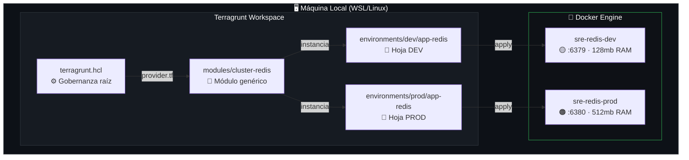
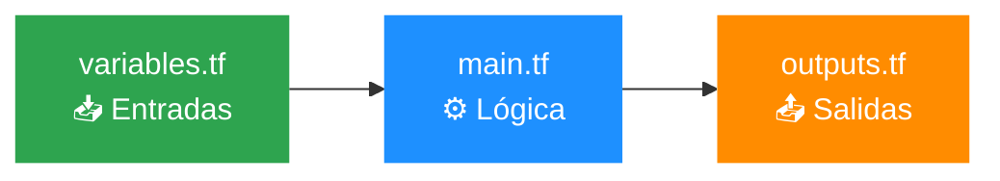
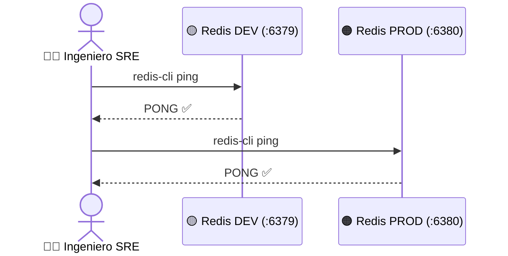
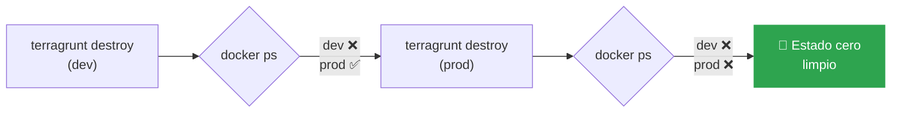

# RBK-IAC-REDIS-02 · Redis HA en Docker con Terragrunt


> **Objetivo:** Construir, desplegar, auditar y destruir un clúster Redis multi-ambiente (DEV/PROD) usando Infraestructura como Código (IaC) con Terragrunt + Docker, desde cero, en Linux/WSL.

---

## Mapa de Ruta



---

## Arquitectura del Sistema



---

## 📂 FASE 1 · Andamiaje de Directorios


> **¿Por qué?** Separar `modules/` (código reutilizable) de `environments/` (datos por entorno) evita modificar producción al editar desarrollo.

```bash
mkdir -p ~/sre-linux-mastery/Fase2/iac-mastery_2/environments/dev/app-redis \
         ~/sre-linux-mastery/Fase2/iac-mastery_2/environments/prod/app-redis \
         ~/sre-linux-mastery/Fase2/iac-mastery_2/modules/cluster-redis

cd ~/sre-linux-mastery/Fase2/iac-mastery_2
```

**✅ Validación:**

```bash
tree
```

```
.
├── environments
│   ├── dev
│   │   └── app-redis
│   └── prod
│       └── app-redis
└── modules
    └── cluster-redis
```

---

## ⚙️ FASE 2 · Gobernanza Central


> **¿Por qué?** Fuerza el uso del mismo binario y proveedor en todo el equipo. Elimina el "en mi máquina funciona".

```bash
nano terragrunt.hcl
```

```hcl
# Forzar binario oficial de Terraform (bloquea OpenTofu si está en PATH)
terraform_binary = "terraform"

# Proveedor Docker generado dinámicamente en cada entorno
generate "provider" {
  path      = "provider.tf"
  if_exists = "overwrite_terragrunt"
  contents  = <<EOF
provider "docker" {
  host = "unix:///var/run/docker.sock"
}
EOF
}
```

---

## 🧱 FASE 3 · Módulo Core (Terraform Puro)


> **¿Por qué?** El módulo es una plantilla genérica e inmutable. Recibe parámetros desde fuera sin cambiar su lógica interna.



### 3.1 · `variables.tf` — Entradas del Sistema

```bash
nano modules/cluster-redis/variables.tf
```

```hcl
variable "nombre_redis" {
  type        = string
  description = "Nombre único del contenedor Redis."
}
variable "puerto_host" {
  type        = number
  description = "Puerto expuesto en la máquina local."
}
variable "max_memoria" {
  type        = string
  description = "Límite de RAM asignado al proceso Redis."
}
variable "entorno" {
  type        = string
  description = "Etiqueta del ciclo de vida: dev | prod."
}
```

### 3.2 · `main.tf` — Lógica de Hardening

```bash
nano modules/cluster-redis/main.tf
```

```hcl
terraform {
  required_version = ">= 1.5.0"
  required_providers {
    docker = {
      source  = "kreuzwerker/docker"
      version = "~> 3.0"  # Acepta parches (3.x) pero bloquea v4.0
    }
  }
}

resource "docker_image" "redis" {
  name         = "redis:7.2-alpine"
  keep_locally = true  # 🛡️ No borra la imagen local al ejecutar destroy
}

resource "docker_container" "redis_db" {
  image = docker_image.redis.image_id
  name  = var.nombre_redis

  command = [
    "redis-server",
    "--maxmemory",        var.max_memoria,
    "--maxmemory-policy", "allkeys-lru",  # Descarta llaves viejas si RAM se llena
    "--protected-mode",   "no"
  ]

  ports {
    internal = 6379
    external = var.puerto_host
  }

  labels { label = "environment"  ; value = var.entorno    }
  labels { label = "orchestrator" ; value = "terragrunt"   }
}
```

### 3.3 · `outputs.tf` — Salidas del Sistema

```bash
nano modules/cluster-redis/outputs.tf
```

```hcl
output "redis_container_id" {
  value       = docker_container.redis_db.id
  description = "ID único del contenedor para auditoría."
}
output "redis_endpoint" {
  value       = "redis://127.0.0.1:${var.puerto_host}"
  description = "URI de conexión lista para microservicios."
}
```

---

## 🌿 FASE 4 · Configuración de Entornos


> **¿Por qué?** El mismo módulo, distintos parámetros. DEV es ligero; PROD tiene más recursos y puerto aislado para evitar colisiones.

### 4.1 · Identidades locales

```bash
# DEV
nano environments/dev/env.hcl
```
```hcl
locals { env = "dev" }
```

```bash
# PROD
nano environments/prod/env.hcl
```
```hcl
locals { env = "prod" }
```

### 4.2 · Hoja DEV — Perfil de Bajo Costo

```bash
nano environments/dev/app-redis/terragrunt.hcl
```

```hcl
include "root" { path = "../../../terragrunt.hcl" }

locals {
  env_vars = read_terragrunt_config("../env.hcl")
  entorno  = local.env_vars.locals.env
}

terraform { source = "../../../modules//cluster-redis" }
#                                     ^^
#                   Doble slash: separa la raíz del módulo

inputs = {
  nombre_redis = "sre-redis-dev"
  puerto_host  = 6379      # Puerto estándar Redis
  max_memoria  = "128mb"   # Recursos limitados para pruebas
  entorno      = local.entorno
}
```

### 4.3 · Hoja PROD — Perfil de Alta Capacidad

```bash
nano environments/prod/app-redis/terragrunt.hcl
```

```hcl
include "root" { path = "../../../terragrunt.hcl" }

locals {
  env_vars = read_terragrunt_config("../env.hcl")
  entorno  = local.env_vars.locals.env
}

terraform { source = "../../../modules//cluster-redis" }

inputs = {
  nombre_redis = "sre-redis-prod"
  puerto_host  = 6380      # Puerto diferente → aislamiento de red
  max_memoria  = "512mb"   # Mayor capacidad para carga real
  entorno      = local.entorno
}
```

> **⚡ Nota técnica:** El `//` en `source` es obligatorio. Indica a Terraform dónde termina la ruta del repositorio y dónde empieza el subdirectorio del módulo.

---

## 🚀 FASE 5 · Despliegue y Smoke Tests


### 5.1 · Lanzar DEV

```bash
cd ~/sre-linux-mastery/Fase2/iac-mastery_2/environments/dev/app-redis/
rm -rf .terragrunt-cache/
terragrunt apply -auto-approve
```

### 5.2 · Lanzar PROD

```bash
cd ~/sre-linux-mastery/Fase2/iac-mastery_2/environments/prod/app-redis/
rm -rf .terragrunt-cache/
terragrunt apply -auto-approve
```

### 5.3 · Auditoría de Salud (Smoke Tests)

```bash
docker ps
```

```
CONTAINER ID   IMAGE          PORTS                    NAMES
edd5e93833ee   dfa18828cbc0   0.0.0.0:6380->6379/tcp   sre-redis-prod
f3770168e6db   dfa18828cbc0   0.0.0.0:6379->6379/tcp   sre-redis-dev
```

```bash
docker exec -it sre-redis-dev  redis-cli ping
docker exec -it sre-redis-prod redis-cli ping
```

**Flujo esperado:**



> **✅ Éxito:** Dos `PONG` confirmados = infraestructura multi-ambiente viva, aislada y lista.

---

## 🧹 FASE 6 · Destrucción Controlada


> **¿Por qué?** Un buen SRE desmantela entornos de forma segura. La prueba real: destruir DEV sin afectar PROD.

### 6.1 · Destruir DEV

```bash
cd ~/sre-linux-mastery/Fase2/iac-mastery_2/environments/dev/app-redis/
terragrunt destroy -auto-approve
```

**Verificar aislamiento:**

```bash
docker ps
# Resultado: sre-redis-dev desaparecido · sre-redis-prod intacto en :6380
```

> **🛡️ Por qué PROD sobrevive:** El flag `keep_locally = true` en `main.tf` protege la imagen Docker local. El destroy solo elimina el contenedor del entorno apuntado.

### 6.2 · Destruir PROD (Cierre Técnico)

```bash
cd ~/sre-linux-mastery/Fase2/iac-mastery_2/environments/prod/app-redis/
terragrunt destroy -auto-approve
```

**Flujo de destrucción:**



---

## 📋 Referencia Rápida

| Parámetro | DEV | PROD |
|-----------|-----|------|
| **Contenedor** | `sre-redis-dev` | `sre-redis-prod` |
| **Puerto Host** | `6379` | `6380` |
| **RAM límite** | `128mb` | `512mb` |
| **URI conexión** | `redis://127.0.0.1:6379` | `redis://127.0.0.1:6380` |
| **Política memoria** | `allkeys-lru` | `allkeys-lru` |
| **Imagen** | `redis:7.2-alpine` | `redis:7.2-alpine` |

---

## 🗂️ Árbol Final del Proyecto

```
iac-mastery_2/
├── terragrunt.hcl                        ← ⚙️ Gobernanza raíz
├── modules/
│   └── cluster-redis/
│       ├── variables.tf                  ← 📥 Entradas
│       ├── main.tf                       ← ⚙️ Lógica
│       └── outputs.tf                    ← 📤 Salidas
└── environments/
    ├── dev/
    │   ├── env.hcl                       ← 🏷️ Identidad DEV
    │   └── app-redis/
    │       └── terragrunt.hcl            ← 🌿 Config DEV
    └── prod/
        ├── env.hcl                       ← 🏷️ Identidad PROD
        └── app-redis/
            └── terragrunt.hcl            ← 🌿 Config PROD
```

---

*Runbook RBK-IAC-REDIS-02 · v1.0 · Diseñado con estándares de reproducibilidad inmutable y tolerancia a fallos locales.*

