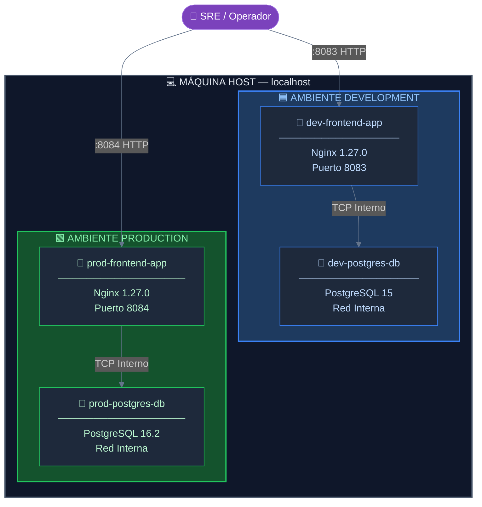
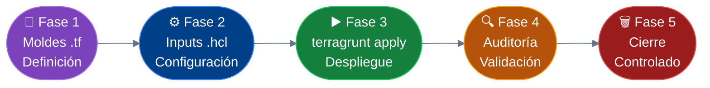
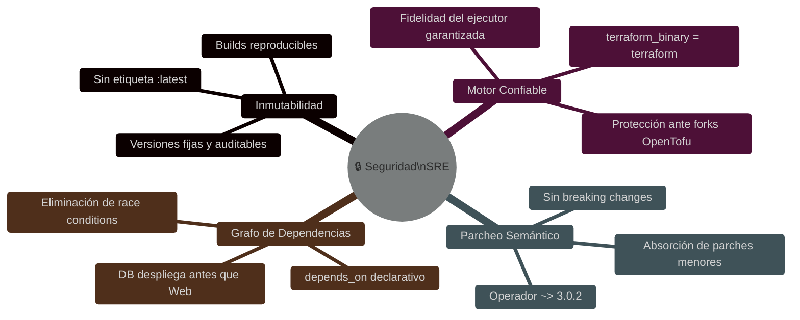
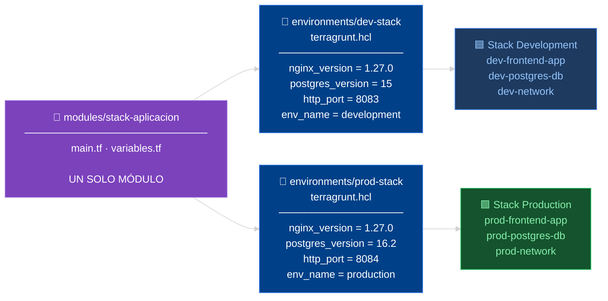

<div align="center">

# 🏗️ Arquitectura Multi-Ambiente Desacoplada
### *Tier-2 Topology · Terraform + Terragrunt · DRY Infrastructure*

<br/>

[](https://www.terraform.io/)
[](https://terragrunt.gruntwork.io/)
[](https://www.docker.com/)
[](https://nginx.org/)
[](https://www.postgresql.org/)
[]()
[]()
[]()

<br/>

> **Laboratorio práctico de infraestructura reproducible**: dos entornos completamente aislados,  
> un único módulo base, cero duplicación de código.

</div>

---

## 🎯 ¿Qué construye este laboratorio?

Este proyecto demuestra la implementación de una **topología Tier-2** donde cada ambiente (`development` y `production`) despliega de forma **completamente independiente**:

| Capa | Componente | Dev | Prod |
|------|-----------|-----|------|
| 🌐 **Frontend** | Nginx (Web Server) | `1.27.0` · Puerto `8083` | `1.27.0` · Puerto `8084` |
| 🐘 **Base de Datos** | PostgreSQL (RDBMS) | `15` | `16.2` |
| 🔗 **Red** | Docker Network aislada | `dev-network` | `prod-network` |

La magia reside en que **un solo módulo Terraform** alimenta ambos mundos, diferenciados únicamente por variables de Terragrunt.

---

## 🗺️ Arquitectura del Sistema



> 🔒 **Principio de aislamiento**: las redes `dev-network` y `prod-network` son completamente independientes.  
> Ningún contenedor de un ambiente puede comunicarse con el del otro.

---

## 🏛️ Estructura del Repositorio

```plaintext
📁 lab-desacoplado/
│
├── 📁 modules/
│   └── 📁 stack-aplicacion/         ← 🧩 MÓDULO ÚNICO (Terraform puro)
│       ├── 📄 variables.tf           ← Definición de parámetros de entrada
│       └── 📄 main.tf                ← Lógica declarativa de infraestructura
│
└── 📁 environments/                  ← 🎛️ ORQUESTACIÓN POR AMBIENTE (Terragrunt)
    ├── 📁 dev-stack/                 ← Instancia Desarrollo (Puerto 8083 · PG 15)
    │   └── 📄 terragrunt.hcl
    └── 📁 prod-stack/               ← Instancia Producción (Puerto 8084 · PG 16.2)
        └── 📄 terragrunt.hcl
```

> **📐 Separación de responsabilidades**: el módulo define el *qué* (infraestructura),  
> Terragrunt define el *cómo* y *dónde* (valores por ambiente).

---

## 🚀 Flujo de Ejecución



---

## 🛠️ Guía de Operación Paso a Paso

### ① Aprovisionamiento de Entornos

```bash
# ── DEVELOPMENT ──────────────────────────────────────────
cd environments/dev-stack/
terragrunt apply -auto-approve
# → Despliega: dev-frontend-app (Nginx 1.27.0:8083)
# → Despliega: dev-postgres-db  (PostgreSQL 15)
# → Crea red:  dev-network

# ── PRODUCTION ───────────────────────────────────────────
cd ../prod-stack/
terragrunt apply -auto-approve
# → Despliega: prod-frontend-app (Nginx 1.27.0:8084)
# → Despliega: prod-postgres-db  (PostgreSQL 16.2)
# → Crea red:  prod-network
```

### ② Verificación del Aislamiento

```bash
# Inspeccionar contenedores activos con sus imágenes y puertos
docker ps --format "table {{.Names}}\t{{.Image}}\t{{.Ports}}"

# Confirmar redes aisladas por ambiente
docker network ls | grep -E "dev|prod"
```

**Salida esperada:**

```
NAMES                  IMAGE                PORTS
prod-frontend-app      nginx:1.27.0         0.0.0.0:8084->80/tcp
prod-postgres-db       postgres:16.2        5432/tcp
dev-frontend-app       nginx:1.27.0         0.0.0.0:8083->80/tcp
dev-postgres-db        postgres:15          5432/tcp
```

### ③ Desmantelamiento Controlado

> ⚠️ **Orden obligatorio**: destruir `prod-stack` primero para evitar bloqueos del daemon Docker  
> por dependencias compartidas de imagen base.

```bash
# ── 1. Remover Producción (primero) ──────────────────────
cd environments/prod-stack/
terragrunt destroy -auto-approve

# ── 2. Remover Desarrollo (al final) ─────────────────────
cd ../dev-stack/
terragrunt destroy -auto-approve
```

---

## 🛡️ Controles de Seguridad SRE



| Control | Técnica | Beneficio |
|--------|---------|-----------|
| 🔒 **Inmutabilidad absoluta** | Versiones explícitas (`nginx:1.27.0`, `postgres:16.2`) | Elimina fallos por actualizaciones silenciosas |
| 🎯 **Motor controlado** | `terraform_binary = "terraform"` en raíz | Protección ante forks alternativos (OpenTofu) |
| 🔄 **Parcheo semántico** | Operador `~> 3.0.2` en providers | Absorbe parches de seguridad menores automáticamente |
| 📊 **Orden de despliegue** | Bloque `depends_on` explícito | Base de datos siempre disponible antes que el frontend |

---

## 📐 Principio DRY en Práctica



> Un módulo → múltiples ambientes. **Modificar una sola fuente de verdad impacta todos los entornos de forma controlada.**

---

## ✅ Checklist de Validación Post-Despliegue

```bash
# 1. Frontend Development accesible
curl -s -o /dev/null -w "%{http_code}" http://localhost:8083
# Esperado: 200

# 2. Frontend Production accesible
curl -s -o /dev/null -w "%{http_code}" http://localhost:8084
# Esperado: 200

# 3. Aislamiento de redes confirmado
docker network inspect dev-network  | grep -c "dev-"
docker network inspect prod-network | grep -c "prod-"

# 4. Conectividad interna DB → Web (solo dentro del mismo ambiente)
docker exec dev-frontend-app ping -c 1 dev-postgres-db
```

---

## 📦 Requisitos Previos

| Herramienta | Versión Mínima | Verificación |
|-------------|---------------|--------------|
| `terraform` | `>= 1.5.0` | `terraform version` |
| `terragrunt` | `>= 0.55.0` | `terragrunt --version` |
| `docker` | `>= 24.0` | `docker --version` |
| `docker compose` | Plugin v2 | `docker compose version` |

---

<div align="center">

**📚 Módulo 2 — Laboratorio Complementario de Orquestación Avanzada Multi-Tier**

*Construido bajo la disciplina **Site Reliability Engineering** — infraestructura como código, operada con rigor.*

[](https://terraform.io)
[](https://terragrunt.gruntwork.io)
[](https://docker.com)

</div>

