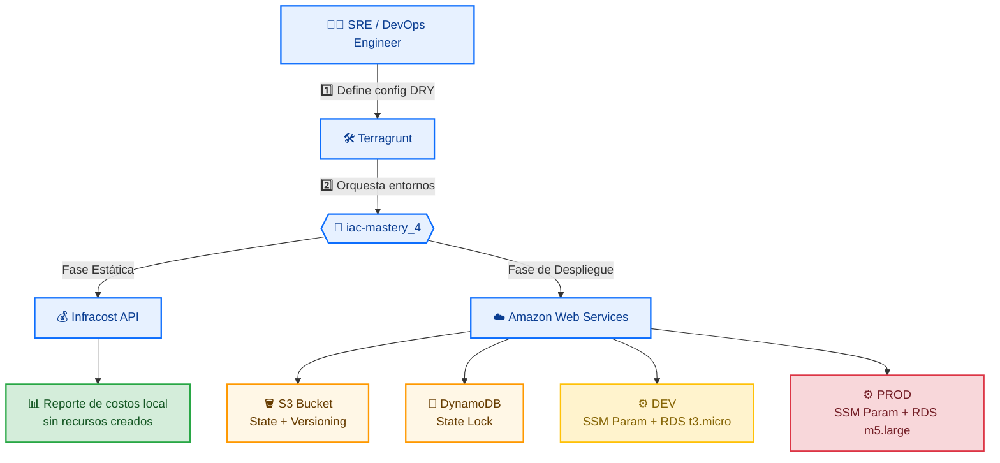
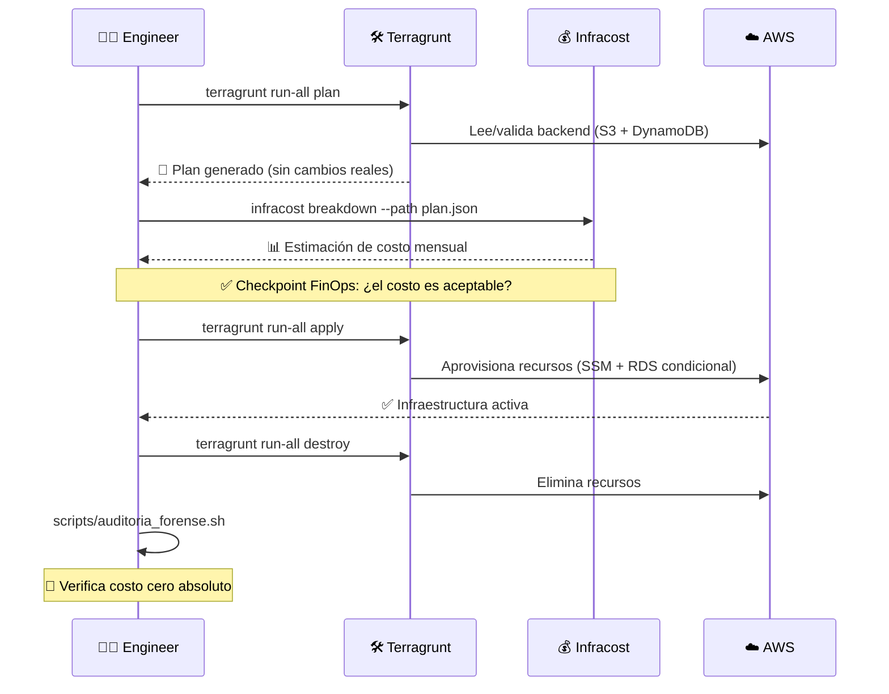

<div align="center">

# 🚀 IaC Mastery — Terragrunt + Terraform + Infracost

### *Infraestructura como Código multi-ambiente, DRY y FinOps-first*


</div>

---

## 📌 ¿Qué es este laboratorio?

**`iac-mastery_4`** es un entorno práctico que demuestra cómo construir, versionar y costear infraestructura en **AWS** usando principios de **SRE** y **FinOps**, antes de gastar un solo dólar en la nube.

> 💡 **Idea central:** primero se *estima* el costo con Infracost (fase estática, sin tocar AWS), y solo después se *despliega* con Terragrunt + Terraform sobre un backend remoto seguro.

| 🎯 Pilar | Descripción |
|---|---|
| 🧩 **DRY** | Una sola fuente de verdad para backend y providers, heredada por todos los ambientes |
| 🌎 **Multi-ambiente** | `dev` y `prod` con topologías y costos completamente distintos |
| 💰 **FinOps Shift-Left** | Costos calculados *antes* del `apply`, no después de la factura |
| 🔒 **Estado seguro** | Backend remoto en S3 + lock distribuido en DynamoDB |
| 🧹 **Cero residuos** | Scripts de auditoría forense y purga total al finalizar |

---

## 🗺️ Arquitectura y Flujo de Trabajo



### 🔁 Ciclo de vida en 4 fases



---

## 🎯 Objetivos de Aprendizaje

- 🧱 **Orquestación DRY avanzada** — heredar configuración global de backend y providers con Terragrunt sin repetir código.
- 🌗 **Control de ciclo de vida multi-ambiente** — diferenciar `dev` (liviano) de `prod` (robusto) desde el mismo módulo base.
- 💸 **FinOps Shift-Left** — estimar costos de nube por análisis estático del código, *antes* de aprovisionar nada.
- 🕵️ **Operaciones forenses** — validar con scripts automatizados que el entorno queda en **costo cero absoluto** tras cada ejercicio.

---

## 📂 Estructura del Repositorio

```text
iac-mastery_4/
├── environments/                 # 🌍 Configuración de entornos
│   ├── dev/
│   │   └── ssm-param/
│   │       └── terragrunt.hcl    # 🟡 Entrada específica de DEV
│   ├── prod/
│   │   └── ssm-param/
│   │       └── terragrunt.hcl    # 🔴 Entrada específica de PROD
│   └── terragrunt.hcl            # 🌐 Config raíz global (Backend S3 + DynamoDB)
│
├── modules/                      # 🧩 Módulos reutilizables (Core)
│   └── ssm/
│       ├── main.tf               # 🛠️ SSM Parameter + RDS condicional
│       └── variables.tf          # ⚙️ Variables base y flags FinOps
│
└── scripts/                      # 🤖 Automatización operativa
    ├── auditoria_forense.sh      # 🔍 Auditoría — cero recursos huérfanos
    ├── eliminar_backend.sh       # 🗑️ Purga profunda S3 (versiones + marcadores)
    └── estimar_costos.sh         # 💰 Validador estático de presupuesto (Infracost)
```

---

## 🧠 ¿Por qué este enfoque?

<table>
<tr>
<td width="50%" valign="top">

### 🔐 Aislamiento absoluto de estado
Cada ambiente tiene su propia ruta dentro del bucket S3 remoto, eliminando el riesgo de que `dev` y `prod` pisen sus configuraciones entre sí.

</td>
<td width="50%" valign="top">

### 🧬 Modularidad dinámica
Una propiedad `count` condicional permite expandir o contraer recursos (como RDS) según el ambiente, reflejando de forma transparente cómo escala la facturación real.

</td>
</tr>
</table>

---

## ⚖️ Comparativa de Ambientes

| Característica | 🟡 DEV | 🔴 PROD |
|---|---|---|
| Instancia RDS | `t3.micro` | `m5.large` |
| Costo relativo | 💲 Bajo | 💲💲💲 Alto |
| Propósito | Pruebas rápidas | Carga productiva |
| Validación previa | Infracost (estática) | Infracost (estática) |
| Aislamiento de estado | Ruta propia en S3 | Ruta propia en S3 |

---

## 🛠️ Requisitos Previos

- ✅ **Terraform** `>= 1.5.0`
- ✅ **Terragrunt** instalado y disponible en el CLI
- ✅ **Infracost** autenticado (`infracost auth login`)
- ✅ **AWS CLI** con credenciales válidas y permisos suficientes en `us-east-1`

```bash
# Verificación rápida de herramientas
terraform -version
terragrunt --version
infracost --version
aws sts get-caller-identity
```

---

## 🚦 Quickstart

```bash
# 1️⃣ Clona el repositorio
git clone <url-del-repo> iac-mastery_4 && cd iac-mastery_4

# 2️⃣ Estima costos ANTES de desplegar (fase FinOps)
bash scripts/estimar_costos.sh

# 3️⃣ Despliega el ambiente DEV
cd environments/dev/ssm-param
terragrunt apply

# 4️⃣ Audita que todo esté limpio al finalizar
bash scripts/auditoria_forense.sh

# 5️⃣ Destruye y purga el backend cuando termines
terragrunt destroy
bash scripts/eliminar_backend.sh
```

> 📘 **¿Necesitas el paso a paso completo?** Consulta el **Runbook detallado del laboratorio** adjunto en este repositorio.

---

## 🏷️ Stack Tecnológico

| Categoría | Tecnología |
|---|---|
| ☁️ Cloud Provider | AWS (`us-east-1`) |
| 🧰 IaC Engine | Terraform |
| 🪢 Orquestador DRY | Terragrunt |
| 💰 FinOps | Infracost |
| 📦 State Backend | S3 + DynamoDB (lock) |
| 🤖 Automatización | Bash scripting |

---

<div align="center">

### 🎓 Laboratorio educativo de alto rendimiento
**Especialización SRE Linux & Infraestructura como Código**

⭐ *Si este laboratorio te resultó útil, considera darle una estrella al repositorio* ⭐

</div>

