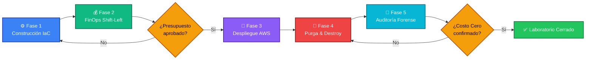
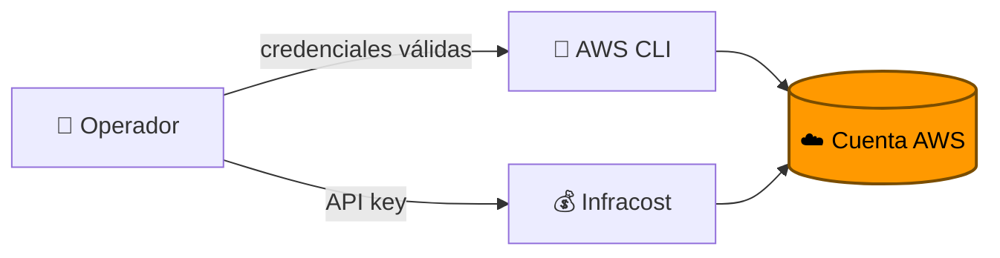
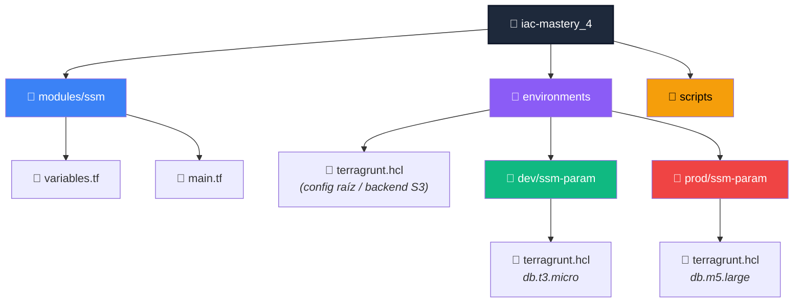
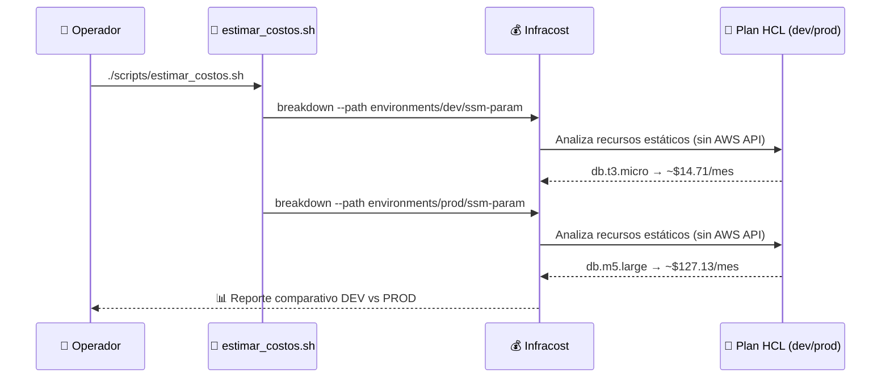
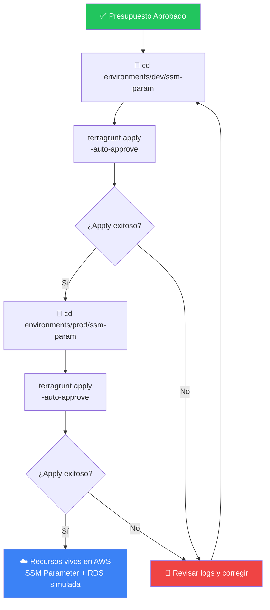
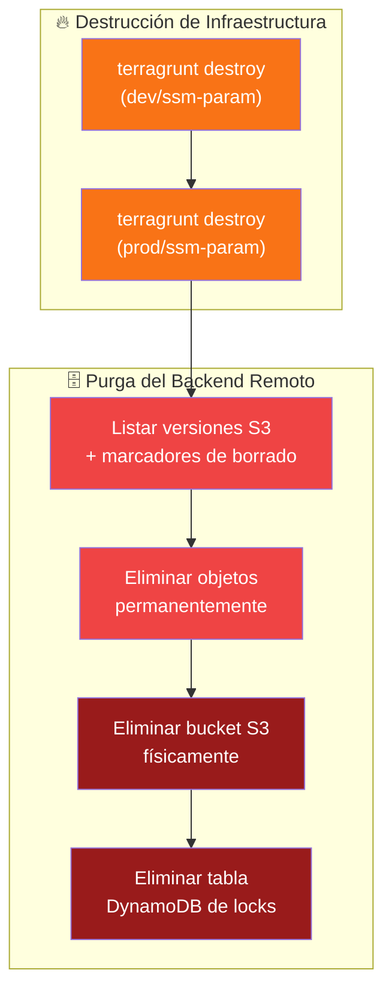
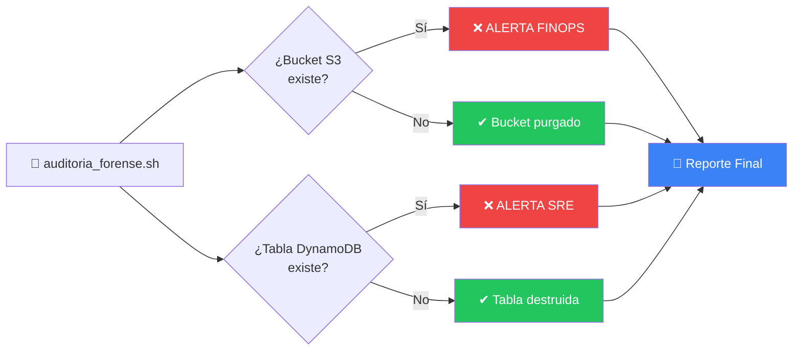

# 📔 Runbook de Operaciones: `iac-mastery_4`
### Guía Quirúrgica de Despliegue, FinOps y Purga de Laboratorio en AWS

<div align="center">


</div>

---

## 🧭 Tabla de Contenidos

| # | Fase | Objetivo | Riesgo |
|---|------|----------|--------|
| 1 | [Construcción de la Estructura](#️-fase-1-construcción-automática-de-la-estructura) | Generar el árbol de archivos IaC | 🟢 Bajo |
| 2 | [FinOps Shift-Left](#-fase-2-gestión-de-costes-estáticos-finops-shift-left) | Estimar costos antes de desplegar | 🟢 Bajo |
| 3 | [Despliegue en AWS](#-fase-3-despliegue-de-la-infraestructura-en-aws) | Provisionar recursos reales | 🟡 Medio |
| 4 | [Purga y Destrucción](#-fase-4-ciclo-de-cierre-seguro-purga-y-destrucción) | Eliminar todo rastro de infraestructura | 🔴 Alto |
| 5 | [Auditoría Forense](#-fase-5-auditoría-forense-final-garantía-de-costo-cero) | Certificar costo cero | 🟢 Bajo |

---

## 🗺️ Visión General del Flujo



---

## 📋 Prerrequisitos

> [!IMPORTANT]
> Antes de comenzar, verifica que tu entorno cumple con lo siguiente. Saltarte este paso es la causa #1 de errores en este laboratorio.

| Herramienta | Versión Mínima | Verificación |
|---|---|---|
| 🧱 Terraform | `>= 1.5.0` | `terraform -version` |
| 🌍 Terragrunt | Última estable | `terragrunt -v` |
| ☁️ AWS CLI | `v2` configurado | `aws sts get-caller-identity` |
| 💰 Infracost | Última estable + API key | `infracost --version` |
| 🧰 jq | Cualquier versión reciente | `jq --version` |



---

## ⚙️ FASE 1: Construcción Automática de la Estructura

> **🎯 Objetivo:** Generar de forma determinista y libre de errores humanos toda la jerarquía de directorios y archivos `.tf` / `.hcl` del laboratorio `iac-mastery_4`.

### 🏗️ Arquitectura de Directorios Resultante



### 1️⃣ Crear el árbol base de directorios

```bash
# Asegurarse de estar en el directorio correcto
mkdir -p ~/sre-linux-mastery/Fase2/iac-mastery_4
cd ~/sre-linux-mastery/Fase2/iac-mastery_4

# Crear directorios del laboratorio
mkdir -p modules/ssm environments/dev/ssm-param environments/prod/ssm-param scripts
```

### 2️⃣ Variables del módulo core (`modules/ssm/variables.tf`)

> 💡 **Tip didáctico:** la variable `crear_base_datos` actúa como un **interruptor condicional** (`count = var.crear_base_datos ? 1 : 0`), una técnica clásica de Terraform para simular recursos opcionales sin duplicar código.

```bash
cat > modules/ssm/variables.tf << 'EOF'
variable "environment" {
  type        = string
  description = "Entorno (dev/prod)"
}

variable "db_endpoint" {
  type        = string
  description = "Endpoint de la Base de Datos para inyectar"
}

variable "crear_base_datos" {
  type        = bool
  default     = false
  description = "Controlador condicional para simular costos con Infracost"
}

variable "instancia_db" {
  type        = string
  default     = "db.t3.micro"
  description = "Tipo de instancia de base de datos para simular en el entorno"
}
EOF
```

### 3️⃣ Recursos del módulo core (`modules/ssm/main.tf`)

```bash
cat > modules/ssm/main.tf << 'EOF'
terraform {
  required_version = ">= 1.5.0"
  required_providers {
    aws = {
      source  = "hashicorp/aws"
      version = "~> 5.0"
    }
  }
}

resource "aws_ssm_parameter" "db_host" {
  name        = "/config/${var.environment}/database_url"
  description = "URL de conexión de base de datos para ${var.environment}"
  type        = "String"
  value       = var.db_endpoint
  tags = {
    Environment = var.environment
    ManagedBy   = "Terragrunt"
    Lab         = "iac-mastery_4"
  }
}

resource "aws_db_instance" "simulada" {
  count                = var.crear_base_datos ? 1 : 0
  allocated_storage    = 20
  engine               = "mysql"
  instance_class       = var.instancia_db
  username             = "admin"
  password             = "PasswordSegura123!"
  skip_final_snapshot  = true

  tags = {
    Name        = "db-simulada-${var.environment}"
    Environment = var.environment
    ManagedBy   = "Terragrunt"
  }
}
EOF
```

> [!WARNING]
> El recurso `aws_db_instance.simulada` contiene una contraseña en texto plano (`PasswordSegura123!`). Esto es **aceptable únicamente en un laboratorio descartable**. En cualquier entorno real, esta credencial debe gestionarse vía `aws_secretsmanager_secret` o variables marcadas como `sensitive = true` inyectadas desde un vault externo.

### 4️⃣ Configuración raíz de Terragrunt (backend remoto S3 + DynamoDB)

```bash
cat > environments/terragrunt.hcl << 'EOF'
remote_state {
  backend = "s3"
  generate = {
    path      = "backend.tf"
    if_exists = "overwrite_terragrunt"
  }
  config = {
    bucket         = "garagorry-sre-tfstate"
    key            = "${path_relative_to_include()}/terraform.tfstate"
    region         = "us-east-1"
    encrypt        = true
    dynamodb_table = "garagorry-sre-tflocks"
  }
}

generate "provider" {
  path      = "provider.tf"
  if_exists = "overwrite_terragrunt"
  contents  = <<EOF
provider "aws" {
  region = "us-east-1"
}
EOF
}
EOF
```

### 5️⃣ Configuración del entorno DEV

```bash
cat > environments/dev/ssm-param/terragrunt.hcl << 'EOF'
include "root" {
  path = find_in_parent_folders()
}
terraform {
  source = "../../../modules//ssm"
}
inputs = {
  environment      = "dev"
  db_endpoint      = "dev-cluster-rds.sre.local"
  crear_base_datos = true
  instancia_db     = "db.t3.micro"
}
EOF
```

### 6️⃣ Configuración del entorno PROD

```bash
cat > environments/prod/ssm-param/terragrunt.hcl << 'EOF'
include "root" {
  path = find_in_parent_folders()
}
terraform {
  source = "../../../modules//ssm"
}
inputs = {
  environment      = "prod"
  db_endpoint      = "prod-main-cluster-ha.aws.com"
  crear_base_datos = true
  instancia_db     = "db.m5.large"
}
EOF
```

✅ **Checkpoint Fase 1:** corre `find . -type f | sort` y confirma que existen exactamente 6 archivos (`main.tf`, `variables.tf`, 3× `terragrunt.hcl`, y el `backend.tf`/`provider.tf` se generarán automáticamente en el primer `terragrunt init`).

---

## 💰 FASE 2: Gestión de Costes Estáticos (FinOps Shift-Left)

> **🎯 Objetivo:** Medir el impacto financiero del código **antes** de gastar un solo dólar en AWS. Esta es la esencia del *Shift-Left FinOps*: mover el control de costos lo más temprano posible en el ciclo de vida.



### 1️⃣ Generar el script de estimación automatizada

```bash
cat > scripts/estimar_costos.sh << 'EOF'
#!/bin/bash
echo "====================================================================="
echo "💰 INICIANDO ESTIMACIÓN DE COSTOS FINOPS CON INFRACOST"
echo "====================================================================="

DEV_PATH="$HOME/sre-linux-mastery/Fase2/iac-mastery_4/environments/dev/ssm-param"
PROD_PATH="$HOME/sre-linux-mastery/Fase2/iac-mastery_4/environments/prod/ssm-param"

echo "📊 [Entorno: DEV] Analizando parámetros estáticos..."
if [ -d "$DEV_PATH" ]; then
    infracost breakdown --path "$DEV_PATH"
fi

echo -e "\n📊 [Entorno: PROD] Analizando parámetros estáticos..."
if [ -d "$PROD_PATH" ]; then
    infracost breakdown --path "$PROD_PATH"
fi
echo "====================================================================="
EOF
chmod 750 scripts/estimar_costos.sh
```

### 2️⃣ Ejecutar el análisis financiero

```bash
./scripts/estimar_costos.sh
```

### 📊 Resultado esperado

| Entorno | Instancia | Costo Mensual Estimado | Diferencia |
|---|---|---|---|
| 🟢 DEV | `db.t3.micro` | **≈ $14.71 USD** | — |
| 🔴 PROD | `db.m5.large` | **≈ $127.13 USD** | 🔺 **+764%** |

> [!NOTE]
> Estos valores son **estimaciones estáticas** generadas por Infracost a partir del plan de Terraform, sin necesidad de llamar a la API de AWS ni de aprovisionar nada todavía. Son la base objetiva para aprobar (o rechazar) el presupuesto antes de avanzar a la Fase 3.

✅ **Checkpoint Fase 2:** si el costo proyectado de PROD excede tu umbral de aprobación, este es el momento de ajustar `instancia_db` en `environments/prod/ssm-param/terragrunt.hcl` — **no después del despliegue**.

---

## 🚀 FASE 3: Despliegue de la Infraestructura en AWS

> **🎯 Objetivo:** Una vez aprobado el presupuesto simulado, aplicar los planos de Terragrunt para materializar los recursos reales en AWS.



### 1️⃣ Desplegar Desarrollo (DEV)

```bash
cd ~/sre-linux-mastery/Fase2/iac-mastery_4/environments/dev/ssm-param
terragrunt apply -auto-approve
```

### 2️⃣ Desplegar Producción (PROD)

```bash
cd ~/sre-linux-mastery/Fase2/iac-mastery_4/environments/prod/ssm-param
terragrunt apply -auto-approve
```


✅ **Checkpoint Fase 3:** verifica en la consola de AWS (o vía `aws ssm get-parameter --name /config/dev/database_url`) que los parámetros SSM y las instancias RDS simuladas existen en ambos entornos.

---

## 🧹 FASE 4: Ciclo de Cierre Seguro (Purga y Destrucción)

> **🎯 Objetivo:** Cumplir con el pilar de **eficiencia de recursos** del Well-Architected Framework, eliminando todo rastro de infraestructura para evitar costos residuales indeseados ("recursos zombie").



### 1️⃣ Destruir recursos gestionados por Terragrunt

```bash
cd ~/sre-linux-mastery/Fase2/iac-mastery_4/environments/dev/ssm-param
terragrunt destroy -auto-approve

cd ~/sre-linux-mastery/Fase2/iac-mastery_4/environments/prod/ssm-param
terragrunt destroy -auto-approve
```

### 2️⃣ Purgar el almacenamiento remoto histórico (S3 + DynamoDB)

> 💡 **Concepto clave:** un bucket S3 con **versionado habilitado** no se vacía solo borrando los "archivos visibles". Cada versión histórica y cada *delete marker* deben eliminarse explícitamente, o el bucket nunca podrá ser destruido (AWS rechaza `delete-bucket` sobre un bucket no vacío).

```bash
cat > ~/sre-linux-mastery/Fase2/iac-mastery_4/scripts/eliminar_backend.sh << 'EOF'
#!/bin/bash
set -e
PREFIJO="garagorry-sre"
BUCKET_NAME="${PREFIJO}-tfstate"
TABLE_NAME="${PREFIJO}-tflocks"

echo "=== [SRE / FinOps] Iniciando Purga Absoluta del Backend ==="
if aws s3api head-bucket --bucket "$BUCKET_NAME" 2>/dev/null; then
    echo "⏳ Extrayendo y eliminando todas las versiones y marcadores de S3..."
    VERSIONS=$(aws s3api list-object-versions --bucket "$BUCKET_NAME" --output json || echo "{}")
    if [ "$VERSIONS" != "" ] && [ "$VERSIONS" != "null" ] && [ "$VERSIONS" != "{}" ]; then
        OBJECTS=$(echo "$VERSIONS" | jq -c '{Objects: [.Versions[]?, .DeleteMarkers[]? | select(. != null) | {Key: .Key, VersionId: .VersionId}]}')
        if [ "$OBJECTS" != "{\"Objects\":[]}" ] && [ "$OBJECTS" != "{\"Objects\":null}" ]; then
            echo "🔥 Eliminando objetos permanentemente de AWS S3..."
            aws s3api delete-objects --bucket "$BUCKET_NAME" --delete "$OBJECTS" > /dev/null
        fi
    fi
    echo "⏳ Eliminando contenedor físico del bucket..."
    aws s3api delete-bucket --bucket "$BUCKET_NAME"
    echo "✔ Bucket S3 eliminado con éxito."
fi
if aws dynamodb describe-table --table-name "$TABLE_NAME" 2>/dev/null; then
    echo "⏳ Eliminando tabla DynamoDB..."
    aws dynamodb delete-table --table-name "$TABLE_NAME" > /dev/null
    echo "✔ Tabla DynamoDB eliminada con éxito."
fi
EOF
chmod +x ~/sre-linux-mastery/Fase2/iac-mastery_4/scripts/eliminar_backend.sh
~/sre-linux-mastery/Fase2/iac-mastery_4/scripts/eliminar_backend.sh
```

> [!CAUTION]
> Esta operación es **irreversible**. `set -e` detiene el script ante cualquier error inesperado, pero la eliminación de versiones S3 y de la tabla DynamoDB **no tiene papelera de reciclaje**. Confirma que ya no necesitas el historial de `tfstate` antes de continuar.

✅ **Checkpoint Fase 4:** ambos `terragrunt destroy` deben finalizar sin errores antes de ejecutar `eliminar_backend.sh` — destruir el backend con un `tfstate` "vivo" dentro puede dejar recursos huérfanos sin registro.

---

## 🔬 FASE 5: Auditoría Forense Final (Garantía de Costo Cero)

> **🎯 Objetivo:** Certificar de forma objetiva que no quedan recursos huérfanos ni "zombies" facturando silenciosamente en la cuenta de AWS.



### 1️⃣ Construir y ejecutar el validador forense

```bash
cat > ~/sre-linux-mastery/Fase2/iac-mastery_4/scripts/auditoria_forense.sh << 'EOF'
#!/bin/bash
PREFIJO="garagorry-sre"
BUCKET_NAME="${PREFIJO}-tfstate"
TABLE_NAME="${PREFIJO}-tflocks"

echo "====================================================================="
echo "🔬 INICIANDO AUDITORÍA FORENSE: COMPROBACIÓN DE RECURSOS RESIDUALES"
echo "====================================================================="
if aws s3api head-bucket --bucket "$BUCKET_NAME" 2>/dev/null; then
    echo "❌ ALERTA FINOPS: El bucket '$BUCKET_NAME' todavía existe."
else
    echo "✔ ÉXITO: El bucket S3 '$BUCKET_NAME' fue purgado y eliminado."
fi
if aws dynamodb describe-table --table-name "$TABLE_NAME" 2>/dev/null; then
    echo "❌ ALERTA SRE: La tabla DynamoDB '$TABLE_NAME' sigue activa."
else
    echo "✔ ÉXITO: La tabla DynamoDB '$TABLE_NAME' fue destruida."
fi
echo "====================================================================="
EOF
chmod +x ~/sre-linux-mastery/Fase2/iac-mastery_4/scripts/auditoria_forense.sh
~/sre-linux-mastery/Fase2/iac-mastery_4/scripts/auditoria_forense.sh
```

### 🏁 Criterio de éxito

| Recurso | Estado Esperado | Comando de Verificación |
|---|---|---|
| 🪣 Bucket `garagorry-sre-tfstate` | ❌ No existe | `aws s3api head-bucket --bucket garagorry-sre-tfstate` |
| 🗃️ Tabla `garagorry-sre-tflocks` | ❌ No existe | `aws dynamodb describe-table --table-name garagorry-sre-tflocks` |

> [!TIP]
> Si la auditoría reporta ✔ en ambos recursos, el laboratorio `iac-mastery_4` está **oficialmente cerrado con costo cero**. Si reporta ❌ en alguno, vuelve a la **Fase 4** antes de dar por finalizado el ejercicio — un recurso olvidado en AWS sigue facturando aunque ya no lo estés usando.

---

## 📊 Resumen Ejecutivo del Ciclo de Vida Completo

```mermaid
gantt
    dateFormat  X
    axisFormat %s
    title Ciclo de Vida del Laboratorio iac-mastery_4
    section Construcción
    Fase 1 - Estructura IaC      :done, f1, 0, 1
    section FinOps
    Fase 2 - Estimación de Costos :done, f2, 1, 2
    section Cloud
    Fase 3 - Despliegue AWS        :active, f3, 2, 3
    Fase 4 - Purga y Destrucción   :crit, f4, 3, 4
    section Validación
    Fase 5 - Auditoría Forense     :f5, 4, 5
```



| Fase | Comando Clave | Resultado |
|---|---|---|
| 1️⃣ | `mkdir -p` + `cat > *.tf/.hcl` | Estructura IaC reproducible |
| 2️⃣ | `infracost breakdown` | DEV ≈ $14.71 / PROD ≈ $127.13 USD |
| 3️⃣ | `terragrunt run-all apply` | Infraestructura viva en AWS |
| 4️⃣ | `terragrunt run-all destroy` + purga S3/DynamoDB | Cero recursos remanentes |
| 5️⃣ | Script de auditoría forense | ✔ Costo Cero certificado |

---

<div align="center">

### 🏆 Laboratorio `iac-mastery_4` — Ciclo SRE / FinOps Completo

**Construir → Medir → Desplegar → Destruir → Verificar**


</div>
