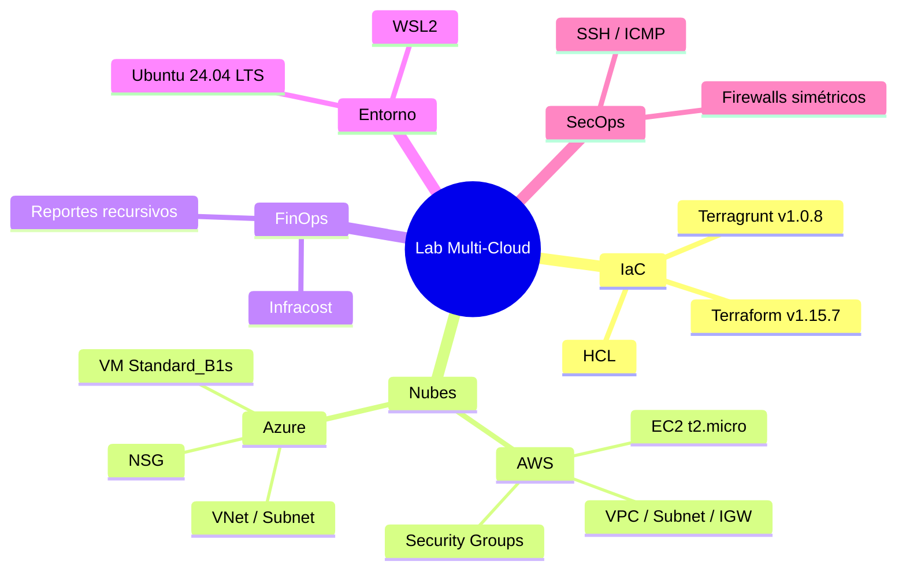
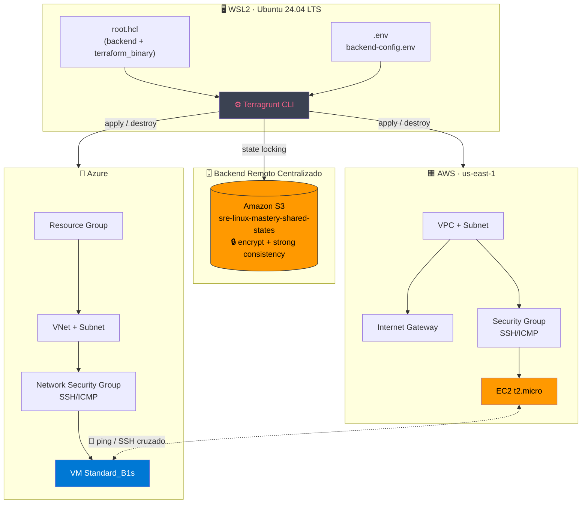
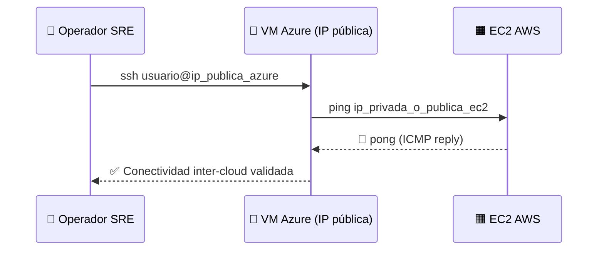

<div align="center">

# 🌐 Laboratorio de Infraestructura Multi-Cloud Avanzada
### 🧠 SRE · IaC · FinOps con Terraform + Terragrunt

**Aprovisionamiento, auditoría de costos y desmantelamiento seguro de infraestructura híbrida en AWS + Azure**

[](https://www.terraform.io/)
[](https://terragrunt.gruntwork.io/)
[](https://aws.amazon.com/)
[](https://azure.microsoft.com/)
[](https://ubuntu.com/wsl)

[](https://www.infracost.io/)
[]()
[]()
[]()

</div>

---

## 📌 Tabla de contenidos

- [🎯 ¿Qué es este laboratorio?](#-qué-es-este-laboratorio)
- [🗺️ Alcance del lab](#️-alcance-del-lab)
- [🧩 Stack tecnológico](#-stack-tecnológico)
- [☁️ Nubes involucradas](#️-nubes-involucradas)
- [🏗️ Arquitectura de la solución](#️-arquitectura-de-la-solución)
- [📁 Estructura del repositorio](#-estructura-del-repositorio)
- [🔄 Flujo de vida del laboratorio](#-flujo-de-vida-del-laboratorio)
- [💰 Auditoría FinOps](#-auditoría-finops)
- [🧪 Prueba de red cruzada](#-prueba-de-red-cruzada)
- [✅ Buenas prácticas aplicadas](#-buenas-prácticas-aplicadas)
- [🚀 Quickstart](#-quickstart)
- [🎓 Objetivos de aprendizaje](#-objetivos-de-aprendizaje)

---

## 🎯 ¿Qué es este laboratorio?

Este repositorio es una **arquitectura de referencia hands-on** pensada para enseñar, de punta a punta, cómo un equipo de **SRE / Platform Engineering** construye, valida el costo, despliega y **destruye de forma higiénica** infraestructura simultánea en **dos proveedores cloud distintos**, usando un único framework de orquestación DRY: **Terragrunt** sobre **Terraform**.

> 💡 No es un tutorial de "hola mundo". Es un laboratorio con decisiones de arquitectura reales: backend remoto centralizado, control de binarios, simetría de reglas de firewall entre nubes y auditoría de costos previa al `apply`.

---

## 🗺️ Alcance del lab

| Fase | Objetivo | Resultado esperado |
|------|-----------|--------------------|
| 1️⃣ Estructura | Construir el árbol de directorios DRY | Carpetas `modules/`, `environments/`, `scripts/` |
| 2️⃣ Bootstrap | Autenticar y cargar variables de entorno | Sesión activa en AWS + Azure |
| 3️⃣ FinOps | Pronosticar costos antes de desplegar | Reporte de Infracost con desglose por nube |
| 4️⃣ Deploy | Aprovisionar VPC/VNet + VM en paralelo | 2 instancias corriendo (AWS + Azure) |
| 5️⃣ Validación | Probar conectividad cruzada SSH/ICMP | Ping exitoso entre nubes |
| 6️⃣ Destrucción | Desmontaje en orden inverso | 0 recursos huérfanos |
| 7️⃣ Auditoría nuclear | Verificación global vía API | Certificación de "cuenta limpia" |

---

## 🧩 Stack tecnológico

<div align="center">



</div>

| Categoría | Herramienta | Rol en el laboratorio |
|---|---|---|
| 🧱 IaC Engine | **Terraform 1.15.7** | Motor de aprovisionamiento declarativo |
| 🎛️ Orquestador DRY | **Terragrunt 1.0.8** | Evita duplicación de backend/config entre entornos |
| ☁️ Cloud #1 | **AWS** | EC2, VPC, Subnet, IGW, Route Table, Security Group |
| ☁️ Cloud #2 | **Azure** | Resource Group, VNet, Subnet, NSG, NIC, IP Pública, VM Linux |
| 💰 FinOps | **Infracost** | Estimación de costo recursivo antes del `apply` |
| 🗄️ Backend remoto | **Amazon S3** | Estado centralizado con consistencia fuerte (sin DynamoDB) |
| 🖥️ Entorno local | **WSL2 + Ubuntu 24.04 LTS** | Terminal de trabajo del operador SRE |

---

## ☁️ Nubes involucradas

<table align="center">
<tr>
<th align="center">🟧 AWS</th>
<th align="center">🔵 Azure</th>
</tr>
<tr>
<td>

- VPC + Subnet pública
- Internet Gateway + Route Table
- Security Group (SSH/ICMP)
- Instancia **EC2 t2.micro** + EBS gp2
- 💵 ~**$9.27 USD/mes**

</td>
<td>

- Resource Group dedicado
- VNet + Subnet
- Network Security Group (NSG)
- VM Linux **Standard_B1s** + IP pública + disco S4
- 💵 ~**$12.78 USD/mes**

</td>
</tr>
</table>

<div align="center">

**💰 Impacto total consolidado estimado: `$22.05 USD / mes`**

</div>

---

## 🏗️ Arquitectura de la solución



---

## 📁 Estructura del repositorio

```text
~/sre-linux-mastery/Fase2/iac-mastery_5/
├── root.hcl                    # 🌐 Backend global + inyección de binario Terraform
├── backend-config.env          # 🔑 Variables de entorno dinámicas
├── modules/                    # 🧩 Módulos reutilizables (HCL)
│   ├── aws_vm/                 #   ├─ VPC, Subnet, IGW, RouteTable, SG, EC2
│   └── azure_vm/                #   └─ RG, VNet, Subnet, NSG, NIC, IP, VM
├── environments/                # 🌱 Entornos segregados
│   └── dev/
│       ├── aws/terragrunt.hcl
│       └── azure/terragrunt.hcl
└── scripts/                     # 🛠️ Automatización y auditoría forense
    ├── fase_0.sh                # ➔ Instala las herramientas base
    ├── fase_1_backend-bootstrap.sh
    ├── finops-report.sh
    ├── resource-inventory.sh
    ├── backend-purge.sh
    └── sre-nuclear-audit.sh
```

---

## 🔄 Flujo de vida del laboratorio

```mermaid
flowchart LR
    A["📂 Fase 1<br/>Estructura de directorios"] --> B["🔐 Fase 2<br/>Bootstrap & Auth<br/>(aws configure / az login)"]
    B --> C["📊 Fase 3<br/>Auditoría FinOps<br/>(Infracost)"]
    C --> D{"¿Costo<br/>aprobado?"}
    D -- ✅ Sí --> E["🚀 Fase 4<br/>Deploy AWS + Azure<br/>(terragrunt apply)"]
    D -- ❌ No --> C
    E --> F["🧪 Fase 5<br/>Pruebas cruzadas<br/>SSH / ICMP"]
    F --> G["🪓 Fase 6<br/>Destrucción ordenada<br/>Azure → AWS → Backend"]
    G --> H["🛡️ Fase 7<br/>Auditoría Nuclear<br/>(0 recursos huérfanos)"]
    H --> I(["✅ Presupuesto a salvo"])

    style A fill:#4C566A,color:#fff
    style E fill:#FF9900,color:#000
    style G fill:#BF616A,color:#fff
    style H fill:#5E81AC,color:#fff
    style I fill:#3B8A45,color:#fff
```



---

## 💰 Auditoría FinOps

> **¿Por qué antes del `apply`?** Un SRE nunca despliega a ciegas. Los planes binarios con "cero cambios" son ignorados silenciosamente por Infracost CLI tradicional — este lab escanea el código HCL **recursivamente** para forzar el pronóstico real.

```bash
./scripts/finops-report.sh
```

| Recurso | Proveedor | Costo estimado |
|---|---|---|
| EC2 t2.micro + EBS gp2 | 🟧 AWS | `$9.27 USD/mes` |
| Standard_B1s + IP estática + disco S4 | 🔵 Azure | `$12.78 USD/mes` |
| **Total consolidado** | 🌐 Multi-Cloud | **`$22.05 USD/mes`** |

---

## 🧪 Prueba de red cruzada



---

## ✅ Buenas prácticas aplicadas

- 🔒 **Control estricto de binarios** — inyección explícita de `terraform_binary` vía `TG_TF_PATH` para evitar colisiones con OpenTofu u otras herramientas.
- 🗄️ **Backend remoto único y segregado** — estado de AWS y Azure centralizado en S3, aprovechando la consistencia fuerte nativa de Terraform 1.15+ (sin DynamoDB).
- 🧱 **DRY con Terragrunt** — configuración de backend heredada desde `root.hcl`, sin repetir bloques `backend {}` por entorno.
- 🧯 **Simetría de SecOps** — reglas de firewall equivalentes (SG / NSG) entre nubes para tráfico crítico SSH/ICMP.
- 💵 **FinOps shift-left** — costos calculados *antes* del `apply`, no después de la factura.
- 🪓 **Destrucción en orden inverso** — Azure → AWS → purga de backend, minimizando dependencias colgantes.
- 🛡️ **Auditoría nuclear post-destrucción** — verificación global por API (no por nombre) para garantizar cero recursos huérfanos.

---

## 🚀 Quickstart

```bash
# 1. Clonar y preparar estructura
mkdir -p modules/aws_vm modules/azure_vm environments/dev/aws environments/dev/azure scripts

# 2. Autenticación multi-cloud
aws configure
az login

# 3. Cargar variables de entorno
source ./backend-config.env

# 4. Auditoría de costos ANTES de desplegar
./scripts/finops-report.sh

# 5. Desplegar
cd environments/dev/aws/    && terragrunt apply --auto-approve && cd ../../../
cd environments/dev/azure/  && terragrunt apply --auto-approve && cd ../../../

# 6. Validar y luego destruir en orden inverso
./scripts/resource-inventory.sh
cd environments/dev/azure/  && terragrunt destroy --auto-approve && cd ../../../
cd environments/dev/aws/    && terragrunt destroy --auto-approve && cd ../../../
./scripts/backend-purge.sh
./scripts/sre-nuclear-audit.sh
```

---

## 🎓 Objetivos de aprendizaje

Al completar este laboratorio, el estudiante será capaz de:

- [x] Diseñar backends remotos centralizados y seguros para múltiples nubes
- [x] Aplicar el principio DRY en infraestructura como código con Terragrunt
- [x] Ejecutar auditorías de costos **preventivas** (FinOps shift-left)
- [x] Configurar reglas de red simétricas entre proveedores cloud distintos
- [x] Validar conectividad real inter-cloud (SSH/ICMP)
- [x] Ejecutar un desmantelamiento higiénico y auditable de infraestructura

---

<div align="center">

**🧑‍🏫 Laboratorio diseñado bajo estándares reales de la industria SRE/Platform Engineering**

`Terraform` · `Terragrunt` · `AWS` · `Azure` · `FinOps` · `WSL2`

</div>

