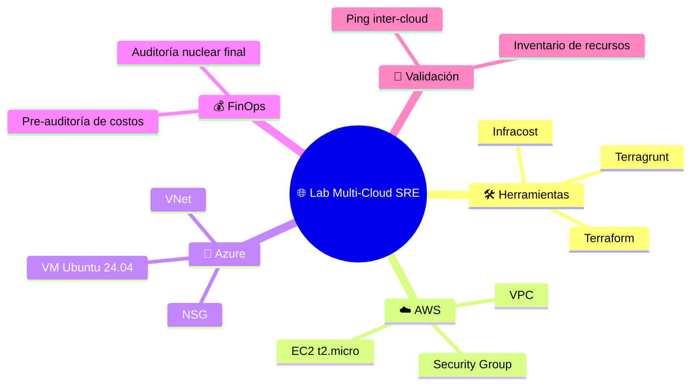
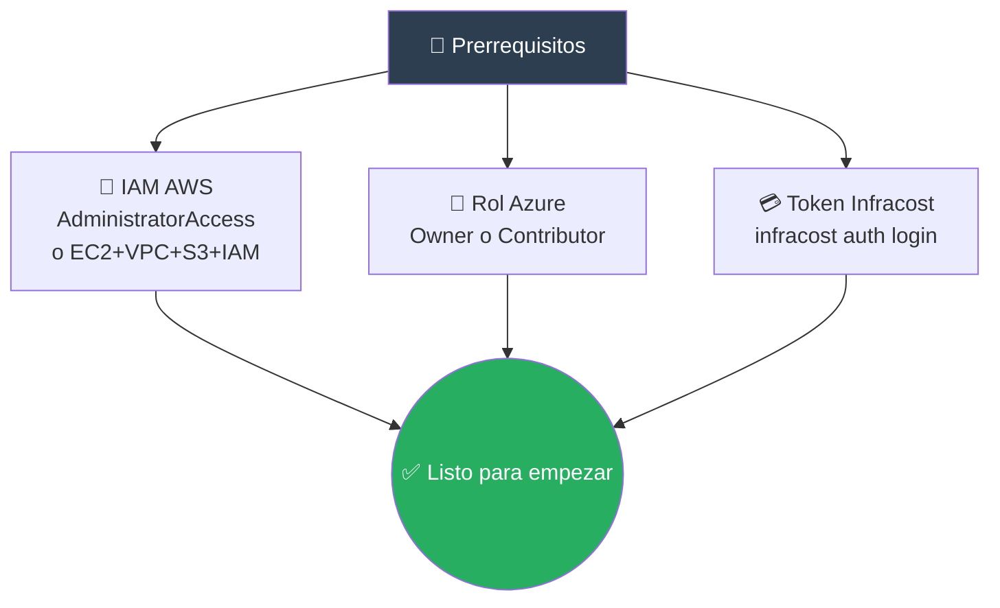
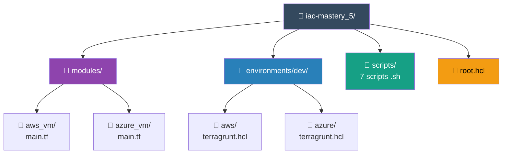
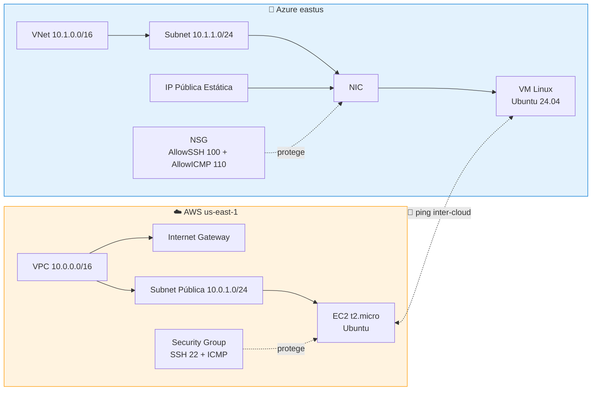
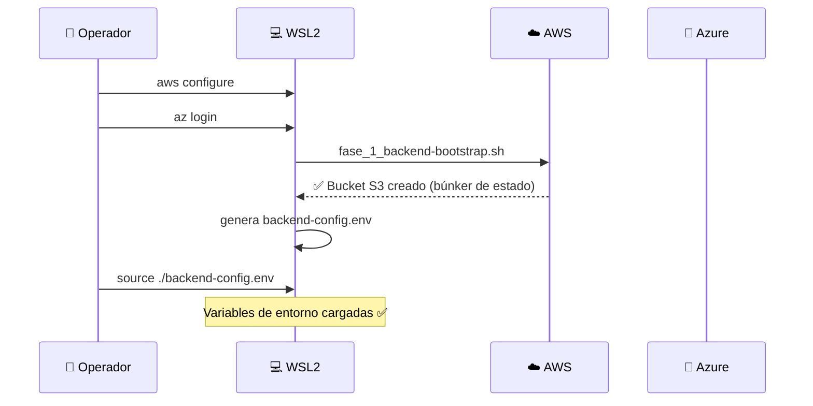
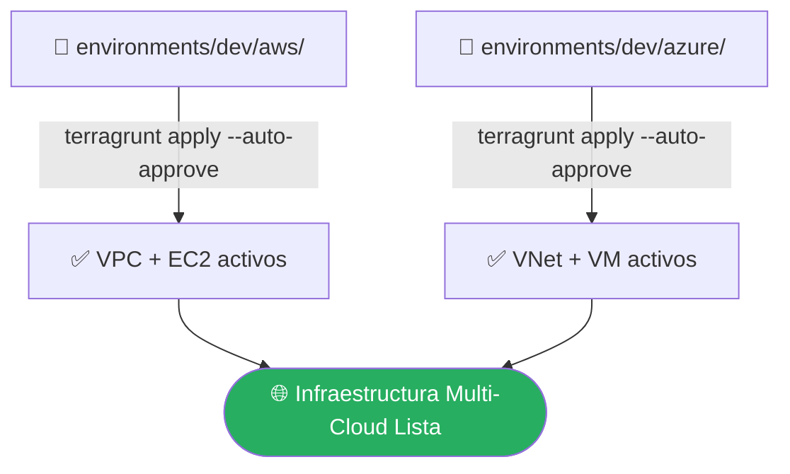
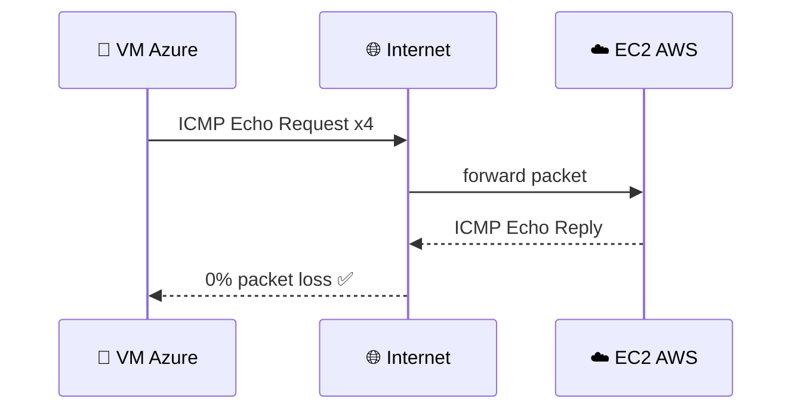
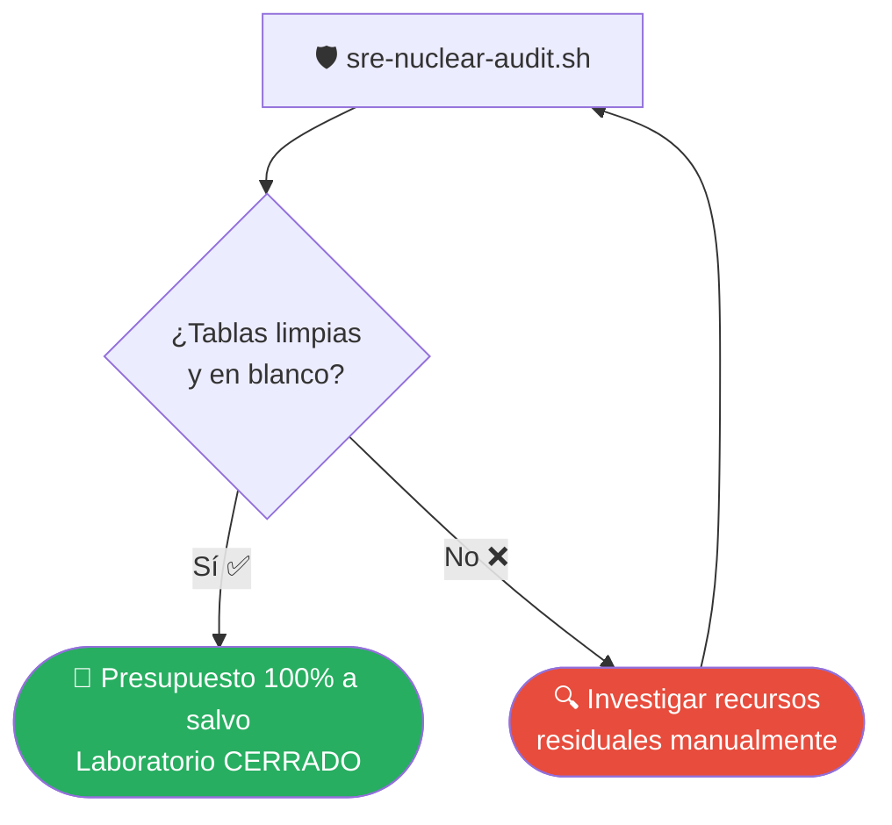
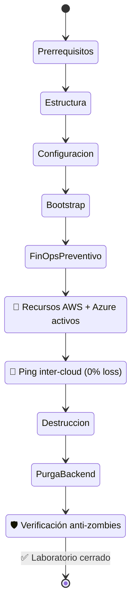

<div align="center">

# 🚀 Runbook Multi-Cloud SRE
### Guía Definitiva de Construcción, Despliegue y Gobierno de Infraestructura Híbrida


**Nivel:** Principiante → Intermedio &nbsp;|&nbsp; **Duración estimada:** 2-3 horas &nbsp;|&nbsp; **Costo estimado:** ~$22.05 USD/mes (si no se destruye)

</div>

---

## 📖 ¿Qué vas a construir?

Este manual te lleva **de la mano, paso a paso**, para levantar un laboratorio de infraestructura **multi-nube (AWS + Azure)** usando **Terraform + Terragrunt**, auditar su costo con **Infracost**, verificar la conectividad entre nubes con un `ping` inter-cloud, y — lo más importante — **destruirlo de forma higiénica** para no recibir sorpresas en tu tarjeta de crédito.

> 💡 **Filosofía del laboratorio:** *"Todo lo que se despliega, se audita. Todo lo que se audita, se destruye. Todo lo que se destruye, se verifica."*



---

## 🗺️ Mapa de Fases (Vista de Vuelo de Pájaro)

```mermaid
flowchart LR
    F0["🟩 Fase 0\nPrerrequisitos"] --> F1["📂 Fase 1\nEstructura"]
    F1 --> F2["📄 Fase 2\nArchivos HCL"]
    F2 --> F3["🟨 Fase 3\nBootstrap Backend"]
    F3 --> F4["📊 Fase 4\nFinOps Preventivo"]
    F4 --> F5["🚀 Fase 5\nDespliegue"]
    F5 --> F6["🧪 Fase 6\nPruebas Cruzadas"]
    F6 --> F7["🪓 Fase 7\nDestrucción"]
    F7 --> F8["🧼 Fase 8\nPurga Backend"]
    F8 --> F9["🛡️ Fase 9\nAuditoría Nuclear"]

    style F0 fill:#d4edda,stroke:#28a745,color:#000
    style F1 fill:#d4edda,stroke:#28a745,color:#000
    style F2 fill:#fff3cd,stroke:#ffc107,color:#000
    style F3 fill:#fff3cd,stroke:#ffc107,color:#000
    style F4 fill:#cce5ff,stroke:#007bff,color:#000
    style F5 fill:#f8d7da,stroke:#dc3545,color:#000
    style F6 fill:#e2d9f3,stroke:#6f42c1,color:#000
    style F7 fill:#f8d7da,stroke:#dc3545,color:#000
    style F8 fill:#d1ecf1,stroke:#17a2b8,color:#000
    style F9 fill:#d1ecf1,stroke:#17a2b8,color:#000
```



---

## 🧰 Caja de Herramientas: Los 7 Scripts

| # | Script | Fase | Qué hace |
|---|--------|------|----------|
| 1️⃣ | `fase_0.sh` | Fase 1 (Paso 2) | Instala Terraform, Terragrunt e Infracost en WSL |
| 2️⃣ | `fase_1_backend-bootstrap.sh` | Fase 2 (Paso 2) | Crea el bucket S3 (búnker de estado) y el `.env` |
| 3️⃣ | `finops-report.sh` | Fase 4 (Paso 2) | Calcula el costo mensual proyectado con Infracost |
| 4️⃣ | `resource-inventory.sh` | Fase 6 (Paso 1) | Consulta a AWS y Azure qué recursos reales están encendidos |
| 5️⃣ | `sre-nuclear-audit.sh` | Fase 9 (Paso 1) | Escanea toda la cuenta buscando "basura tecnológica" |
| 6️⃣ | `backend-list.sh` | Consulta libre | Lista los `.tfstate` guardados en el S3 |
| 7️⃣ | `backend-purge.sh` | Fase 8 (Paso 3) | Destruye el bucket S3 y limpia la máquina local |

> ⚠️ **Regla de oro:** ejecuta los scripts **solo en el orden indicado**. Saltarte pasos puede dejar recursos huérfanos cobrando en segundo plano.

---

## 🟩 Fase 0 — Prerrequisitos

Antes de tocar la terminal, necesitas **tres llaves** listas:



1. **AWS IAM:** las credenciales locales (Access Key + Secret Key) deben pertenecer a un usuario con `AdministratorAccess`, o mínimo permisos totales sobre **EC2, VPC, S3 e IAM**.
2. **Azure RBAC:** el usuario necesita rol **Propietario (Owner)** o **Contribuidor (Contributor)** sobre la suscripción activa.
3. **Infracost:** regístrate gratis en [infracost.io](https://www.infracost.io) y autentica:

   ```bash
   infracost auth login
   ```
   Esto guarda una API Key local indispensable para el script de costos.

<details>
<summary>🧠 <b>¿Por qué tantos permisos?</b> (haz clic para expandir)</summary>

Terraform necesita crear/leer/modificar recursos de red, cómputo y almacenamiento en ambas nubes. Un permiso insuficiente se traduce en errores `AccessDenied` a mitad del `apply`, dejando el entorno en un estado parcial — por eso conviene empezar con permisos amplios en un entorno de laboratorio (nunca en producción).
</details>

---

## 📂 Fase 1 — Estructura de Directorios

Levanta de golpe el árbol de carpetas del proyecto:

```bash
cd ~
mkdir -p sre-linux-mastery/Fase2/iac-mastery_5/modules/aws_vm \
         sre-linux-mastery/Fase2/iac-mastery_5/modules/azure_vm \
         sre-linux-mastery/Fase2/iac-mastery_5/environments/dev/aws \
         sre-linux-mastery/Fase2/iac-mastery_5/environments/dev/azure \
         sre-linux-mastery/Fase2/iac-mastery_5/scripts

cd sre-linux-mastery/Fase2/iac-mastery_5/
```



### ⚙️ Instalar herramientas base

```bash
chmod +x scripts/fase_0.sh
./scripts/fase_0.sh
```

Este script descarga los binarios oficiales de HashiCorp (**Terraform**), **Terragrunt** e **Infracost**, dejándolos disponibles en el `PATH` del sistema — concretamente en `/usr/local/bin/terraform`, que es la ruta que referencia `root.hcl` más abajo. Si alguno de tus otros scripts (por ejemplo `fase_1_backend-bootstrap.sh`) exporta una variable como `TG_TF_PATH` apuntando a otra ruta, **ajústala para que coincida exactamente** con esta; una discrepancia aquí hace que Terragrunt intente invocar un binario que no existe o uno equivocado.

---

## 📄 Fase 2 — Archivos de Configuración (El Plano)

### 🧩 Arquitectura general



### 1️⃣ `root.hcl` — Control Global

📍 `~/sre-linux-mastery/Fase2/iac-mastery_5/root.hcl`

**Función:** centraliza la herencia del backend remoto (S3) y fija el binario oficial de Terraform en el sistema, evitando conflictos con otras herramientas como OpenTofu.

> ⚠️ **Checklist de consistencia (léelo antes de copiar/pegar):**
> - `local.tf_path` debe apuntar **exactamente** a donde `fase_0.sh` deja el binario (`/usr/local/bin/terraform` en este runbook).
> - `config.bucket` debe ser **el mismo string, carácter por carácter**, que el bucket que crea `fase_1_backend-bootstrap.sh` y que queda expuesto en `backend-config.env` (p. ej. como `TG_AWS_BUCKET`). Si tu script de bootstrap genera un nombre dinámico (con timestamp, sufijo random, etc.), **copia ese valor real** aquí en vez de un string fijo, o Terragrunt intentará inicializar un bucket que no existe.

```hcl
locals {
  tf_path = "/usr/local/bin/terraform"
}

terraform_binary = local.tf_path

remote_state {
  backend = "s3"
  generate = {
    path      = "backend.tf"
    if_exists = "overwrite_header"
  }
  config = {
    # 👇 Debe coincidir EXACTAMENTE con el bucket creado por
    #    scripts/fase_1_backend-bootstrap.sh (revisa backend-config.env)
    bucket  = "sre-lab-1782406945-tfstate"
    key     = "${path_relative_to_include()}/terraform.tfstate"
    region  = "us-east-1"
    encrypt = true
  }
}
```

### 2️⃣ Módulo AWS — `modules/aws_vm/main.tf`

**Función:** construye una VPC aislada, un Internet Gateway y una tabla de ruteo pública, además de un Security Group que expone SSH (22) e ICMP (ping).

> ⚠️ **Regla crítica:** el Security Group se nombra `firewall-sre-...` porque la API de AWS **prohíbe** nombres que empiecen con el prefijo reservado `sg-`.

```hcl
terraform {
  required_providers {
    aws = {
      source  = "hashicorp/aws"
      version = "~> 5.0"
    }
  }
  backend "s3" {}
}

variable "environment" { type = string }

resource "aws_vpc" "main" {
  cidr_block           = "10.0.0.0/16"
  enable_dns_hostnames = true
  tags                 = { Name = "vpc-sre-${var.environment}", Env = var.environment }
}

resource "aws_internet_gateway" "igw" {
  vpc_id = aws_vpc.main.id
  tags   = { Name = "igw-sre-${var.environment}" }
}

resource "aws_route_table" "public" {
  vpc_id = aws_vpc.main.id
  route {
    cidr_block = "0.0.0.0/0"
    gateway_id = aws_internet_gateway.igw.id
  }
  tags = { Name = "rt-sre-${var.environment}" }
}

resource "aws_subnet" "public" {
  vpc_id                  = aws_vpc.main.id
  cidr_block              = "10.0.1.0/24"
  map_public_ip_on_launch = true
  tags                    = { Name = "subnet-sre-${var.environment}" }
}

resource "aws_route_table_association" "public" {
  subnet_id      = aws_subnet.public.id
  route_table_id = aws_route_table.public.id
}

resource "aws_security_group" "sg" {
  name   = "firewall-sre-${var.environment}"
  vpc_id = aws_vpc.main.id

  ingress {
    from_port   = 22
    to_port     = 22
    protocol    = "tcp"
    cidr_blocks = ["0.0.0.0/0"]
  }

  ingress {
    from_port   = -1
    to_port     = -1
    protocol    = "icmp"
    cidr_blocks = ["0.0.0.0/0"]
  }

  egress {
    from_port   = 0
    to_port     = 0
    protocol    = "-1"
    cidr_blocks = ["0.0.0.0/0"]
  }
}

resource "aws_instance" "web" {
  ami                    = "ami-0e2c8caa4b6378d8c"
  instance_type          = "t2.micro"
  subnet_id              = aws_subnet.public.id
  vpc_security_group_ids = [aws_security_group.sg.id]
  tags                   = { Name = "vm-aws-${var.environment}" }
}

output "instance_ip" { value = aws_instance.web.public_ip }
```

### 3️⃣ Módulo Azure — `modules/azure_vm/main.tf`

**Función:** levanta un Resource Group, una VNet, una Subred y una IP Pública Estática. Declara un NSG con reglas explícitas (`AllowSSH` prioridad 100, `AllowICMP` prioridad 110) vinculado a la NIC de la VM Linux Ubuntu 24.04.

```hcl
terraform {
  required_providers {
    azurerm = {
      source  = "hashicorp/azurerm"
      version = "~> 4.0"
    }
  }
  backend "s3" {}
}

variable "environment" { type = string }

resource "azurerm_resource_group" "rg" {
  name     = "rg-sre-${var.environment}"
  location = "eastus"
}

resource "azurerm_virtual_network" "vnet" {
  name                = "vnet-sre-${var.environment}"
  address_space       = ["10.1.0.0/16"]
  location            = azurerm_resource_group.rg.location
  resource_group_name = azurerm_resource_group.rg.name
}

resource "azurerm_subnet" "sub" {
  name                 = "subnet-sre-${var.environment}"
  resource_group_name  = azurerm_resource_group.rg.name
  virtual_network_name = azurerm_virtual_network.vnet.name
  address_prefixes     = ["10.1.1.0/24"]
}

resource "azurerm_public_ip" "pip" {
  name                = "pip-sre-${var.environment}"
  location            = azurerm_resource_group.rg.location
  resource_group_name = azurerm_resource_group.rg.name
  allocation_method   = "Static"
}

resource "azurerm_network_security_group" "nsg" {
  name                = "nsg-sre-${var.environment}"
  location            = azurerm_resource_group.rg.location
  resource_group_name = azurerm_resource_group.rg.name

  security_rule {
    name                       = "AllowSSH"
    priority                   = 100
    direction                  = "Inbound"
    access                     = "Allow"
    protocol                   = "Tcp"
    source_port_range          = "*"
    destination_port_range     = "22"
    source_address_prefix      = "*"
    destination_address_prefix = "*"
  }

  security_rule {
    name                       = "AllowICMP"
    priority                   = 110
    direction                  = "Inbound"
    access                     = "Allow"
    protocol                   = "Icmp"
    source_port_range          = "*"
    destination_port_range     = "*"
    source_address_prefix      = "*"
    destination_address_prefix = "*"
  }
}

resource "azurerm_network_interface" "nic" {
  name                = "nic-sre-${var.environment}"
  location            = azurerm_resource_group.rg.location
  resource_group_name = azurerm_resource_group.rg.name

  ip_configuration {
    name                          = "internal"
    subnet_id                     = azurerm_subnet.sub.id
    private_ip_address_allocation = "Dynamic"
    public_ip_address_id          = azurerm_public_ip.pip.id
  }
}

resource "azurerm_network_interface_security_group_association" "assoc" {
  network_interface_id      = azurerm_network_interface.nic.id
  network_security_group_id = azurerm_network_security_group.nsg.id
}

resource "azurerm_linux_virtual_machine" "vm" {
  name                   = "vm-az-${var.environment}"
  resource_group_name    = azurerm_resource_group.rg.name
  location               = azurerm_resource_group.rg.location
  size                   = "Standard_B1s"
  admin_username         = "adminuser"
  network_interface_ids  = [azurerm_network_interface.nic.id]

  admin_password                  = "P@ssw0rdSRE2026!"
  disable_password_authentication = false

  os_disk {
    caching              = "ReadWrite"
    storage_account_type = "Standard_LRS"
  }

  source_image_reference {
    publisher = "Canonical"
    offer     = "ubuntu-24_04-lts"
    sku       = "server"
    version   = "latest"
  }
}

output "vm_ip" { value = azurerm_linux_virtual_machine.vm.public_ip_address }
```

> 🔒 **Nota de seguridad para producción:** la contraseña embebida (`admin_password`) es válida **solo para laboratorio**. En un entorno real, usa `azurerm_key_vault_secret` o llaves SSH en lugar de contraseñas en texto plano dentro del código, y nunca subas este archivo a un repositorio público con la contraseña real.

### 4️⃣ Hojas Terragrunt (patrón DRY)

📍 `environments/dev/aws/terragrunt.hcl`
```hcl
include "root" { path = find_in_parent_folders() }
terraform { source = "../../../modules//aws_vm" }
inputs = { environment = "dev" }
```

📍 `environments/dev/azure/terragrunt.hcl`
```hcl
include "root" { path = find_in_parent_folders() }
terraform { source = "../../../modules//azure_vm" }
inputs = { environment = "dev" }
```

---

## 🟨 Fase 3 — Bootstrap del Backend Remoto

### 🧠 Fundamento: S3 Native Locking

> A partir de **Terraform v1.15+**, las operaciones condicionales nativas de la API de S3 gestionan el bloqueo de estado (*state locking*) concurrente **sin necesidad de DynamoDB**. Menos infraestructura = menos costo = menos superficie de fallo.



```bash
# 1. Autenticar terminales contra las nubes reales
aws configure
az login

# 2. Lanzar el bootstrap del búnker remoto
./scripts/fase_1_backend-bootstrap.sh

# 3. Cargar la configuración generada en la sesión
source ./backend-config.env
```

> 💡 **Tip de consistencia:** justo después de este paso, abre `backend-config.env` y confirma que el bucket ahí listado sea idéntico al que pusiste en `root.hcl` (Fase 2). Si tu flujo real usa un nombre generado dinámicamente, es más seguro reemplazar el string fijo del `root.hcl` por ese valor real antes de correr `terragrunt init`.

---

## 📊 Fase 4 — Pre-Auditoría de Costos (FinOps Preventivo)

Antes de gastar un solo dólar, **audita el costo proyectado**:

```bash
./scripts/finops-report.sh
```

Este script invoca la metodología de escaneo recursivo HCL de Infracost, superando el bloqueo de los planes binarios sin cambios.

<div align="center">

### 💰 Métrica objetivo consolidada

| Recurso | Costo estimado |
|---|---|
| EC2 `t2.micro` (AWS) | incluido |
| VM `Standard_B1s` (Azure) | incluido |
| **Total mensual proyectado** | **≈ $22.05 USD / mes** |

</div>

---

## 🚀 Fase 5 — Despliegue Físico de Infraestructura



**Paso 1 — Desplegar AWS DEV**
```bash
cd environments/dev/aws/
terragrunt apply --auto-approve
cd ../../../
```

**Paso 2 — Desplegar Azure DEV**
```bash
cd environments/dev/azure/
terragrunt apply --auto-approve
cd ../../../
```

---

## 🧪 Fase 6 — Pruebas Cruzadas de Red e Interconexión Inter-Cloud

### Paso 1 — Consultar IPs asignadas

```bash
./scripts/resource-inventory.sh
```

> 📌 Para este laboratorio, asumamos que Azure entregó `20.85.244.32` y AWS `13.217.197.199`.

### Paso 2 — Conexión SSH a la VM de Azure

```bash
ssh adminuser@20.85.244.32
```
Escribe `yes` para confirmar el host e introduce la contraseña definida en el código HCL: `P@ssw0rdSRE2026!`

### Paso 3 — Ping Inter-Nube

Ya dentro del prompt de Azure (`adminuser@vm-az-dev:~#`):

```bash
ping -c 4 13.217.197.199
```



### Paso 4 — Criterio de éxito

✅ La prueba se valida si obtienes **`0% packet loss`**. Luego regresa a tu máquina local:

```bash
exit
```

---

## 🪓 Fase 7 — Desmontaje Seguro de Recursos Lógicos

> ⚠️ El orden **importa**: primero Azure, luego AWS, para evitar dependencias residuales.

```bash
source backend-config.env

# 1. Destruir componentes de Azure DEV
cd environments/dev/azure/
terragrunt destroy --auto-approve
cd ../../../

# 2. Destruir componentes de AWS DEV
cd environments/dev/aws/
terragrunt destroy --auto-approve
cd ../../../
```

---

## 🧼 Fase 8 — Purga de Persistencia Remota

Una vez que veas `Destroy complete!` en ambas nubes, elimina el almacenamiento remoto y sus versiones históricas:

```bash
./scripts/backend-purge.sh
```

---

## 🛡️ Fase 9 — Auditoría Nuclear Final

**Última línea de defensa financiera.** Escanea toda la cuenta buscando escombros tecnológicos o discos huérfanos:

```bash
./scripts/sre-nuclear-audit.sh
```



### 🏁 Criterio de cierre del laboratorio

Si **todas las tablas regresan completamente limpias y en blanco**, el ciclo de vida del laboratorio se declara exitosamente **CERRADO**. 🎉

---

## 🧭 Diagrama Maestro del Ciclo de Vida Completo



---

## ❓ Preguntas Frecuentes (FAQ)

<details>
<summary><b>¿Qué pasa si olvido ejecutar la Fase 7 (destrucción)?</b></summary>

Seguirás pagando por la EC2, la VM de Azure y sus recursos asociados. Por eso la **Fase 9 (Auditoría Nuclear)** existe: es tu red de seguridad para detectar cualquier cosa que haya quedado encendida por error.
</details>

<details>
<summary><b>¿Por qué el Security Group de AWS no puede llamarse <code>sg-...</code>?</b></summary>

La API de AWS reserva el prefijo `sg-` para los **identificadores autogenerados** de los Security Groups (ej. `sg-0a1b2c3d`). Usar ese prefijo en el campo `name` provoca un conflicto de validación, por eso se usa `firewall-sre-...`.
</details>

<details>
<summary><b>¿Necesito DynamoDB para el lock de estado?</b></summary>

No. Desde Terraform v1.15+, el **S3 Native Locking** usa operaciones condicionales nativas de S3, eliminando la necesidad (y el costo) de una tabla DynamoDB separada.
</details>

<details>
<summary><b>¿Puedo ejecutar los scripts en cualquier orden?</b></summary>

No. Cada script depende del estado que deja el anterior (bucket creado, variables de entorno cargadas, infraestructura desplegada, etc.). Sigue siempre el **Índice Cronológico** de la parte superior de este documento.
</details>

<details>
<summary><b>¿Por qué insiste el runbook en que el nombre del bucket coincida en todos lados?</b></summary>

Terragrunt lee `root.hcl` para saber dónde inicializar/leer el estado remoto. Si ese nombre no coincide **exactamente** con el bucket que existe de verdad en S3 (el que crea `fase_1_backend-bootstrap.sh`), `terragrunt init` fallará o, peor, intentará crear un bucket nuevo con un nombre que ya podría estar ocupado por otro usuario de AWS (los nombres de bucket S3 son globales).
</details>

---

<div align="center">

### 🎓 Checklist Final de Aprendizaje

- [ ] Entiendo qué hace `root.hcl` y por qué centraliza el backend
- [ ] Verifiqué que el bucket de `root.hcl` coincide con el de `backend-config.env`
- [ ] Puedo explicar la diferencia entre el módulo AWS y el módulo Azure
- [ ] Sé por qué usamos Terragrunt en lugar de Terraform puro (patrón DRY)
- [ ] Ejecuté el `ping` inter-cloud y obtuve `0% packet loss`
- [ ] Destruí ambos entornos y purgué el backend
- [ ] Verifiqué con la auditoría nuclear que no quedó nada encendido

---

**🔁 Ciclo de vida:** `Crear → Auditar → Desplegar → Probar → Destruir → Verificar`

*Hecho para SREs en formación. Repite el laboratorio las veces que necesites — el aprendizaje está en el proceso, no en dejarlo corriendo.*

</div>
