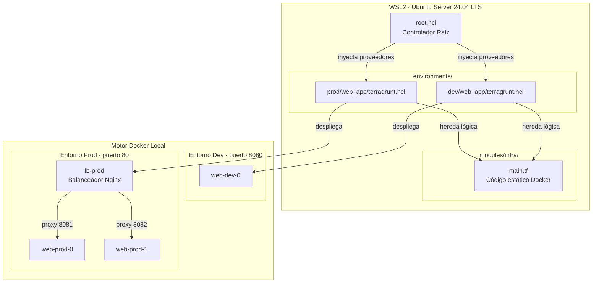
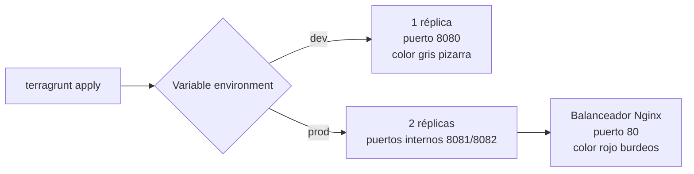
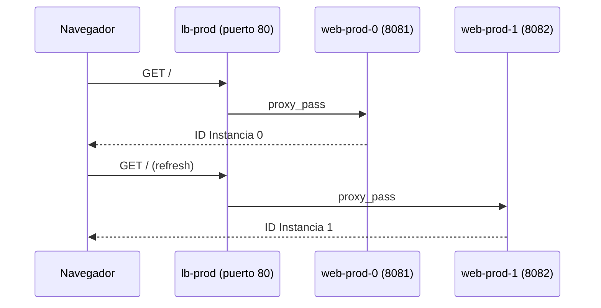

# Laboratorio Avanzado de IaC: Multi-entorno Local con Terragrunt y Docker

<div align="center">


**Infraestructura como Código de nivel profesional, 100% local, cero costos en la nube.**

</div>

---

## Tabla de Contenidos

1. [Descripción General](#descripción-general)
2. [Objetivos del Aprendizaje](#objetivos-del-aprendizaje)
3. [Arquitectura del Laboratorio](#arquitectura-del-laboratorio)
4. [Componentes Tecnológicos](#componentes-tecnológicos)
5. [Estructura del Repositorio](#estructura-del-repositorio)
6. [Requisitos Previos](#requisitos-previos)
7. [Guía de Implementación](#guía-de-implementación)
8. [Validación y Pruebas](#validación-y-pruebas)
9. [Limpieza de Recursos](#limpieza-de-recursos)
10. [Preguntas Frecuentes](#preguntas-frecuentes)

---

## Descripción General

Este laboratorio práctico permite comprender y dominar los conceptos fundamentales de la Infraestructura como Código (IaC) utilizando herramientas de nivel profesional en un entorno completamente controlado y local.

La propuesta consiste en construir una arquitectura espejo que simula entornos de **Desarrollo** y **Producción** dentro de WSL2 con Ubuntu Server 24.04 LTS, empleando Docker como proveedor real de infraestructura, Terraform como motor de ejecución y Terragrunt como orquestador jerárquico encargado de mantener el código limpio y sin duplicaciones.

> No se necesita cuenta en la nube, tarjeta de crédito ni acceso a internet una vez descargadas las dependencias. Todo corre en tu máquina.

---

## Objetivos del Aprendizaje

| Objetivo | Descripción |
|---|---|
| Filosofía DRY | Aplicar el principio Don't Repeat Yourself a la infraestructura mediante herencia de configuraciones |
| Jerarquía Terragrunt | Dominar el modelo moderno basado en el archivo maestro `root.hcl` |
| Pipeline Local | Implementar un despliegue aislado utilizando contenedores Nginx dinámicos |
| Alta Disponibilidad | Simular balanceo de carga y proxies inversos en un entorno controlado |

---

## Arquitectura del Laboratorio

El diseño segmenta responsabilidades de forma clara, replicando la estructura que un equipo de Plataformas o SRE utilizaría en un entorno productivo real.



### Flujo de decisiones por entorno



---

## Componentes Tecnológicos

### Entorno de Desarrollo

Instancia única de un contenedor web expuesta al host mediante el puerto **8080**. Su fondo gris pizarra permite validar visualmente y de forma inmediata que los cambios de variables se aplican de forma correcta sin afectar otras capas.

### Entorno de Producción

Escenario de alta disponibilidad compuesto por dos réplicas independientes en los puertos internos **8081** y **8082**, identificadas con un fondo rojo burdeos corporativo. Un tercer contenedor actúa como balanceador de carga, recibiendo todo el tráfico en el puerto estándar **80** y distribuyéndolo de forma equitativa entre las réplicas.

| Entorno | Réplicas | Puerto expuesto | Color identificador |
|---|---|---|---|
| Desarrollo | 1 | 8080 | `#2d3748` gris pizarra |
| Producción | 2 + balanceador | 80 | `#85144b` rojo burdeos |

---

## Estructura del Repositorio

```
iac-mastery_6/
├── envcommon/
│   └── web_app.hcl               Lógica de herencia común para aplicaciones
├── environments/                 Aislamiento de variables por entorno
│   ├── dev/
│   │   └── web_app/
│   │       └── terragrunt.hcl    Definición específica de Desarrollo
│   └── prod/
│       └── web_app/
│           └── terragrunt.hcl    Definición específica de Producción
├── modules/                      Código fuente estático de Terraform
│   └── infra/
│       └── main.tf               Declaración de recursos nativos de Docker
├── root.hcl                      Archivo maestro de control de Terragrunt
└── scripts/                      Automatizaciones e inicializaciones
    └── setup_env.sh              Script idempotente de preparación
```

---

## Requisitos Previos

- WSL2 con distribución Ubuntu Server 24.04 LTS
- Permisos de administrador para instalar paquetes del sistema
- Conexión a internet únicamente durante la fase de instalación de dependencias

El script de preparación se encarga de instalar Docker Engine de forma nativa, configurar el llavero oficial de HashiCorp para obtener Terraform e instalar el binario de Terragrunt.

---

## Guía de Implementación

### 1. Preparación automática del entorno

```bash
chmod +x scripts/setup_env.sh
./scripts/setup_env.sh
```

Al finalizar la instalación es indispensable aplicar los cambios del grupo Docker en la terminal activa, sin necesidad de reiniciar la sesión de WSL:

```bash
newgrp docker
```

### 2. Archivo maestro de control

El archivo `root.hcl` actúa como raíz lógica de la infraestructura. Intercepta las llamadas de los entornos e inyecta de forma dinámica el bloque del proveedor, sin duplicar código. También restringe el uso al binario oficial de Terraform, evitando colisiones con otros motores.

```hcl
# root.hcl
terraform_binary = "/usr/bin/terraform"

generate "provider" {
  path      = "provider.tf"
  if_exists = "overwrite_terragrunt"
  contents  = <<EOF
provider "docker" {
  host = "unix:///var/run/docker.sock"
}
EOF
}
```

### 3. Lógica común de la aplicación

`envcommon/web_app.hcl` centraliza la ubicación del módulo de Terraform. Mediante `find_in_parent_folders` localiza automáticamente el directorio raíz del proyecto, sin importar la profundidad del entorno que lo invoque.

```hcl
# envcommon/web_app.hcl
terraform {
  source = "${dirname(find_in_parent_folders("root.hcl"))}/modules/infra"
}
```

### 4. Módulo de infraestructura

`modules/infra/main.tf` declara los recursos que Docker levantará. Utiliza variables para parametrizar el comportamiento, de modo que un mismo bloque de código genere arquitecturas distintas según el entorno.

```hcl
# modules/infra/main.tf
terraform {
  required_providers {
    docker = {
      source  = "kreuzwerker/docker"
      version = "~> 3.0.0"
    }
  }
}

variable "environment"   { type = string }
variable "app_port"      { type = number }
variable "html_color"    { type = string }
variable "replica_count" { type = number }

resource "docker_image" "nginx" {
  name         = "nginx:alpine"
  keep_locally = false
}

resource "docker_container" "web" {
  count = var.replica_count
  name  = "web-${var.environment}-${count.index}"
  image = docker_image.nginx.image_id
  ports {
    internal = 80
    external = var.environment == "prod" ? (var.app_port + count.index + 1) : var.app_port
  }
  command = [
    "sh", "-c",
    "echo '<html><body style=\"background-color:${var.html_color}; color:white; font-family:sans-serif; text-align:center; padding-top:10%;\"><h1>Entorno: ${upper(var.environment)}</h1><p>ID Instancia: ${count.index}</p></body></html>' > /usr/share/nginx/html/index.html && nginx -g 'daemon off;'"
  ]
}

resource "docker_container" "lb" {
  count = var.environment == "prod" ? 1 : 0
  name  = "lb-prod"
  image = docker_image.nginx.image_id
  ports {
    internal = 80
    external = 80
  }
  command = [
    "sh", "-c",
    "echo 'events {} http { upstream app { server 172.17.0.1:8081; server 172.17.0.1:8082; } server { listen 80; location / { proxy_pass http://app; } } }' > /etc/nginx/nginx.conf && nginx -g 'daemon off;'"
  ]
}
```

### 5. Configuración particular de los entornos

**Desarrollo** — `environments/dev/web_app/terragrunt.hcl`

```hcl
include "root" {
  path = find_in_parent_folders("root.hcl")
}

include "envcommon" {
  path = "${get_terragrunt_dir()}/../../../envcommon/web_app.hcl"
}

inputs = {
  environment   = "dev"
  app_port      = 8080
  html_color    = "#2d3748"
  replica_count = 1
}
```

**Producción** — `environments/prod/web_app/terragrunt.hcl`

```hcl
include "root" {
  path = find_in_parent_folders("root.hcl")
}

include "envcommon" {
  path = "${get_terragrunt_dir()}/../../../envcommon/web_app.hcl"
}

inputs = {
  environment   = "prod"
  app_port      = 8080
  html_color    = "#85144b"
  replica_count = 2
}
```

### 6. Despliegue de la infraestructura

```bash
# Desarrollo
cd environments/dev/web_app/
terragrunt init
terragrunt apply --auto-approve

# Producción
cd ../../prod/web_app/
terragrunt init
terragrunt apply --auto-approve
```

---

## Validación y Pruebas

### Verificación de estado en Docker

```bash
docker ps
```

Confirma que los contenedores estén activos y correctamente mapeados en sus puertos correspondientes dentro de la red de WSL2.

### Auditoría del tráfico local

| Dirección | Resultado esperado |
|---|---|
| `http://localhost:8080` | Pantalla de validación de Desarrollo, fondo gris pizarra |
| `http://localhost` | Interfaz corporativa de Producción, fondo rojo burdeos |

Al actualizar de forma repetida `http://localhost`, el balanceador conmutará las peticiones mostrando alternadamente `ID Instancia: 0` e `ID Instancia: 1`, comprobando la correcta distribución de carga en alta disponibilidad.



---

## Limpieza de Recursos

Desmantelar el laboratorio al finalizar cada sesión de estudio es una práctica estándar de Ingeniería de Confiabilidad de Sitios, evitando el consumo innecesario de memoria y sockets en la máquina local.

```bash
# Limpieza de Producción
cd environments/prod/web_app/
terragrunt destroy --auto-approve

# Limpieza de Desarrollo
cd ../../dev/web_app/
terragrunt destroy --auto-approve
```

---

## Preguntas Frecuentes

**¿Por qué usar Terragrunt en lugar de Terraform puro?**
Terragrunt permite mantener la lógica de proveedores y módulos centralizada en un único punto, evitando la duplicación de bloques `provider` y `terraform` en cada entorno.

**¿Puedo agregar un tercer entorno, por ejemplo staging?**
Sí. Basta con crear una nueva carpeta dentro de `environments/`, apuntar al mismo `envcommon/web_app.hcl` y definir sus propios `inputs`.

**¿Qué ocurre si cambio `replica_count` en producción?**
El balanceador seguirá apuntando a las direcciones fijas definidas en el bloque `upstream`. Para escalar dinámicamente sería necesario generar la configuración del balanceador con una plantilla que itere sobre las réplicas creadas.

---

<div align="center">

Laboratorio construido para práctica personal de Infraestructura como Código.

</div>

