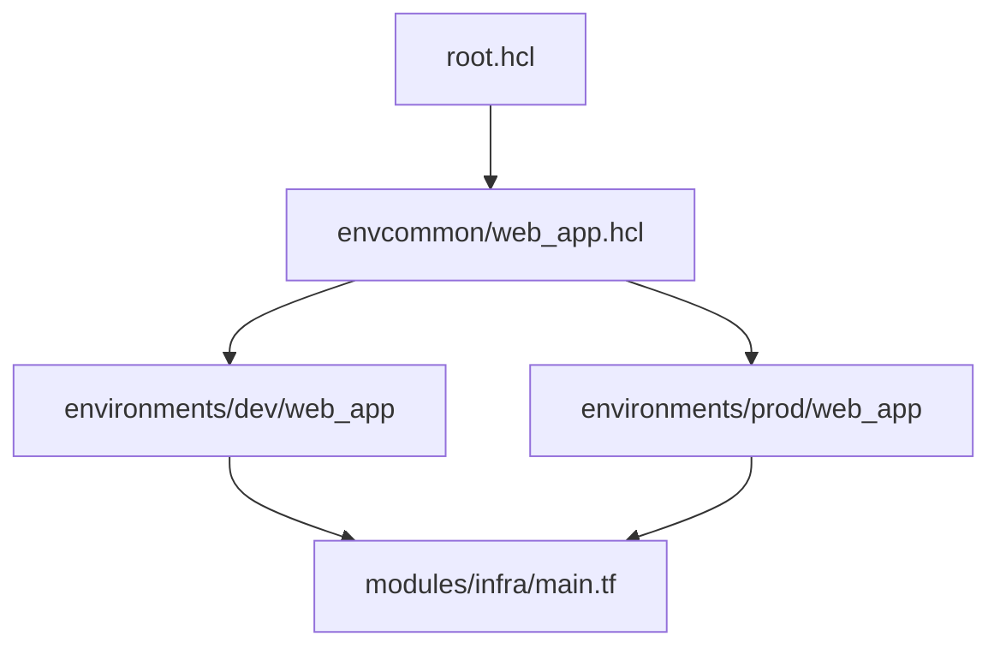
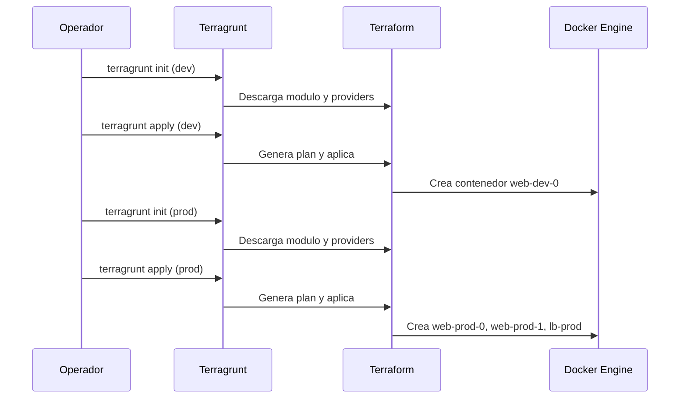
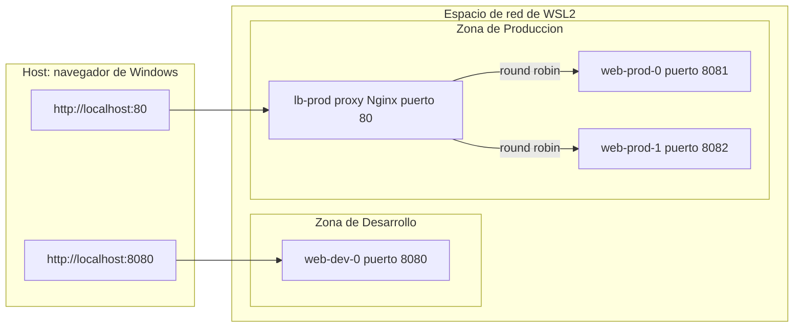
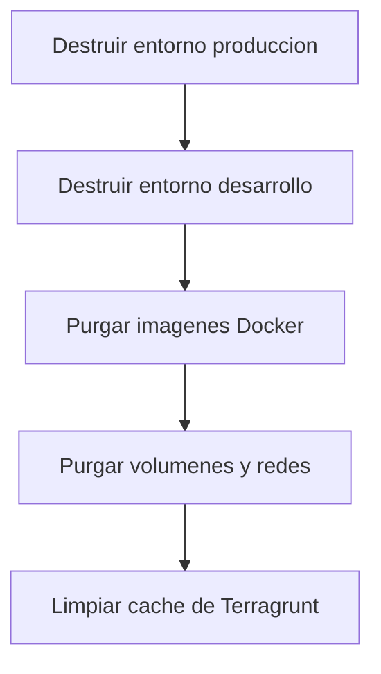

# Runbook de Operaciones: Plataforma Web Multi-Entorno con Terragrunt y Docker

## Tabla de contenidos

1. [Introduccion](#1-introduccion)
2. [Requisitos previos del sistema](#2-requisitos-previos-del-sistema)
3. [Estructura del repositorio](#3-estructura-del-repositorio)
4. [Componentes del proyecto](#4-componentes-del-proyecto)
5. [Guia de despliegue](#5-guia-de-despliegue)
6. [Pruebas de humo y validacion de trafico](#6-pruebas-de-humo-y-validacion-de-trafico)
7. [Resolucion de incidentes](#7-resolucion-de-incidentes)
8. [Desmantelamiento seguro de recursos](#8-desmantelamiento-seguro-de-recursos)
9. [Buenas practicas y checklist final](#9-buenas-practicas-y-checklist-final)

---

## 1. Introduccion

Este documento describe, de forma estandarizada, los procedimientos de preparacion, inicializacion, despliegue, auditoria y desmantelamiento de una infraestructura de laboratorio basada en **Docker** y gestionada mediante **Terraform** y **Terragrunt**.

El objetivo es contar con un flujo de trabajo repetible que garantice:

- Un estado consistente del motor de contenedores.
- Prevencion de corrupcion en los archivos de estado de Terraform.
- Separacion clara entre los entornos de desarrollo y produccion.

El laboratorio despliega un entorno de desarrollo con una sola instancia web y un entorno de produccion con dos instancias detras de un balanceador de carga con proxy inverso, todo corriendo sobre contenedores Nginx dentro de WSL2.


---

## 2. Requisitos previos del sistema

Antes de interactuar con las herramientas de infraestructura como codigo es obligatorio validar que el entorno WSL2 cuente con los componentes base instalados y con los servicios activos.

### 2.1 Diagnostico del motor Docker

El demonio de Docker debe reportar un estado activo para permitir la comunicacion a traves del socket local.

```bash
sudo service docker status
```

Si el servicio se encuentra detenido, inicielo con:

```bash
sudo service docker start
```

### 2.2 Control de binarios oficiales

Confirme que las rutas y versiones de los ejecutables correspondan a las herramientas oficiales de HashiCorp.

```bash
which terraform
terraform version
```

Salida esperada:

```
/usr/bin/terraform
Terraform v1.15.2 o superior
```

### 2.3 Checklist de prerrequisitos

| Componente | Comando de verificacion | Estado esperado |
|---|---|---|
| Docker Engine | `sudo service docker status` | active (running) |
| Terraform | `terraform version` | v1.15.2 o superior |
| Terragrunt | `terragrunt --version` | instalado y en PATH |
| Permisos de socket | `docker ps` sin sudo | ejecuta sin error de permisos |

---

## 3. Estructura del repositorio

El laboratorio utiliza una estructura jerarquica desacoplada, siguiendo la filosofia DRY (Don't Repeat Yourself), para mantener la modularidad y facilitar la reutilizacion de codigo entre entornos.

```
iac-mastery_6/
├── envcommon/
│   └── web_app.hcl               # Configuracion intermedia de herencia
├── environments/                 # Variables especificas por entorno
│   ├── dev/
│   │   └── web_app/
│   │       └── terragrunt.hcl    # Componente ejecutor de Desarrollo
│   └── prod/
│       └── web_app/
│           └── terragrunt.hcl    # Componente ejecutor de Produccion
├── modules/                      # Modulo raiz estatico de Terraform
│   └── infra/
│       └── main.tf               # Declaracion nativa de recursos Docker
├── root.hcl                      # Archivo maestro de control global
└── scripts/                      # Automatizaciones del entorno
    └── setup_env.sh              # Script de preconfiguracion
```



El archivo `root.hcl` centraliza la configuracion global. El bloque intermedio `envcommon/web_app.hcl` apunta al modulo real de Terraform y cada entorno hereda ese comportamiento inyectando solo sus variables propias.

---

## 4. Componentes del proyecto

### 4.1 Script de automatizacion inicial: `scripts/setup_env.sh`

Prepara el sistema operativo de forma idempotente, verificando si las herramientas ya existen antes de realizar cualquier descarga.

```bash
#!/usr/bin/env bash
set -euo pipefail

# 1. Instalacion de paquetes base obligatorios
sudo apt update -qq
sudo apt install -y -qq curl gnupg lsb-release ca-certificates unzip git

# 2. Configuracion de Docker Engine nativo
if ! command -v docker &> /dev/null; then
    sudo install -m 0755 -d /etc/apt/keyrings
    sudo curl -fsSL https://download.docker.com/linux/ubuntu/gpg -o /etc/apt/keyrings/docker.asc
    sudo chmod a+r /etc/apt/keyrings/docker.asc
    echo "deb [arch=$(dpkg --print-architecture) signed-by=/etc/apt/keyrings/docker.asc] https://download.docker.com/linux/ubuntu $(. /etc/os-release && echo "$VERSION_CODENAME") stable" | sudo tee /etc/apt/sources.list.d/docker.list > /dev/null
    sudo apt update -qq
    sudo apt install -y -qq docker-ce docker-ce-cli containerd.io
fi

# 3. Permisos de grupo para el socket sin sudo
if ! groups "$USER" | grep &> /dev/null "\bdocker\b"; then
    sudo usermod -aG docker "$USER"
fi

# 4. Instalacion de Terraform oficial
if ! command -v terraform &> /dev/null; then
    wget -O- https://apt.releases.hashicorp.com/gpg | sudo gpg --dearmor -o /usr/share/keyrings/hashicorp-archive-keyring.gpg
    echo "deb [signed-by=/usr/share/keyrings/hashicorp-archive-keyring.gpg] https://apt.releases.hashicorp.com/ubuntu $(lsb_release -cs) main" | sudo tee /etc/apt/sources.list.d/hashicorp.list
    sudo apt update -qq && sudo apt install -y -qq terraform
fi

# 5. Instalacion de Terragrunt
if ! command -v terragrunt &> /dev/null; then
    TG_VERSION=$(curl -s https://api.github.com/repos/gruntwork-io/terragrunt/releases/latest | grep '"tag_name":' | sed -E 's/.*"([^"]+)".*/\1/')
    curl -SL "https://github.com/gruntwork-io/terragrunt/releases/download/${TG_VERSION}/terragrunt_linux_amd64" -o terragrunt
    chmod +x terragrunt
    sudo mv terragrunt /usr/local/bin/terragrunt
fi
```

> Nota didactica: cada bloque del script usa `command -v` para comprobar existencia previa antes de instalar, lo que hace que el script pueda ejecutarse multiples veces sin generar efectos secundarios (idempotencia).

### 4.2 Archivo maestro global: `root.hcl`

Actua como el orquestador principal. Define el binario exacto de Terraform que debe ejecutarse y genera dinamicamente el archivo `provider.tf` en los entornos hijos al momento del despliegue, centralizando el acceso al socket de Docker.

```hcl
# root.hcl
terraform_binary = "/usr/bin/terraform"

generate "provider" {
  path      = "provider.tf"
  if_exists = "overwrite_terragrunt"
  contents  = <<EOF
provider "docker" {
  host = "unix:///var/run/docker.sock"
}
EOF
}
```

### 4.3 Bloque intermedio de acoplamiento: `envcommon/web_app.hcl`

Establece la ruta hacia el codigo base de Terraform. La funcion `find_in_parent_folders` combinada con `dirname` permite que, sin importar desde que subcarpeta de entorno se ejecute la accion, el sistema localice de forma exacta y absoluta el directorio de los modulos.

```hcl
# envcommon/web_app.hcl
terraform {
  source = "${dirname(find_in_parent_folders("root.hcl"))}/modules/infra"
}
```

### 4.4 Modulo fuente estatico: `modules/infra/main.tf`

Contiene la logica pura de Terraform. Recibe las variables de los entornos y condiciona los recursos: si el entorno es produccion, crea multiples replicas y levanta un contenedor adicional configurado como balanceador de carga con proxy inverso.

```hcl
# modules/infra/main.tf
terraform {
  required_providers {
    docker = {
      source  = "kreuzwerker/docker"
      version = "~> 3.0.0"
    }
  }
}

variable "environment"   { type = string }
variable "app_port"      { type = number }
variable "html_color"    { type = string }
variable "replica_count" { type = number }

resource "docker_image" "nginx" {
  name         = "nginx:alpine"
  keep_locally = false
}

resource "docker_container" "web" {
  count = var.replica_count
  name  = "web-${var.environment}-${count.index}"
  image = docker_image.nginx.image_id
  ports {
    internal = 80
    external = var.environment == "prod" ? (var.app_port + count.index + 1) : var.app_port
  }
  command = [
    "sh", "-c",
    "echo '<html><body style=\"background-color:${var.html_color}; color:white; font-family:sans-serif; text-align:center; padding-top:10%;\"><h1>Entorno: ${upper(var.environment)}</h1><p>ID Instancia: ${count.index}</p></body></html>' > /usr/share/nginx/html/index.html && nginx -g 'daemon off;'"
  ]
}

resource "docker_container" "lb" {
  count = var.environment == "prod" ? 1 : 0
  name  = "lb-prod"
  image = docker_image.nginx.image_id
  ports {
    internal = 80
    external = 80
  }
  command = [
    "sh", "-c",
    "echo 'events {} http { upstream app { server 172.17.0.1:8081; server 172.17.0.1:8082; } server { listen 80; location / { proxy_pass http://app; } } }' > /etc/nginx/nginx.conf && nginx -g 'daemon off;'"
  ]
}
```

### 4.5 Configuracion del entorno de desarrollo: `environments/dev/web_app/terragrunt.hcl`

Inyecta los valores para desarrollo: una sola replica expuesta en el puerto 8080 y un color de fondo gris pizarra. Utiliza rutas relativas para consumir el archivo raiz y el intermediario.

```hcl
include "root" {
  path = find_in_parent_folders("root.hcl")
}

include "envcommon" {
  path = "${get_terragrunt_dir()}/../../../envcommon/web_app.hcl"
}

inputs = {
  environment   = "dev"
  app_port      = 8080
  html_color    = "#2d3748"
  replica_count = 1
}
```

### 4.6 Configuracion del entorno de produccion: `environments/prod/web_app/terragrunt.hcl`

Establece las variables corporativas: dos replicas para el backend y un color de fondo rojo burdeos, con el trafico expuesto sobre el puerto 80 a traves del balanceador.

```hcl
include "root" {
  path = find_in_parent_folders("root.hcl")
}

include "envcommon" {
  path = "${get_terragrunt_dir()}/../../../envcommon/web_app.hcl"
}

inputs = {
  environment   = "prod"
  app_port      = 8080
  html_color    = "#85144b"
  replica_count = 2
}
```

### 4.7 Comparativa de entornos

| Parametro | Desarrollo | Produccion |
|---|---|---|
| Puerto de acceso | 8080 | 80 (via balanceador) |
| Replicas | 1 | 2 |
| Color HTML | `#2d3748` (gris pizarra) | `#85144b` (rojo burdeos) |
| Balanceador de carga | No | Si, Nginx con proxy inverso |

---

## 5. Guia de despliegue

El despliegue debe realizarse secuencialmente para asegurar el aislamiento de las redes locales.

### 5.1 Despliegue del entorno de desarrollo

```bash
cd environments/dev/web_app/
terragrunt init
terragrunt apply --auto-approve
```

### 5.2 Despliegue del entorno de produccion

```bash
cd ../../prod/web_app/
terragrunt init
terragrunt apply --auto-approve
```



---

## 6. Pruebas de humo y validacion de trafico

Una vez completadas las ejecuciones de infraestructura como codigo, se debe auditar el estado de la red local desde la linea de comandos antes de validar desde el navegador web.



### 6.1 Auditoria de sockets activos

Verifique que los cuatro contenedores esten listados en estado activo y correctamente mapeados:

```bash
docker ps --format "table {{.Names}}\t{{.Status}}\t{{.Ports}}"
```

### 6.2 Validacion de la distribucion del balanceador

Ejecute un bucle de peticiones HTTP en la terminal para comprobar que el proxy distribuye el trafico alternadamente entre los backends de produccion:

```bash
for i in {1..4}; do curl -s http://localhost | grep "ID Instancia"; done
```

Salida esperada:

```
<p>ID Instancia: 0</p>
<p>ID Instancia: 1</p>
<p>ID Instancia: 0</p>
<p>ID Instancia: 1</p>
```

Este patron alternado confirma que el algoritmo round robin del bloque `upstream` de Nginx esta funcionando correctamente entre `web-prod-0` y `web-prod-1`.

---

## 7. Resolucion de incidentes

### 7.1 Error de privilegios en el socket de Docker

**Sintoma:** el comando `terragrunt apply` aborta el proceso indicando un error de permisos denegados (permission denied) al conectar con `/var/run/docker.sock`.

**Solucion:** ejecute el comando de recarga de configuracion de grupos para forzar al shell actual a reconocer los privilegios asignados, sin necesidad de cerrar la terminal activa:

```bash
newgrp docker
```

### 7.2 Bloqueo del archivo de estado (state lock)

**Sintoma:** el pipeline se detiene reportando que el archivo de estado `.terraform.tfstate` esta retenido por otro identificador de proceso.

**Solucion:** si se confirma que no hay otra terminal realizando operaciones en paralelo, remueva el archivo de bloqueo temporal del entorno afectado de forma manual:

```bash
rm -f .terraform.tfstate.lock.info
```

### 7.3 Tabla resumen de incidentes

| Sintoma | Causa probable | Accion correctiva |
|---|---|---|
| Permission denied en el socket | Grupo docker no aplicado en la sesion activa | `newgrp docker` |
| State lock activo | Proceso interrumpido dejo un lock huerfano | Verificar procesos y eliminar el lock file |
| Puerto en uso | Contenedor previo no liberado | `docker ps -a` y eliminar contenedor residual |
| Imagen no descargada | Sin conexion a registry | Verificar conectividad y reintentar `terragrunt apply` |

---

## 8. Desmantelamiento seguro de recursos

Para liberar la memoria asignada al motor local, limpiar las interfaces virtuales de red, borrar las imagenes en cache y liberar por completo el espacio en disco dentro de WSL2, se debe proceder con la destruccion controlada en el orden inverso al de su creacion.



### 8.1 Paso 1: destruccion de la infraestructura gestionada por IaC

Ejecute la destruccion a traves de Terragrunt para que el proveedor de Terraform ordene la parada (stop) y eliminacion (rm) de los contenedores y redes logicas del laboratorio.

```bash
# 1. Remocion y parada del entorno de Produccion (app y balanceador)
cd environments/prod/web_app/
terragrunt destroy --auto-approve

# 2. Remocion y parada del entorno de Desarrollo
cd ../../dev/web_app/
terragrunt destroy --auto-approve
```

### 8.2 Paso 2: purga absoluta del entorno Docker

Terraform no elimina las imagenes descargadas ni los volumenes, para prevenir perdida accidental de datos. Ejecute los siguientes comandos nativos en la terminal de WSL para purgar el almacenamiento residual:

```bash
# 1. Eliminar la imagen base de Nginx utilizada en el laboratorio
docker image rm nginx:alpine

# 2. Eliminar volumenes huerfanos o residuales
docker volume prune -f

# 3. Limpieza de redes logicas de Docker que no esten en uso
docker network prune -f

# 4. Verificacion de limpieza (la salida debe reportar cero artefactos del laboratorio)
docker ps -a
docker image ls
```

### 8.3 Paso 3: limpieza de artefactos de codigo residuales

Fuerce la eliminacion de los directorios temporales de trabajo creados por Terragrunt, para evitar que caches antiguas corrompan futuros laboratorios:

```bash
cd ../../../
find . -name ".terragrunt-cache" -type d -exec rm -rf {} +
find . -name ".terraform.lock.hcl" -type f -exec rm -f {} +
```

---

## 9. Buenas practicas y checklist final

- Ejecute siempre `terragrunt init` antes de `apply` cuando cambie de entorno.
- Nunca edite manualmente el archivo `provider.tf` generado, ya que se sobrescribe en cada ejecucion.
- Mantenga el orden inverso de creacion al destruir: primero produccion, luego desarrollo.
- Realice la auditoria con `docker ps` despues de cada despliegue y despues de cada destruccion.
- No comparta ni versiones los archivos `.terragrunt-cache` ni `.terraform.lock.hcl` sin necesidad, ya que se regeneran automaticamente.

### Checklist de cierre de sesion de laboratorio

- [ ] Entorno de produccion destruido
- [ ] Entorno de desarrollo destruido
- [ ] Imagenes Docker purgadas
- [ ] Volumenes y redes purgados
- [ ] Cache de Terragrunt eliminada
- [ ] `docker ps -a` retorna lista vacia de contenedores del laboratorio

---

*Documento de referencia interna. Ultima revision del contenido tecnico incluida en este runbook.*

