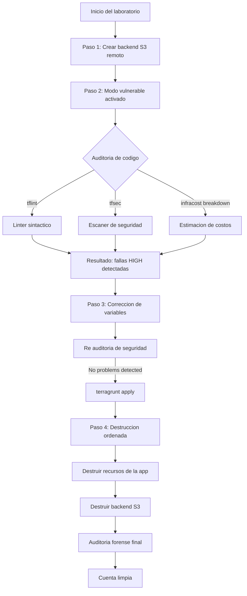
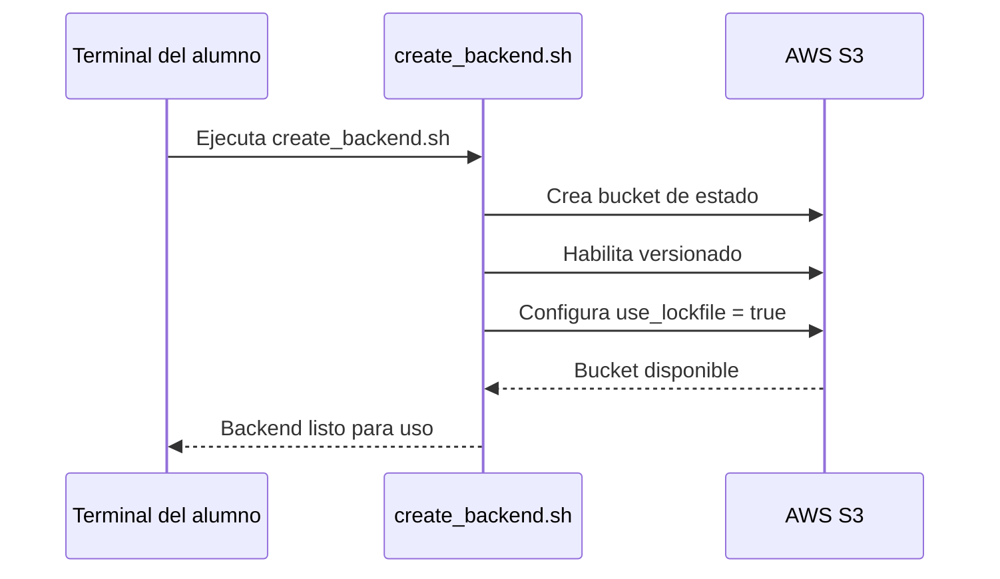
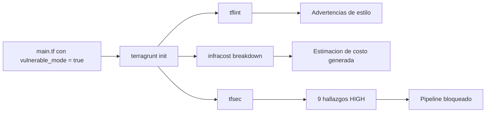
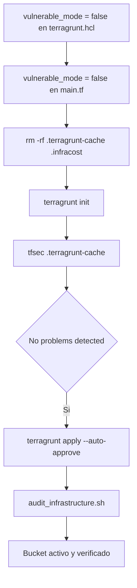
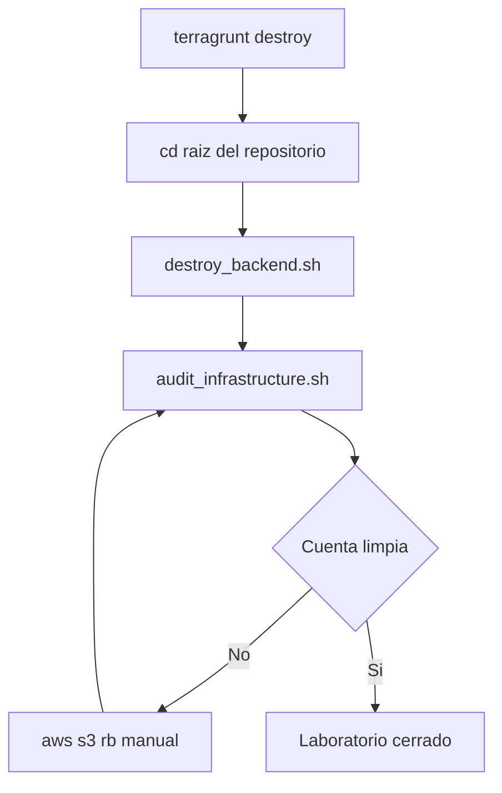

# Runbook SRE: Control de Gobernanza Multiambiente en IaC


---

## Tabla de contenidos

1. [Objetivo del runbook](#objetivo-del-runbook)
2. [Arquitectura general del laboratorio](#arquitectura-general-del-laboratorio)
3. [Requisitos previos](#requisitos-previos)
4. [Paso 1: Inicialización del backend remoto de estados](#paso-1-inicialización-del-backend-remoto-de-estados)
5. [Paso 2: Simulación y detección de vulnerabilidades](#paso-2-simulación-y-detección-de-vulnerabilidades-modo-inseguro)
6. [Paso 3: Mitigación de riesgos y despliegue seguro](#paso-3-mitigación-de-riesgos-y-despliegue-modo-seguro)
7. [Paso 4: Desmantelamiento seguro](#paso-4-desmantelamiento-seguro-orden-antidegradación)
8. [Comandos de referencia rápida](#comandos-de-referencia-rápida)
9. [Errores comunes y solución](#errores-comunes-y-solución)

---

## Objetivo del runbook

Este documento guía la ejecución de un laboratorio de gobernanza de infraestructura como código (IaC), diseñado para que el estudiante entienda por qué un pipeline de despliegue nunca debe depender solo de la voluntad del desarrollador, sino de controles automatizados que detengan el código inseguro antes de que llegue a la nube.

El laboratorio combina tres disciplinas que en la práctica profesional casi siempre se enseñan por separado:

- Linting estructural de código HCL con TFLint.
- Análisis de seguridad estática (SAST) con TFSec.
- Gobernanza financiera (FinOps) con Infracost, para anticipar el costo mensual de lo que se va a desplegar.

El entorno usa OpenTofu o Terraform en su versión 1.10 o superior, orquestado con Terragrunt, sobre un backend de estado en Amazon S3 con bloqueo nativo de estado, sin necesidad de DynamoDB.

---

## Arquitectura general del laboratorio

El siguiente diagrama resume el ciclo de vida completo que se ejecuta en este runbook, desde la creación del backend hasta el desmantelamiento final.



El punto central del diseño pedagógico es el bloque D: ninguna herramienta actúa sola. TFLint valida sintaxis y buenas prácticas de escritura, TFSec valida postura de seguridad, e Infracost valida impacto económico. Solo cuando las tres luces están en verde se autoriza el apply.

---

## Requisitos previos

### Instalación de binarios

Si es la primera vez que se interactúa con el entorno, ejecute lo siguiente en la terminal para desplegar el conjunto de herramientas de validación:

```bash
# 1. Instalar TFLint (linter sintáctico de HCL)
curl -sS https://raw.githubusercontent.com/terraform-linters/tflint/master/install_linux.sh | bash

# 2. Instalar TFSec (escáner de seguridad estática SAST)
curl -s https://raw.githubusercontent.com/aquasecurity/tfsec/master/scripts/install_linux.sh | bash

# 3. Instalar Infracost (validación FinOps de costos mensuales)
curl -fsSL https://raw.githubusercontent.com/infracost/cli/master/scripts/install.sh | sh
```

### Tabla de herramientas y su rol en el pipeline

| Herramienta | Nombre del binario en terminal | Función en el pipeline |
|---|---|---|
| TFLint | tflint | Analiza la sintaxis y las buenas prácticas del código HCL antes de cualquier despliegue. |
| TFSec | tfsec | Escanea el código en busca de configuraciones inseguras: cifrado ausente, exposición pública, permisos excesivos. |
| Infracost | infracost | Calcula el impacto en costos antes de aplicar cambios, usando el subcomando infracost breakdown. |

Nota de consistencia: el nombre del producto se escribe siempre "Infracost", con la o final. El binario que se invoca en la terminal es infracost, tal como se usa en el comando infracost breakdown --path . del paso 2. El nombre del producto y el nombre del comando coinciden, de modo que no hay ambigüedad entre la explicación teórica y la ejecución práctica.

---

## Paso 1: Inicialización del backend remoto de estados

Ubíquese en la raíz del proyecto:

```bash
cd ~/sre-linux-mastery/Fase2/iac-mastery_8
```

Otorgue permisos de ejecución a la suite de scripts y cree el backend:

```bash
# Otorgar permisos de ejecución a la suite de scripts
chmod 750 ./scripts/*

# Crear el bucket de AWS S3 que alojará de forma segura los archivos .tfstate
./scripts/create_backend.sh
```

Nota SRE: este backend aprovecha la característica Native S3 State Locking, disponible desde Terraform 1.10, mediante el parámetro use_lockfile = true configurado en root.hcl. Esto elimina la necesidad de aprovisionar una tabla de DynamoDB para el bloqueo de estado, reduciendo tanto el costo como la superficie de mantenimiento del backend.



---

## Paso 2: Simulación y detección de vulnerabilidades (modo inseguro)

El objetivo de este paso es observar cómo las herramientas detienen código descuidado antes de que toque la nube. Para eso, los archivos se dejan intencionalmente en modo vulnerable.

### 1. Forzar el fallo en el módulo base

Edite el archivo del módulo:

```bash
vi modules/s3_app/main.tf
```

Deje el valor default = true en la variable, de forma que el análisis falle de manera obligatoria:

```hcl
variable "environment" {
  type = string
}

variable "vulnerable_mode" {
  type    = bool
  default = true # forzado a true para la demostración
}

resource "aws_s3_bucket" "app_bucket" {
  bucket = "sre-linux-mastery-app-bucket-${var.environment}"
}
```

### 2. Forzar el fallo en el entorno local

Muévase al entorno de desarrollo e inicialice la caché de Terragrunt:

```bash
cd environments/dev
terragrunt init
```

### 3. Ejecutar la suite de auditoría de código

```bash
# A. Análisis de sintaxis básica (linter)
tflint

# B. Análisis FinOps de costos
infracost breakdown --path .

# C. Escaneo de seguridad apuntando a la caché local
tfsec .terragrunt-cache/
```

Resultado esperado: la terminal mostrará en rojo un conjunto de nueve vulnerabilidades de criticidad HIGH, advirtiendo que el bucket de la aplicación queda expuesto a internet y sin cifrado en reposo.



---

## Paso 3: Mitigación de riesgos y despliegue (modo seguro)

### 1. Corregir el input dinámico de Terragrunt

Abra la configuración del entorno de desarrollo:

```bash
vi terragrunt.hcl
```

Ajuste la variable correctiva para forzar el blindaje perimetral del recurso:

```hcl
inputs = {
  environment     = "dev"
  vulnerable_mode = false # cambiado a false
}
```

### 2. Corregir el default del módulo base

Para que el escáner estático de TFSec lea la estructura final correcta, actualice la raíz del código base:

```bash
vi ../../modules/s3_app/main.tf
```

Cambie el valor por defecto a false:

```hcl
variable "vulnerable_mode" {
  type    = bool
  default = false # cambiado a false
}
```

### 3. Validación y aprobación de seguridad

Limpie las cachés remanentes e inicialice de nuevo para refrescar el estado:

```bash
rm -rf .terragrunt-cache/ .infracost/
terragrunt init
tfsec .terragrunt-cache/
```

Resultado exitoso esperado:

```
No problems detected! (7 passed, 3 ignored de forma controlada)
```

El pipeline queda habilitado para continuar.

### 4. Ejecución del despliegue real

```bash
terragrunt apply --auto-approve
```

### 5. Auditoría activa de infraestructura

```bash
../../scripts/audit_infrastructure.sh
```

Esto certifica que el bucket sre-linux-mastery-app-bucket-dev está activo y responde correctamente a las peticiones de la API de AWS.



---

## Paso 4: Desmantelamiento seguro (orden antidegradación)

Para mitigar condiciones de carrera y evitar desajustes de estado, la infraestructura de la aplicación debe removerse obligatoriamente antes de apagar el backend de control. El orden importa: destruir el backend primero dejaría recursos huérfanos sin una forma sencilla de referenciarlos.

```bash
# 1. Destruir los recursos vivos de la aplicación en desarrollo
terragrunt destroy --auto-approve

# 2. Regresar a la raíz del repositorio central
cd ../..

# 3. Purgar el historial de versiones del S3 central y destruirlo por completo
./scripts/destroy_backend.sh

# 4. Inspección forense final de cierre
./scripts/audit_infrastructure.sh
```

Veredicto de limpieza esperado en terminal:

```
==========================================================
    AUDITORIA FORENSE SRE: DETECCION DE RECURSOS ACTIVOS
==========================================================
Revisando Buckets S3...
S3: 100% Limpio. No quedan remanentes en la cuenta.
Revisando Instancias EC2...
EC2: 100% Limpio. No hay servidores activos.
==========================================================
```

### Comando de emergencia para borrado manual

Si un alumno se saltó algún paso del script y necesita eliminar manualmente un bucket vacío, puede usar el siguiente comando. La CLI de AWS es sensible a mayúsculas y minúsculas, por lo que el comando y sus subcomandos deben escribirse siempre en minúsculas:

```bash
aws s3 rb s3://sre-linux-mastery-app-bucket-dev --force
```

El flag --force solo es necesario si el bucket todavía contiene objetos o versiones, ya que rb (remove bucket) por sí solo falla ante un bucket no vacío.



---

## Comandos de referencia rápida

| Fase | Comando | Propósito |
|---|---|---|
| Backend | ./scripts/create_backend.sh | Crea el bucket S3 con bloqueo nativo de estado |
| Inicialización | terragrunt init | Inicializa la caché local de Terragrunt |
| Linter | tflint | Valida sintaxis y buenas prácticas |
| FinOps | infracost breakdown --path . | Estima el costo mensual del cambio |
| Seguridad | tfsec .terragrunt-cache/ | Escanea vulnerabilidades en el plan generado |
| Despliegue | terragrunt apply --auto-approve | Aplica los cambios sin confirmación interactiva |
| Auditoría | ./scripts/audit_infrastructure.sh | Verifica el estado real de los recursos en AWS |
| Destrucción | terragrunt destroy --auto-approve | Elimina la infraestructura de la aplicación |
| Backend | ./scripts/destroy_backend.sh | Elimina el bucket de estado remoto |
| Emergencia | aws s3 rb s3://nombre-del-bucket --force | Borra manualmente un bucket residual |

---

## Errores comunes y solución

| Síntoma | Causa probable | Solución |
|---|---|---|
| tfsec reporta hallazgos aunque ya se corrigió main.tf | La caché de Terragrunt no se regeneró | Ejecutar rm -rf .terragrunt-cache/ seguido de terragrunt init |
| infracost breakdown no devuelve estimación | Falta configurar la API key de Infracost | Ejecutar infracost auth login antes de correr el breakdown |
| terragrunt destroy falla por dependencias | El backend se intentó destruir antes que la app | Revertir el orden: primero destruir la aplicación, luego el backend |
| aws s3 rb devuelve error de comando no reconocido | El comando se escribió con mayúsculas | Verificar que aws, s3 y rb estén siempre en minúsculas |
| El bucket no se elimina con rb | El bucket contiene objetos o versiones | Agregar el flag --force al comando aws s3 rb |

---

Documento elaborado para uso interno del laboratorio de Fase 2, módulo iac-mastery_8.

